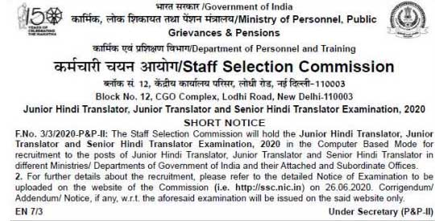

SSC Junior Hindi translator Recruitment 2020 Notification Released! The Staff Selection Commission will hold an open competitive examination for recruitment of Group „B‟ Non-Gazetted posts of Junior Hindi Translator, Junior Translator and Senior Hindi Translator for various Ministries/ Departments/ Organizations in the Government of India. SSC JHT Online Form Start on 29th June 2020 to Available until 25th July 2020. Interested & Eligible Cndaiets Can Apply for SSC Jobs Before the Last Date.

<table style="border-collapse: collapse; width: 100%;"><tbody><tr><td style="width: 50%; background-color: #2a5a8e; text-align: center;" colspan="2"><h3><strong>SSC Recruitment 2020</strong></h3></td></tr><tr><td style="width: 50%; text-align: center;">Job Recruitment Board</td><td style="width: 50%; text-align: center;">Staff Selection Commission</td></tr><tr><td style="width: 50%; text-align: center;">Notification No.</td><td style="width: 50%; text-align: center;">-</td></tr><tr><td style="width: 50%; text-align: center;">Post</td><td style="width: 50%; text-align: center;">Translator</td></tr><tr><td style="width: 50%; text-align: center;">Vacancies</td><td style="width: 50%; text-align: center;">283</td></tr><tr><td style="width: 50%; text-align: center;">Job Location</td><td style="width: 50%; text-align: center;">Across India</td></tr><tr><td style="width: 50%; text-align: center;">Job Type</td><td style="width: 50%; text-align: center;">Central Govt Job</td></tr><tr><td style="width: 50%; text-align: center;">Application Mode</td><td style="width: 50%; text-align: center;">Online</td></tr></tbody></table>

## **SSC Junior Hindi Translator Recruitment 2020**

<table style="border-collapse: collapse;"><tbody><tr><td style="width: 50%; background-color: #2a5a8e; text-align: center;" colspan="2"><h3><strong>Important Dates</strong></h3></td></tr><tr><td style="width: 50%; text-align: center;">Starting Date of Online Application</td><td style="width: 50%; text-align: center;">29-06-2020</td></tr><tr><td style="width: 50%; text-align: center;">Last Date of Online Application</td><td style="width: 50%; text-align: center;">25-07-2020</td></tr><tr><td style="width: 50%; text-align: center;">Last date and time for receipt of applications</td><td style="width: 50%; text-align: center;">25-07-2020 (23:30)</td></tr><tr><td style="width: 50%; text-align: center;">Last date and time for making online fee payment</td><td style="width: 50%; text-align: center;">27-07-2020 (23:30)</td></tr><tr><td style="width: 50%; text-align: center;">Last date and time for generation of offline Challan</td><td style="width: 50%; text-align: center;">29-07-2020 (23:30)</td></tr><tr><td style="width: 50%; text-align: center;">Last date for payment through Challan (during working hours of Bank)</td><td style="width: 50%; text-align: center;">31-07-2020</td></tr><tr><td style="width: 50%; text-align: center;">Date of Computer Based Examination (Paper-I)</td><td style="width: 50%; text-align: center;">06-10-2020</td></tr><tr><td style="width: 50%; text-align: center;">Date of Paper-II (Descriptive Paper)</td><td style="width: 50%; text-align: center;">31-01-2021</td></tr></tbody></table>

### **SSC Vacancy 2020 Details**

- Junior Translator/ Junior Hindi Translator: 275 Posts
- Senior Hindi Translator: 8 Posts

### **SSC JHT Eligibility Criteria**

Age Limits

- Minimum 18 Years
- Maximum 30 Years

Age Relaxing

- SC/ST: 5 Years
- OBC: 3 Years
- PwD: 10 Years
- PwD + OBC: 13 Years
- PwD + SC/ST: 15 Years

Education Qualification

<table style="border-collapse: collapse; width: 100%; height: 161px;"><tbody><tr style="height: 22px;"><td style="width: 14.1909%; height: 22px; text-align: center; background-color: #2a5a8e;"><strong>Post Code</strong></td><td style="width: 55.556%; height: 22px; text-align: center; background-color: #2a5a8e;"><strong>Post Name</strong></td><td style="width: 30.253%; height: 22px; text-align: center; background-color: #2a5a8e;"><strong>Qualification</strong></td></tr><tr style="height: 10px;"><td style="width: 14.1909%; height: 10px; text-align: center;">A</td><td style="width: 55.556%; height: 10px; text-align: center;">Junior Translator in Central Secretariat Official Language Service (CSOLS)</td><td style="width: 30.253%; height: 139px; text-align: center;" rowspan="5">Diploma/ Master's degree of a recognized University in Hindi with English.</td></tr><tr style="height: 22px;"><td style="width: 14.1909%; height: 22px; text-align: center;">B</td><td style="width: 55.556%; height: 22px; text-align: center;">Junior Translator in M/o Railways (Railway Board)</td></tr><tr style="height: 10px;"><td style="width: 14.1909%; height: 10px; text-align: center;">C</td><td style="width: 55.556%; height: 10px; text-align: center;">Junior Translator in Armed Forces Headquarters (AFHQ)</td></tr><tr style="height: 53px;"><td style="width: 14.1909%; height: 53px; text-align: center;">D</td><td style="width: 55.556%; height: 53px; text-align: center;">Junior Translator (JT)/Junior Hindi Translator (JHT) in subordinate offices who have adopted Model RRs of DoP&amp;T for JT/ JHT</td></tr><tr style="height: 44px;"><td style="width: 14.1909%; height: 44px; text-align: center;">E</td><td style="width: 55.556%; height: 44px; text-align: center;">Senior Hindi Translator in various Central Government Ministries/ Departments/ Offices</td></tr></tbody></table>

### **SSC JHT Salary /Pay Scale**

<table style="border-collapse: collapse; width: 100%; height: 68px;"><tbody><tr style="height: 25px;"><td style="width: 67.1617%; text-align: center; height: 25px; background-color: #2a5a8e;"><strong>Post Name</strong></td><td style="width: 32.8383%; text-align: center; height: 25px; background-color: #2a5a8e;"><strong>Salary</strong></td></tr><tr style="height: 18px;"><td style="width: 67.1617%; text-align: center; height: 18px;">Junior Translator&nbsp;</td><td style="width: 32.8383%; text-align: center; height: 18px;">Level-6 (Rs.35400- 112400)</td></tr><tr style="height: 25px;"><td style="width: 67.1617%; text-align: center; height: 25px;">Senior Hindi Translator&nbsp;</td><td style="width: 32.8383%; text-align: center; height: 25px;">Level-7 (Rs.44900- 142400)</td></tr></tbody></table>

### **Selection Process**

- Computer Mode Exam
- Descriptive Exam (Written Exam)
- Interview/DV

### **Scheme of Examination For SSC JHT Jobs**

<table style="border-collapse: collapse; width: 100%;"><tbody><tr><td style="width: 22.9703%; text-align: center; background-color: #2a5a8e;"><strong>Part</strong></td><td style="width: 19.78%; text-align: center; background-color: #2a5a8e;"><strong>Mode of Paper</strong></td><td style="width: 19.1199%; text-align: center; background-color: #2a5a8e;"><strong>Subject</strong></td><td style="width: 24.5104%; text-align: center; background-color: #2a5a8e;"><strong>Question/Marks</strong></td><td style="width: 13.6194%; text-align: center; background-color: #2a5a8e;"><strong>Duration</strong></td></tr><tr><td style="width: 22.9703%; text-align: center;">Paper 1 (Objective Type)</td><td style="width: 19.78%; text-align: center;">Computer-Based Mode</td><td style="width: 19.1199%; text-align: center;">i) General Hindi ii) General English</td><td style="width: 24.5104%; text-align: center;">100/ 100 100/ 100</td><td style="width: 13.6194%; text-align: center;">2 Hours</td></tr><tr><td style="width: 22.9703%; text-align: center;">Paper 2</td><td style="width: 19.78%; text-align: center;">Descriptive</td><td style="width: 19.1199%; text-align: center;">Translation &amp; Essay</td><td style="width: 24.5104%; text-align: center;">200 marks</td><td style="width: 13.6194%; text-align: center;">2 Hours</td></tr></tbody></table>

- There will be negative marking of 0.25 marks for each wrong answer in Paper-I.

### **SSC Hindi Translator Syllabus**

**Paper-I (Computer Based Examination):**

- The questions will be designed to test the candidates‟ understanding of the languages and literature, correct use of words, phrases and idioms and ability to write the languages correctly, precisely and effectively.
- The questions will be of degree level.

**Paper-II: Translation and Essay:**

- This paper will contain two passages for translation - one passage for translation from Hindi to English and one passage for translation from English to Hindi, and an Essay each in Hindi and English, to test the candidates‟ translation skills and their ability to write as well as comprehend the two languages correctly, precisely and effectively.
- The level of the paper will be consistent with the educational qualifications prescribed.

### **SSC Junior Hindi Translator Application Fee**

- Fee payable: Rs 100/-
- Women/ SC/ST/ PWD/ Ex-Servicemen: No Fee
- Payment Mode: Online/ Offline

\[su\_button url="https://t.me/free\_govtjobalert" target="self" style="default" background="#2a5a8e" color="#FFFFFF" size="3" wide="no" center="no" radius="auto" icon="" icon\_color="#FFFFFF" text\_shadow="none" desc="" download="" onclick="" rel="" title="" id="" class=""\]Get Daily Job Updates On Telegram\[/su\_button\]

### **How to Apply For SSC Junior Hindi translator Jobs ?**

1. The Candidates Should Visit Official Website @ https://ssc.nic.in/
2. Next, Find & Download Advertisement and Check Eligibility Criteria Very Carefully.
3. Select the Desired Post from Online Application Section and Click on the Apply Now Button.
4. Fill Registration Along with Some Basic Information Like Name, Date of Birth, Caste, Etc. With Registered Mobile Number and Email.
5. Pay Application Fee Through Online or Offline SBI Challan.
6. Then Upload Photo, Sign & Photo Identity Card.
7. Last, Submit the Application Form & Download or Take a Printout For Future Use.

<table style="border-collapse: collapse; width: 100%; height: 110px;"><tbody><tr style="height: 10px;"><td style="width: 50%; text-align: center; height: 10px;" colspan="2"><h3><strong>Important Links</strong></h3></td></tr><tr style="height: 25px;"><td style="width: 50%; text-align: center; height: 25px;">Apply Online&nbsp;</td><td style="width: 50%; text-align: center; height: 25px;"><a title="SSC" href="https://ssc.nic.in/" target="_blank" rel="noopener noreferrer">Registration</a>&nbsp;|&nbsp;<a title="SSC" href="https://ssc.nic.in/Portal/Apply" target="_blank" rel="noopener noreferrer">Login</a></td></tr><tr style="height: 25px;"><td style="width: 50%; text-align: center; height: 25px;">Recruitment Notification</td><td style="width: 50%; text-align: center; height: 25px;"><a href="https://ssc.nic.in/SSCFileServer/PortalManagement/UploadedFiles/notice_jht_29062020.pdf" target="_blank" rel="noopener noreferrer">Download</a></td></tr><tr style="height: 25px;"><td style="width: 50%; text-align: center; height: 25px;">Official Website</td><td style="width: 50%; text-align: center; height: 25px;"><a href="https://ssc.nic.in/" target="_blank" rel="noopener noreferrer">Check Here</a></td></tr><tr style="height: 25px;"><td style="width: 50%; text-align: center; height: 25px;">Get Free Govt Job Alert On Mobile&nbsp;</td><td style="width: 50%; text-align: center; height: 25px;"><a href="https://t.me/free_govtjobalert" target="_blank" rel="noopener noreferrer">Telegram</a> | <a href="https://www.facebook.com/Free-Govt-Job-Alert-1091006524429779/" target="_blank" rel="noopener noreferrer">Facebook</a> | <a href="https://feedburner.google.com/fb/a/mailverify?uri=Freegovtjobalertin&amp;loc=en_US" target="_blank" rel="noopener noreferrer">Email</a></td></tr></tbody></table>

We Hope That the Information About SSC JHT Recruitment 2020 Given Above on this Page is Very Useful For You. Candidates Can Visit the Official Website For more details about the Staff Selection Commission Vacancy. Also, Admit Card, Merit List, Selection List, Result, etc. It will be published on the official website. Visit Our Website [www.freegovtjobalert.in](https://freegovtjobalert.in) Regularly To Easily Get The Latest Job Updates.
