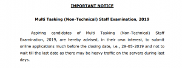

**SSC MTS recruitment 2019 Notification Out** | welcome to [www.FreeGovtJobAlert.in](http://www.FreeGovtJobAlert.in) recently the staff selection commission has published a requirement for Multi Tasking Staff (Non Technical) vacancies 2019.this is the best chance to build your career in government sector. so who candidate are interested in this vacancy can read the notification & apply Online. 

## **SSC MTS recruitment @ ssc.nic.in**

<table style="height: 1456px; width: 82.0253%; border-color: #030000; border-style: double;" width="592"><tbody><tr style="height: 81px;"><td style="width: 119.624%; text-align: center; height: 81px;" colspan="2">
Staff Selection Commission (SSC)

Multi Tasking (Non-Technical) Staff Examination 2019
</td></tr><tr style="height: 29px;"><td style="height: 29px; width: 119.624%; background-color: #2a5a8e; text-align: center;" colspan="2"><strong>Important Date</strong></td></tr><tr style="height: 22px;"><td style="width: 53.8462%; text-align: center; height: 22px;">Starting date for Online Apply</td><td style="width: 65.7776%; text-align: center; height: 22px;"><strong>22/04/2019</strong></td></tr><tr style="height: 22px;"><td style="width: 53.8462%; text-align: center; height: 22px;">Last date for Online Apply</td><td style="width: 65.7776%; text-align: center; height: 22px;"><strong>29/05/2019 up to 05:00 P.M.</strong></td></tr><tr style="height: 22px;"><td style="width: 53.8462%; text-align: center; height: 22px;">Last Date for Payment of Fee through Online</td><td style="width: 65.7776%; text-align: center; height: 22px;"><strong>31/05/2019 up to 05:00 P.M.</strong></td></tr><tr style="height: 22px;"><td style="width: 53.8462%; text-align: center; height: 22px;">Last Date for Generation of Offline Challan</td><td style="width: 65.7776%; text-align: center; height: 22px;"><strong>31/05/2019 up to 05:00 P.M.</strong></td></tr><tr style="height: 22px;"><td style="width: 53.8462%; text-align: center; height: 22px;">Last Date for Payment of Fee through Challan</td><td style="width: 65.7776%; text-align: center; height: 22px;"><strong>01/06/2019 during working hours of Bank</strong></td></tr><tr style="height: 22px;"><td style="width: 53.8462%; text-align: center; height: 22px;">Starting Date for Computer Based Exam (Tier-I)</td><td style="width: 65.7776%; text-align: center; height: 22px;"><strong>02/08/2019</strong></td></tr><tr style="height: 22px;"><td style="width: 53.8462%; text-align: center; height: 22px;">Last Date for&nbsp;Computer Based Exam (Tier-I)</td><td style="width: 65.7776%; text-align: center; height: 22px;"><strong>06/09/2019</strong></td></tr><tr style="height: 15px;"><td style="width: 53.8462%; text-align: center; height: 15px;">Date of Tier-II Examination (Descriptive Paper)</td><td style="width: 65.7776%; text-align: center; height: 15px;"><strong>17/11/2019</strong></td></tr><tr style="height: 28px;"><td style="width: 119.624%; height: 28px; background-color: #2a5a8e; text-align: center;" colspan="2"><strong>Qualification</strong><strong></strong></td></tr><tr style="height: 61px;"><td style="text-align: center; width: 119.624%; height: 61px;" colspan="2">Details of class 10th&nbsp;(subject, type of degree, marks obtained and year of passing)<strong></strong></td></tr><tr style="height: 28px;"><td style="width: 119.624%; height: 28px; background-color: #2a5a8e; text-align: center;" colspan="2"><strong>Age Limit</strong></td></tr><tr style="height: 28px;"><td style="width: 53.8462%; text-align: center; height: 28px;"><strong>Category</strong></td><td style="width: 65.7776%; text-align: center; height: 28px;"><strong>Max. Age Limit</strong></td></tr><tr style="height: 28px;"><td style="width: 53.8462%; text-align: center; height: 28px;">SC/ST</td><td style="width: 65.7776%; text-align: center; height: 28px;">30 years</td></tr><tr style="height: 28px;"><td style="width: 53.8462%; text-align: center; height: 28px;">OBC</td><td style="width: 65.7776%; text-align: center; height: 28px;">28 years</td></tr><tr style="height: 28px;"><td style="width: 53.8462%; text-align: center; height: 28px;">PH(GEN)</td><td style="width: 65.7776%; text-align: center; height: 28px;">35 years</td></tr><tr style="height: 28px;"><td style="width: 53.8462%; text-align: center; height: 28px;">PH(OBC)</td><td style="width: 65.7776%; text-align: center; height: 28px;">38 Years</td></tr><tr style="height: 28px;"><td style="width: 53.8462%; text-align: center; height: 28px;">PH(SC/ST)</td><td style="width: 65.7776%; text-align: center; height: 28px;">40 years</td></tr><tr style="height: 28px;"><td style="width: 53.8462%; text-align: center; height: 28px;">Ex-Servicemen(GEN)</td><td style="width: 65.7776%; text-align: center; height: 28px;">28 years</td></tr><tr style="height: 28px;"><td style="width: 53.8462%; text-align: center; height: 28px;">Ex-Servicemen(OBC)</td><td style="width: 65.7776%; text-align: center; height: 28px;">29 years</td></tr><tr style="height: 28px;"><td style="width: 53.8462%; text-align: center; height: 28px;">Ex-Servicemen(SC/ST)</td><td style="width: 65.7776%; text-align: center; height: 28px;">33 years</td></tr><tr style="height: 57px;"><td style="width: 53.8462%; text-align: center; height: 57px;">Domiciled in the State of Jammu &amp; Kashmir(GEN)</td><td style="width: 65.7776%; text-align: center; height: 57px;">30 years</td></tr><tr style="height: 57px;"><td style="width: 53.8462%; text-align: center; height: 57px;">Domiciled in the State of Jammu &amp; Kashmir(OBC)</td><td style="width: 65.7776%; text-align: center; height: 57px;">33 years</td></tr><tr style="height: 57px;"><td style="width: 53.8462%; text-align: center; height: 57px;">Domiciled in the State of Jammu &amp; Kashmir(SC/ST)</td><td style="width: 65.7776%; text-align: center; height: 57px;">35 years</td></tr><tr style="height: 28px;"><td style="height: 28px; width: 119.624%; background-color: #2a5a8e; text-align: center;" colspan="2"><strong>Application Fee</strong></td></tr><tr style="height: 21px;"><td style="height: 21px; text-align: center; width: 53.8462%;"><strong>Category</strong></td><td style="height: 21px; width: 65.7776%; text-align: center;"><strong>Fee</strong></td></tr><tr style="height: 21px;"><td style="height: 21px; width: 53.8462%; text-align: center;">General-OBC</td><td style="height: 21px; width: 65.7776%; text-align: center;"><strong>100/-</strong></td></tr><tr style="height: 21px;"><td style="height: 21px; width: 53.8462%; text-align: center;">&nbsp;Women, SC, ST, PWD &amp; ESM</td><td style="height: 21px; width: 65.7776%; text-align: center;"><strong>Nill</strong></td></tr><tr style="height: 21px;"><td style="background-color: #2a5a8e; width: 119.624%; height: 21px; text-align: center;" colspan="2"><strong>Payment Mode (Online/ Offline)</strong></td></tr><tr style="height: 44px;"><td style="text-align: center; width: 119.624%; height: 44px;" colspan="2"><strong>&nbsp;BHIM UPI/ SBI Challan/ Net Banking by using Visa, Master Card, Maestro, RuPay Credit/ Debit Card</strong></td></tr><tr style="height: 21px;"><td style="background-color: #2a5a8e; width: 119.624%; height: 21px; text-align: center;" colspan="2"><strong>Nationality/ Citizenship</strong></td></tr><tr style="height: 172px;"><td style="text-align: center; height: 172px; width: 119.624%;" colspan="2">
A candidate must be either:

<ul><li style="text-align: left;">&nbsp;a citizen of India, or</li><li style="text-align: left;">&nbsp;a subject of Nepal, or</li><li style="text-align: left;">&nbsp;a subject of Bhutan, or</li><li style="text-align: left;">&nbsp;a Tibetan refugee who came over to India, before the 1st January 1962, with the intention of permanently settling in India.&nbsp;</li><li style="text-align: left;">&nbsp;a person of Indian origin who has migrated from Pakistan, Burma, Sri Lanka, East African countries of Kenya, Uganda, the United Republic of Tanzania(Formerly Tanganyika and Zanzibar), Zambia, Malawi, Zaire, Ethiopia and Vietnam with the intention of permanently settling in India.</li></ul></td></tr><tr style="height: 36px;"><td style="width: 119.624%; background-color: #2a5a8e; height: 36px; text-align: center;" colspan="2"><strong>Important Links</strong></td></tr><tr style="height: 28px;"><td style="text-align: center; width: 53.8462%; height: 28px;"><strong>SSC MTS recruitment Notice</strong></td><td style="text-align: center; width: 65.7776%; height: 28px;"><a href="https://freegovtjobalert.in/wp-content/uploads/2019/07/SSC-MTS-recruitment-Notic.pdf" target="_blank" rel="noopener noreferrer"><strong>Click Here&nbsp;</strong></a></td></tr><tr style="height: 28px;"><td style="text-align: center; width: 53.8462%; height: 28px;"><strong>Apply Online</strong></td><td style="text-align: center; width: 65.7776%; height: 28px;"><a style="color: #ff0000;" href="https://ssc.nic.in/Registration/Home" target="_blank" rel="noopener noreferrer"><strong>Click Here&nbsp;</strong></a></td></tr><tr style="height: 28px;"><td style="text-align: center; width: 53.8462%; height: 28px;"><strong>Application Status</strong></td><td style="text-align: center; width: 65.7776%; height: 28px;"><a style="color: #ff0000;" href="https://ssc.nic.in/Portal/GetMTSApplicationStatus" target="_blank" rel="noopener noreferrer"><strong>Click Here&nbsp;</strong></a></td></tr><tr style="height: 28px;"><td style="text-align: center; width: 53.8462%; height: 28px;"><strong>Syllabus &amp; Exam Pattern</strong></td><td style="text-align: center; width: 65.7776%; height: 28px;"><a href="https://freegovtjobalert.in/ssc-mts-syllabus-exam-pattern/" target="_blank" rel="noopener noreferrer"><strong>Click Here</strong></a></td></tr><tr style="height: 28px;"><td style="text-align: center; width: 53.8462%; height: 28px;"><strong>Selection Process</strong></td><td style="text-align: center; width: 65.7776%; height: 28px;"><a href="https://freegovtjobalert.in/ssc-mts-selection-process/" target="_blank" rel="noopener noreferrer"><strong>Click Here</strong></a></td></tr><tr style="height: 28px;"><td style="text-align: center; width: 53.8462%; height: 28px;"><strong>Admit Card</strong></td><td style="text-align: center; width: 65.7776%; height: 28px;"><a style="color: #ff0000;" href="https://freegovtjobalert.in/ssc-admit-card/" target="_blank" rel="noopener noreferrer"><strong>Click Here</strong></a></td></tr><tr style="height: 28px;"><td style="text-align: center; width: 53.8462%; height: 28px;"><strong>Detailed Official Notification</strong></td><td style="text-align: center; width: 65.7776%; height: 28px;"><a href="https://freegovtjobalert.in/wp-content/uploads/2019/07/SSC-MTS-recruitment-2019.pdf" target="_blank" rel="noopener noreferrer"><strong>Click Here</strong></a></td></tr><tr style="height: 28px;"><td style="text-align: center; width: 53.8462%; height: 28px;"><strong>SSC MTS recruitment News Paper Notification</strong></td><td style="text-align: center; width: 65.7776%; height: 28px;"><a href="https://freegovtjobalert.in/wp-content/uploads/2019/07/SSC-MTS-recruitment-2019.pdf" target="_blank" rel="noopener noreferrer"><strong>Click Here&nbsp;</strong></a></td></tr><tr style="height: 28px;"><td style="text-align: center; width: 53.8462%; height: 28px;"><strong>SSC MTS recruitment Official Website</strong></td><td style="text-align: center; width: 65.7776%; height: 28px;"><a style="color: #ff0000;" href="https://ssc.nic.in" target="_blank" rel="noopener noreferrer"><strong>SSC.NIC.IN</strong></a></td></tr></tbody></table>
