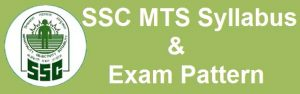

**SSC MTS Syllabus & Exam Pattern 2022**: The **Staff Selection Commission** will hold a competitive examination for the recruitment of Multi Tasking Staff. Here you can find **SSC MTS Syllabus**, **SSC MTS Exam Pattern**. SSC MTS exam paper-1 & paper-2 date is announced in an official notification @ [ssc.nic.in](https://ssc.nic.in) 

  

Scheme of Examination:

- The examination will consist of a Computer Based Examination (Paper-I) and a Descriptive Paper (Paper-II).
- The dates of examinations indicated below are tentative. Any change in the schedule of examinations will be informed to the candidates through the website of the Commission.

**SSC MTS 2022 Exam Pattern (Paper 1)**

Paper-I (Computer Based Examination-Objective Type)

<table style="height: 99px; border-style: double; width: 51.0714%;"><tbody><tr style="height: 20px;"><td style="height: 20px; width: 143px; text-align: center; background-color: #2a5a8e;">Subject (Not in sequence)</td><td style="height: 20px; width: 143px; text-align: center; background-color: #2a5a8e;">Maximum Marks</td><td style="height: 20px; width: 143px; text-align: center; background-color: #2a5a8e;">Time Duration&nbsp;</td></tr><tr style="height: 20px;"><td style="height: 20px; width: 143px; text-align: center;">General Intelligence &amp; Reasoning(25 Questions)</td><td style="height: 20px; width: 143px; text-align: center;">25</td><td style="height: 79px; width: 143px; text-align: center;" rowspan="4">90 Minutes</td></tr><tr style="height: 19px;"><td style="height: 19px; width: 143px; text-align: center;">General English(25 Questions)</td><td style="height: 19px; width: 143px; text-align: center;">25</td></tr><tr style="height: 20px;"><td style="height: 20px; width: 143px; text-align: center;">Numerical Aptitude(25 Questions)</td><td style="height: 20px; width: 143px; text-align: center;">25</td></tr><tr style="height: 20px;"><td style="height: 20px; width: 143px; text-align: center;">General Awareness(25 Questions)</td><td style="height: 20px; width: 143px; text-align: center;">25</td></tr></tbody></table>

  **Other Detail For SSC MTS Syllabus & Exam Pattern 2022 (Paper 1):**

- Paper-I will consist of Objective Type, Multiple choice questions only.
- The questions will be set both in English & Hindi for Part-II, III & IV.
- There will be negative marking of 0.25 marks for each wrong answer.

SSC MTS Syllabus for Computer Based Examination (Paper-I):

<table style="height: 250px; width: 79%; border-style: double;" width="79%"><tbody><tr style="height: 88px;"><td style="text-align: center; width: 166.25px; height: 88px; background-color: #2a5a8e;">General Intelligence &amp; Reasoning</td><td style="width: 140px; height: 88px; background-color: #2a5a8e;">English Language</td><td style="width: 162.5px; height: 88px; background-color: #2a5a8e;">Numerical Aptitude</td><td style="width: 121.25px; height: 88px; background-color: #2a5a8e;">General Awareness</td></tr><tr style="height: 350px;"><td style="width: 166.25px; height: 237px; text-align: center;">*Classification* *Analogy* *Coding-Decoding* *Matrix* *Word Formation* *Venn Diagram* *Direction/Distance* *Blood Relation* *Missing Numbers* *Non-Verbal Reasoning* *Verbal Reasoning*</td><td style="width: 140px; height: 237px; text-align: center;">*Reading Comprehension* *Fill in the Blanks Spellings* *Phrases and Idioms* *Synonyms and Antonyms* *One word Substitution* *Sentence Correction* *Error Spotting*</td><td style="width: 162.5px; height: 237px; text-align: center;">*Simplification* *Interest* *Percentage* *Ratio and Proportion* *Average* *Problem on Ages* *Speed, Distance and Time* *Profit and Loss* *Number Series* *Number System* *Mensuration* *Time and Work* *DI* *Mixture Problem* *Algebra* *Geometry* *Trigonometry*</td><td style="width: 121.25px; height: 237px; text-align: center;">*Static GK* *Science* *Books and Authors* *Current Affairs* *Dates, Portfolios*</td></tr></tbody></table>

**SSC MTS 2022 Exam Pattern (Paper 2)**

- Paper-II will only be of qualifying nature and is intended to test elementary language skills in view of categorization of the post as Group-C and in view of job requirements.
- However, marks scored by the candidates in Paper-II will be used to decide merit in case more than one candidate score equal normalized marks in Paper-I.
- There will be **No negative marking Paper-2** of SSC MTS 2022

<table style="height: 82px; border-style: double;"><tbody><tr style="height: 41px;"><td style="text-align: center; height: 41px; width: 240px; background-color: #2a5a8e;">Subject</td><td style="text-align: center; height: 41px; width: 162.5px; background-color: #2a5a8e;">Maximum Marks</td><td style="text-align: center; height: 41px; width: 192.5px; background-color: #2a5a8e;">Time Duration</td></tr><tr style="height: 41px;"><td style="text-align: center; height: 41px; width: 240px;">Short Essay/Letter in English or in any language included in the 8th schedule of the Constitution.</td><td style="text-align: center; height: 41px; width: 162.5px;">50</td><td style="text-align: center; height: 41px; width: 192.5px;">30 Minutes</td></tr></tbody></table>

  **SSC MTS 2022 Syllabus for (Paper 2):**

- The Paper will be set in Hindi, English and in other languages mentioned in the 8th Schedule of the Constitution as given in Annexure-XIV, to test basic language skills commensurate with the educational qualification prescribed for the post.
- Candidates will be required to write one short essay/ letter.

Note: The Applicants Are Requested to Read the Official Notification Carefully Before Apply.

<table style="border-collapse: collapse; width: 100%; height: 180px;"><tbody><tr style="height: 30px;"><td style="width: 100%; background-color: #2a5a8e; text-align: center; height: 30px;" colspan="2"><h3>Important Links</h3></td></tr><tr style="height: 25px;"><td style="width: 50%; text-align: center; height: 25px;">Apply Online&nbsp;</td><td style="width: 50%; text-align: center; height: 25px;"><a href="https://freegovtjobalert.in/ssc-multi-tasking-staff-recruitment/" target="_blank" rel="noopener">Click Here</a></td></tr><tr style="height: 25px;"><td style="width: 50%; text-align: center; height: 25px;">Join our Google Groups to Get Updates</td><td style="width: 50%; text-align: center; height: 25px;"><a href="https://groups.google.com/g/freegovtjobalert" target="_blank" rel="noopener">Join Now</a></td></tr><tr style="height: 25px;"><td style="width: 50%; text-align: center; height: 25px;">Whatsapp Group</td><td style="width: 50%; text-align: center; height: 25px;">&nbsp;<a href="https://chat.whatsapp.com/CPXYZzGBfKUIUrw4yxM3gG" target="_blank" rel="noopener">Group1</a> (New) | <a href="https://chat.whatsapp.com/CCZNzwLUok28fDcrBN14BQ" target="_blank" rel="noopener">Group2</a> | <a href="https://chat.whatsapp.com/BkbmqeRRYWJFMuieHVvHH8" target="_blank" rel="noopener">Group3</a> </td></tr><tr style="height: 25px;"><td style="width: 50%; text-align: center; height: 25px;">Get <a href="https://freegovtjobalert.in" target="_blank" rel="noopener">Free Govt Job Alert</a> On Mobile&nbsp;</td><td style="width: 50%; text-align: center; height: 25px;"><a href="https://telegram.me/free_govtjobalert" target="_blank" rel="noopener">Telegram</a> | <a href="https://www.facebook.com/Freegovtjobalert247/" target="_blank" rel="noopener">Facebook</a> | <a href="https://feedburner.google.com/fb/a/mailverify?uri=Freegovtjobalertin&amp;loc=en_US" target="_blank" rel="noopener noreferrer">Email</a></td></tr></tbody></table>

**Latest Jobs:**

\[catlist name="job-notification" numberposts=20 orderby=modified date\]
