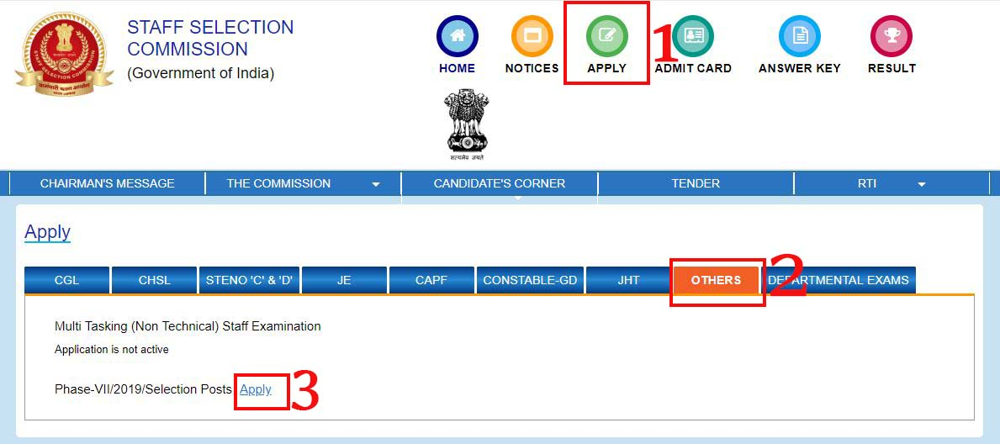

**SSC recruitment 2019**: Staff Selection Commission has published the notification regarding various vacancies of selection Post Phase-VII. this **SSC selection post phase 7 2019** is in various Departments in across India. staff selection commission is invited for eligible candidates who completed 10th, 12th, any graduate. Interested and eligible candidates can apply for **SSC Selection Posts (Phase-VII) Online Form 2019** before Date 31-08-2019. we have mentioned all the details about selection Post Phase-VII such as **selection Post Phase-VII Recruitment online form 2019**, eligible criteria, Age limits, pay scale, also you can get selection Post Phase-VII the official notification PDF in this page.

## SSC Selection Post Phase-VII Vacancy Details

<table style="height: 461px; width: 84.9475%; border-collapse: collapse; border-style: double;"><tbody><tr style="height: 132px;"><td style="width: 100%; text-align: center; height: 10px;" colspan="2">Staff Selection Commission

SSC recruitment 2019
SSC Selection Post Phase-VII 1350 Vacancies
</td></tr><tr style="height: 30px;"><td style="width: 100%; height: 30px; background-color: #2a5a8e; text-align: center;" colspan="2"><h3><strong>&nbsp;</strong><strong>Selection Post Phase-VII </strong><strong>Important Dates</strong></h3></td></tr><tr style="height: 22px;"><td style="width: 50%; text-align: center; height: 22px;">Starting Dates for submission of online applications</td><td style="width: 50%; text-align: center; height: 22px;">06-08-2019</td></tr><tr style="height: 22px;"><td style="width: 50%; text-align: center; height: 22px;">Last Dates for submission of online applications</td><td style="width: 50%; text-align: center; height: 22px;">31-08-2019</td></tr><tr style="height: 25px;"><td style="width: 50%; text-align: center; height: 25px;">Last date for receipt of application</td><td style="width: 50%; text-align: center; height: 25px;">31-08-2019(up to 5:00 P.M)</td></tr><tr style="height: 25px;"><td style="width: 50%; text-align: center; height: 25px;">Last date for making online fee payment</td><td style="width: 50%; text-align: center; height: 25px;">02-09-2019(5:00 P.M)</td></tr><tr style="height: 25px;"><td style="width: 50%; text-align: center; height: 25px;">Last date for generation of offline Challan</td><td style="width: 50%; text-align: center; height: 25px;">02-09-2019(5:00 P.M)</td></tr><tr style="height: 50px;"><td style="width: 50%; text-align: center; height: 50px;">Last date for payment through Challan (during working hours of Bank)</td><td style="width: 50%; text-align: center; height: 50px;">04-09-2019</td></tr><tr style="height: 25px;"><td style="width: 50%; text-align: center; height: 25px;">Date of Computer Based Examination</td><td style="width: 50%; text-align: center; height: 25px;">14-10-2019 To 18-10-2019</td></tr><tr style="height: 30px;"><td style="height: 30px; background-color: #2a5a8e; text-align: center; width: 100%;" colspan="2"><h3><strong>SSC Selection Posts Phase-VII Eligibility Criteria&nbsp;</strong></h3></td></tr><tr style="height: 64px;"><td style="width: 100%; text-align: center; height: 64px;" colspan="2">Check Notification for Post Name Wise Eligibility Criteria, Qualification, No. of Vacancy, Age Limit, Payscale All Details Available: <a style="color: #ff0000;" href="https://freegovtjobalert.in/wp-content/uploads/2019/08/Notification-SSC-Selection-Posts-Phase-VII-Posts.pdf" target="_blank" rel="noopener noreferrer"><strong>SSC Selection Posts Phase-VII Notification Download PDF</strong></a></td></tr><tr style="height: 30px;"><td style="width: 100%; height: 30px; background-color: #2a5a8e; text-align: center;" colspan="2"><h3><strong>SSC Selection Posts Application Fee&nbsp;</strong></h3></td></tr><tr style="height: 30px;"><td style="width: 100%; text-align: center; height: 30px;" colspan="2"><ul><li style="text-align: left;">Fee payable: <strong>Rs. 100/-</strong></li><li style="text-align: left;">Women/ SC/ ST/ PWD/ Ex-Serviceman Candidates:<strong> Nill</strong></li></ul>
(Fee can be paid online through BHIM UPI, Net Banking, by using Visa, Mastercard, Maestro, RuPay Credit or Debit cards or in SBI Branches by generating SBI Challan.)
</td></tr><tr style="height: 30px;"><td style="width: 100%; height: 30px; background-color: #2a5a8e; text-align: center;" colspan="2"><h3><strong>SSC Selection Important Links&nbsp;</strong></h3></td></tr><tr style="height: 10px;"><td style="width: 50%; text-align: center; height: 10px;"><strong>Apply Online&nbsp;</strong></td><td style="width: 50%; text-align: center; height: 10px;"><strong><a style="color: #ff0000;" title="SSC" href="https://ssc.nic.in/Registration/Home" target="_blank" rel="noopener noreferrer">Registration</a>&nbsp;|&nbsp;<a style="color: #ff0000;" title="SSC" href="https://ssc.nic.in/" target="_blank" rel="noopener noreferrer">Login</a></strong></td></tr><tr style="height: 36px;"><td style="width: 50%; text-align: center; height: 23px;"><strong>Notification</strong></td><td style="width: 50%; text-align: center; height: 23px;"><a href="https://freegovtjobalert.in/wp-content/uploads/2019/08/Notification-SSC-Selection-Posts-Phase-VII-Posts.pdf" target="_blank" rel="noopener noreferrer"><strong>Click Here&nbsp;</strong></a></td></tr><tr style="height: 10px;"><td style="width: 50%; text-align: center; height: 10px;"><strong>&nbsp;Official Website</strong></td><td style="width: 50%; text-align: center; height: 10px;"><a style="color: #ff0000;" href="https://ssc.nic.in" target="_blank" rel="noopener noreferrer"><strong>Click Here&nbsp;</strong></a></td></tr></tbody></table>

### How To Apply For SSC Selection Posts Phase-VII?

1. candidates got Staff selection commission official website: [ssc.nic.in](https://ssc.nic.in)
2. Login With Your **Username (Registration Number)** and P**assword** ****(SSC Registration Password). if you Don't have registration number and password then register on SSC Official website and save your registration number & password for future use.****
3. After login Click On **Apply** Button.
4. Click On **Others** button
5. You find  **Phase-VII/2019/Selection Posts Apply** Now Click on APPLY button.
