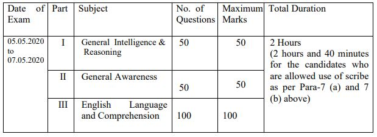

**SSC Recruitment 2019:** Staff Selection Commission Has Published Short Notice For Fill Up Stenographer Post. SSC Recruitment 2019 to the Posts of Stenographer in Different Ministries, Departments of Government of India and Subordinates Offices. SSC Stenographer Online Form Available on 20-09-2019. Eligible and Interested candidates can fill up SSC Stenographer online application Form 2019. to Know About SSC Recruitment Stenographer post Details Like Education Qualification, SSC stenographer eligibility Age Limits, SSC stenographer salary, SSC stenographer exam pattern, SSC stenographer cut off How To Apply, Etc. Given Below.

## SSC Recruitment 2019 For Stenographer Grade C&D Post Details

<table style="height: 1511px; width: 84.9475%; border-collapse: collapse; border-style: double;"><tbody><tr style="height: 80px;"><td style="width: 100%; text-align: center; height: 50px;" colspan="2">Staff Selection Commission

SSC Recruitment 2019

SSC Stenographer Posts Vacancy</td></tr><tr style="height: 30px;"><td style="width: 100%; height: 30px; background-color: #2a5a8e; text-align: center;" colspan="2"><h3><strong>&nbsp;Important Dates</strong></h3></td></tr><tr style="height: 22px;"><td style="width: 50%; text-align: center; height: 22px;">Starting Date for Registration</td><td style="width: 50%; text-align: center; height: 22px;">20-09-2019</td></tr><tr style="height: 22px;"><td style="width: 50%; text-align: center; height: 22px;">Last Date for Registration</td><td style="width: 50%; text-align: center; height: 22px;">18-10-2019</td></tr><tr style="height: 25px;"><td style="width: 50%; text-align: center; height: 25px;">Online Fee Payment Last Date</td><td style="width: 50%; text-align: center; height: 25px;">20-10-2019</td></tr><tr style="height: 25px;"><td style="width: 50%; text-align: center; height: 25px;">Offline Challan Generation Last Date</td><td style="width: 50%; text-align: center; height: 25px;">20-10-2019</td></tr><tr style="height: 25px;"><td style="width: 50%; text-align: center; height: 25px;">Last Date Payment Through Challan</td><td style="width: 50%; text-align: center; height: 25px;">22-10-2019</td></tr><tr style="height: 25px;"><td style="width: 50%; text-align: center; height: 25px;">Computer based Exam</td><td style="width: 50%; text-align: center; height: 25px;">05 to 07-05-2020</td></tr><tr style="height: 30px;"><td style="width: 100%; height: 30px; background-color: #2a5a8e; text-align: center;" colspan="2"><h3><strong>SSC Recruitment Vacancy Details</strong></h3></td></tr><tr style="height: 22px;"><td style="text-align: center; height: 22px; width: 50%;">Job Recruitment Board</td><td style="text-align: center; width: 50%; height: 22px;">SSC Recruitment 2019</td></tr><tr style="height: 25px;"><td style="text-align: center; width: 50%; height: 25px;">Post</td><td style="text-align: center; width: 50%; height: 25px;">Stenographer</td></tr><tr style="height: 25px;"><td style="text-align: center; width: 50%; height: 25px;">No of Vacancies</td><td style="text-align: center; width: 50%; height: 25px;">Update Soon</td></tr><tr style="height: 25px;"><td style="text-align: center; width: 50%; height: 25px;">Job Location</td><td style="text-align: center; width: 50%; height: 25px;">&nbsp;anywhere in India</td></tr><tr style="height: 25px;"><td style="text-align: center; width: 50%; height: 25px;">Application Mode</td><td style="text-align: center; width: 50%; height: 25px;">Online</td></tr><tr style="height: 30px;"><td style="width: 100%; height: 30px; background-color: #2a5a8e; text-align: center;" colspan="2"><h3><strong>Eligibility Criteria</strong></h3></td></tr><tr style="height: 14px;"><td style="width: 50%; text-align: center; height: 14px;"><strong>Education Qualification</strong></td><td style="width: 50%; text-align: center; height: 14px;"><strong>Age Limits</strong></td></tr><tr style="height: 30px;"><td style="width: 50%; text-align: center; height: 30px;">Candidates Must Have Passed 12th Exam From Recognized Board.</td><td style="width: 50%; text-align: center; height: 30px;">
Minimum: 18 Years

Maximum: 30 Years For Stenographer Grade C

Maximum: 27 Years For Stenographer Grade D
</td></tr><tr style="height: 30px;"><td style="width: 100%; height: 30px; background-color: #2a5a8e; text-align: center;" colspan="2"><h3><strong>Mode of Selection</strong></h3></td></tr><tr style="height: 637px;"><td style="text-align: center; height: 637px;" colspan="2"><ol><li style="text-align: left;">Computer Based Exam</li><li style="text-align: left;">Skill Test</li><li style="text-align: left;">Document Verification</li></ol>
All candidates who register themselves in response to this advertisement by the closing date and time and whose applications are found to be in order and are provisionally accepted by the Commission as per the terms and conditions of this&nbsp; Notice of Examination will be assigned Roll numbers and issued Admission Certificate (AC) for appearing in the Computer Based Examination.

Admission Certificates for all stages of examination will be issued online on the websites of concerned Regional/ Sub-Regional Office of the Commission. Candidates are therefore advised to regularly visit the websites of the Commission Headquarters (i.e. https://ssc.nic.in) and concerned Regional/ Sub-Regional office of the Commission under whose jurisdiction the examination centers opted by the candidate are located.

Minimum qualifying marks in Computer Based Examination, are as follows:

<ul><li style="text-align: left;">UR: 30%</li><li style="text-align: left;">OBC/ EWS: 25%</li><li style="text-align: left;">All other categories (SC, ST, PwD, ESM, etc): 20%</li></ul>
Based on the marks scored in the Computer Based Examination, candidates will be shortlisted, category-wise, to appear in the Skill Test(s) for the post(s) they have applied for.

Final selection and allocation of Ministries/ Departments will be made on the basis of the performance of candidates in the Computer Based Examination and the preference of Posts/ Departments exercised by them at the time of Document Verification.
</td></tr><tr style="height: 16px;"><td style="height: 16px; background-color: #2a5a8e; text-align: center;" colspan="2"><h3><strong>Exam Pattern</strong></h3></td></tr><tr style="height: 220px;"><td style="width: 100%; text-align: center; height: 220px;" colspan="2">

[caption id="attachment_1063" align="aligncenter" width="619"] SSC Stenographer Exam[/caption]<ul><li style="text-align: left;">Question paper will be of Objective Type Multiple Choice only.</li><li style="text-align: left;">There will be negative marking of 0.25 marks for each wrong answer.</li><li style="text-align: left;">Tentative Answer Keys will be placed on the Commission‟s website after the Examination.</li><li style="text-align: left;">Candidates may go through the Answer Keys and submit representations, if any, within the time limit given by the Commission through on-line modality only, on payment of Rs 100/- per question.</li><li style="text-align: left;">Any representation regarding Answer Keys received within the time limit fixed by the Commission at the time of uploading of the Answer Keys will be scrutinized before finalizing the Answer Keys and the decision of the Commission in this regard will be final. No representation regarding Answer Keys shall be entertained later.</li></ul></td></tr><tr style="height: 30px;"><td style="width: 100%; height: 30px; background-color: #2a5a8e; text-align: center;" colspan="2"><h3><strong>SSC Application Fee&nbsp;</strong></h3></td></tr><tr style="height: 30px;"><td style="width: 100%; text-align: center; height: 30px;" colspan="2"><ul><li style="text-align: left;">General Candidates: Rs. 100/-</li><li style="text-align: left;">SC/ST/PWD/Woman/ESM Candidates: None</li><li style="text-align: left;">Payment Mode: Online/Offline</li></ul></td></tr><tr style="height: 30px;"><td style="width: 100%; height: 30px; background-color: #2a5a8e; text-align: center;" colspan="2"><h3><strong>Important Links&nbsp;</strong></h3></td></tr><tr style="height: 10px;"><td style="width: 50%; text-align: center; height: 10px;"><strong>Apply Online&nbsp;</strong></td><td style="width: 50%; text-align: center; height: 10px;"><a href="https://ssc.nic.in/Portal/Apply" target="_blank" rel="noopener noreferrer"><strong>Click Here</strong></a></td></tr><tr><td style="width: 50%; text-align: center;"><strong>Detailed Notification</strong></td><td style="width: 50%; text-align: center;"><a href="https://freegovtjobalert.in/wp-content/uploads/2019/09/Stenographer-Detailed-Notification.pdf" target="_blank" rel="noopener noreferrer"><strong>Click Here</strong></a></td></tr><tr style="height: 25px;"><td style="width: 50%; text-align: center; height: 25px;"><strong>Date Change Notice</strong></td><td style="width: 50%; text-align: center; height: 25px;"><a href="https://freegovtjobalert.in/wp-content/uploads/2019/09/Important_Notice_stenographer-grade-CD.pdf" target="_blank" rel="noopener noreferrer"><strong>Click Here</strong></a></td></tr><tr style="height: 36px;"><td style="width: 50%; text-align: center; height: 23px;"><strong>Short Notice</strong></td><td style="width: 50%; text-align: center; height: 23px;"><a href="https://freegovtjobalert.in/wp-content/uploads/2019/09/Short-Notification-SSC-Stenographer-Grade-CD.pdf" target="_blank" rel="noopener noreferrer"><strong>Click Here</strong></a></td></tr><tr style="height: 10px;"><td style="width: 50%; text-align: center; height: 10px;"><strong>&nbsp;Official Website</strong></td><td style="width: 50%; text-align: center; height: 10px;"><a href="https://ssc.nic.in/" target="_blank" rel="noopener noreferrer"><strong>Click Here</strong></a></td></tr></tbody></table>

### How To Apply For SSC Stenographer Online Form 2019?

1. candidates got Staff selection commission official website: [ssc.nic.in](https://ssc.nic.in)
2. Login With Your **Username (Registration Number)** and P**assword** **(SSC Registration Password). if you Don't have registration number and password then register on SSC Official website and save your registration number & password for future use.**
3. After login Click On **Apply** Section.
4. Click On STENO 'C' & 'D' Section
5. You find  **STENOGRAPHER GRADE 'C' & 'D' EXAMINATION 2018 Apply** Now Click on APPLY button.
6. Pay Application Fee Via Online
7. Upload Required Documents. (Images, Certificates)
8. Submit Application.
9. Download & Save Application For Future Use.
10. Done
