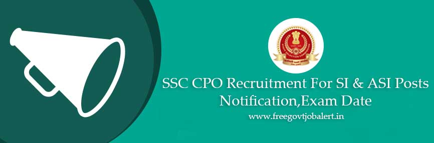

SSC Updates on 31-1-2022:

- The Staff Selection Commission vide result dated 10.12.2021 had shortlisted 4003 candidates (396 Female and 3607 Male) for appearing in the Document Verification of Sub-Inspector in Delhi Police, CAPFs, and Assistant Sub-Inspector in CISF Examination, 2019.
- Download [SSC SI & ASI Result 2022 Released @ssc.nic.in](https://ssc.nic.in/SSCFileServer/PortalManagement/UploadedFiles/Write_up_Final_Result_SICPO2019_latest_31012022.pdf)

* * *

# 

**SSC CPO recruitment 2019(SSC SI & ASI):** Staff Selection Commission and Central Police Organization has Released Short Notice For Recruitment of SI & ASI. And Now Published Fully Detailed **SSC CPO 2019-20 notification** on Official Website. The Staff Selection Commission Will Held an Open Competitive Computer Based Examination For Recruitment of Sub Inspector in Delhi Police, Central Armed Police Force And Assistant Sub Inspector in CISF. **SSC CPO 2019 vacancy** Number will be Update Soon on Official Website @ssc.nic.in. to know about **SSC SI ASI recruitment 2019** Details Like Education Qualification, SSC CPO Syllabus, Age Limits, SI & ASI Eligibility Criteria, Application Fee, **SSC CPO admit card**, Selection Process, SSC CPO result, **SSC SI & ASI Online Form 2019** Information, Etc. Given in this page Below.

## SSC CPO Recruitment For SI & ASI Posts Vacancy Details

<table style="height: 654px; width: 84.9475%; border-collapse: collapse; border-style: double;"><tbody><tr style="height: 80px;"><td style="width: 100%; text-align: center; height: 50px;" colspan="2">Staff Selection Commission (SSC)

Central Police Organization (CPO)

SSC CPO recruitment 2019

SI &amp; ASI Vacancy&nbsp;</td></tr><tr style="height: 30px;"><td style="width: 100%; height: 30px; background-color: #2a5a8e; text-align: center;" colspan="2"><h3><strong>&nbsp;Important Dates</strong></h3></td></tr><tr style="height: 22px;"><td style="width: 50%; text-align: center; height: 22px;">Starting Date for Application</td><td style="width: 50%; text-align: center; height: 22px;">17-09-2019</td></tr><tr style="height: 22px;"><td style="width: 50%; text-align: center; height: 22px;">Last Date for Application</td><td style="width: 50%; text-align: center; height: 22px;">16-10-2019</td></tr><tr><td style="width: 50%; text-align: center;">Last date for receipt of applications</td><td style="width: 50%; text-align: center;">16-10-2019 (17:00)</td></tr><tr><td style="width: 50%; text-align: center;">Last date for making online fee payment</td><td style="width: 50%; text-align: center;">18-10-2019 (17:00)</td></tr><tr><td style="width: 50%; text-align: center;">Last date for generation of offline Challan</td><td style="width: 50%; text-align: center;">18-10-2019 (17:00)</td></tr><tr><td style="width: 50%; text-align: center;">Last date for payment through Challan (during working hours of Bank)</td><td style="width: 50%; text-align: center;">19-10-2019</td></tr><tr><td style="width: 50%; text-align: center;">Date of Computer Based Examination (Paper-I)</td><td style="width: 50%; text-align: center;">11-12-2019 to 13-12-2019</td></tr><tr><td style="width: 50%; text-align: center;">Date of Paper-II</td><td style="width: 50%; text-align: center;">to be notified later</td></tr><tr style="height: 30px;"><td style="width: 100%; height: 30px; background-color: #2a5a8e; text-align: center;" colspan="2"><h3><strong>&nbsp;SI &amp; ASI Vacancy Details</strong></h3></td></tr><tr style="height: 22px;"><td style="text-align: center; height: 22px; width: 50%;">Job Recruitment Board</td><td style="text-align: center; width: 50%;">SSC CPO Recruitment 2019</td></tr><tr><td style="text-align: center; width: 50%;">Post</td><td style="text-align: center; width: 50%;">Various Posts</td></tr><tr><td style="text-align: center; width: 50%;">No of Vacancies</td><td style="text-align: center; width: 50%;">Update Soon</td></tr><tr><td style="text-align: center; width: 50%;">Job Location</td><td style="text-align: center; width: 50%;">Anywhere in India</td></tr><tr><td style="text-align: center; width: 50%;">Application Mode</td><td style="text-align: center; width: 50%;">Online</td></tr><tr style="height: 30px;"><td style="width: 100%; height: 30px; background-color: #2a5a8e; text-align: center;" colspan="2"><h3><strong>Eligibility Criteria&nbsp;</strong></h3></td></tr><tr style="height: 14px;"><td style="width: 50%; text-align: center; height: 14px;"><strong>Education Qualification</strong></td><td style="width: 50%; text-align: center; height: 14px;"><strong>Age Limits</strong></td></tr><tr style="height: 30px;"><td style="width: 50%; text-align: center; height: 30px;">Educational Qualification for all posts is Bachelor’s degree from a recognized university or equivalent.</td><td style="width: 50%; text-align: center; height: 30px;">Minimum: 20 Years

Maximum: 25 Years

(Check Notification For Age Relaxing)</td></tr><tr><td style="width: 100%; background-color: #2a5a8e; text-align: center;" colspan="2"><h3><strong>SSC CPO Salary/Pay Scale</strong></h3></td></tr><tr><td style="width: 100%; text-align: center;" colspan="2"><ul><li style="text-align: left;"><strong>Sub-Inspector (GD) in CAPFs</strong>: The post carries pay scale of <strong>Level-6 (Rs.35,400-1,12,400/-)</strong> and is classified as Group “B” (Non-Gazetted), Non-Ministerial.</li><li style="text-align: left;"><strong>Sub Inspector (Executive) - (Male/ Female) in Delhi Police:</strong> The post carries pay scale of <strong>Leve-6</strong> <strong>(Rs.35,400-1,12,400/-)</strong> and is classified as Group “C” (Non-Gazetted) by Delhi Police.</li><li style="text-align: left;"><strong>Assistant Sub-Inspector (Executive) in CISF:</strong> The post carries pay scale of<strong> Level-5 (Rs.29,200-92,300)</strong> and is classified as Group “C” (Non-Gazetted).</li></ul></td></tr><tr style="height: 30px;"><td style="width: 100%; height: 30px; background-color: #2a5a8e; text-align: center;" colspan="2"><h3><strong>Application Fee&nbsp;</strong></h3></td></tr><tr style="height: 30px;"><td style="width: 100%; text-align: center; height: 30px;" colspan="2"><ul><li style="text-align: left;">General Candidates: <strong>Rs. 100/-</strong></li><li style="text-align: left;">SC/ST/Woman/ESM Candidates: <strong>None</strong></li><li style="text-align: left;">Payment Mode: <strong>Online/Offline</strong>(BHIM UPI, Net Banking or by using Visa MasterCard, Maestro RuPay Credit, or Debit cards or in cash at SBI Branch by generating SBI Challan)</li></ul></td></tr><tr style="height: 30px;"><td style="width: 100%; height: 30px; background-color: #2a5a8e; text-align: center;" colspan="2"><h3><strong>SSC Recruitment Important Links&nbsp;</strong></h3></td></tr><tr style="height: 10px;"><td style="width: 50%; text-align: center; height: 10px;"><strong>Apply Online&nbsp;</strong></td><td style="width: 50%; text-align: center; height: 10px;"><a href="https://ssc.nic.in/Portal/Apply" target="_blank" rel="noopener noreferrer"><strong>Click Here</strong></a></td></tr><tr><td style="width: 50%; text-align: center;"><strong>Eligibility Criteria</strong></td><td style="width: 50%; text-align: center;"><a href="https://freegovtjobalert.in/ssc-si-asi-eligibility-criteria/" target="_blank" rel="noopener noreferrer"><strong>Click Here</strong></a></td></tr><tr><td style="width: 50%; text-align: center;"><strong>Syllabus &amp; Exam Pattern</strong></td><td style="width: 50%; text-align: center;"><a href="https://freegovtjobalert.in/ssc-si-asi-syllabus-exam-pattern/" target="_blank" rel="noopener noreferrer"><strong>Click Here</strong></a></td></tr><tr><td style="width: 50%; text-align: center;"><strong>Detailed Notification</strong></td><td style="width: 50%; text-align: center;"><a href="https://freegovtjobalert.in/wp-content/uploads/2019/09/Detailed-Notification-SSC-SI-ASI-Posts.pdf" target="_blank" rel="noopener noreferrer"><strong>Click Here</strong></a></td></tr><tr style="height: 36px;"><td style="width: 50%; text-align: center; height: 23px;"><strong>Short Notice</strong></td><td style="width: 50%; text-align: center; height: 23px;"><a href="https://freegovtjobalert.in/wp-content/uploads/2019/09/Short-Notice-SSC-SI-ASI-Posts.pdf" target="_blank" rel="noopener noreferrer"><strong>Click Here</strong></a></td></tr><tr style="height: 10px;"><td style="width: 50%; text-align: center; height: 10px;"><strong>&nbsp;Official Website</strong></td><td style="width: 50%; text-align: center; height: 10px;"><a href="https://ssc.nic.in/" target="_blank" rel="noopener noreferrer"><strong>Click Here</strong></a></td></tr></tbody></table>

### How to Apply For SSC CPO Recruitment SI & ASI Post?

1. candidates got Staff selection commission official website: [ssc.nic.in](https://ssc.nic.in)
2. Login With Your **Username (Registration Number)** and P**assword** **(SSC Registration Password). if you Don't have registration number and password then register on SSC Official website and save your registration number & password for future use.**
3. After login Click On **Apply** Section.
4. Click On **CAPF** Section
5. You find  **Sub-Inspector in Delhi Police, CAPFs and Assistant Sub-Inspector In CISF Examination, 2019 Apply** Now Click on APPLY button.
6. Pay Application Fee Via Online/Offline
7. Upload Required Documents. (Images, Certificates)
8. Submit Application.
9. Download & Save Application For Future Use.
10. Done
