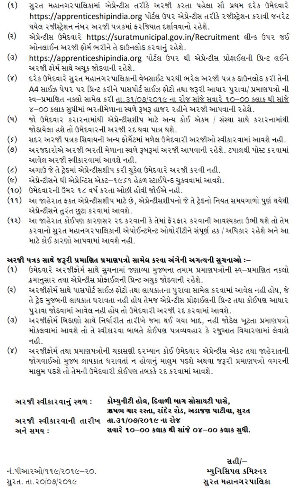

**Surat Municipal Corporation (SMC Requirement 2019)** Has Published a Notification for the Recruitment of Apprentice Wireman, Apprentice Electrician, Apprentice Health Sanitary Inspector, Apprentice Fitter, Apprentice Computer Operator Programming Assistant, Apprentice Medical Laboratory Technician (Pathology) Class, Apprentice Accountant, Back Office Apprentice, Micro Finance Apprentice, Apprentice Assistant (Human Resource).total of **700 Apprentice Vacancy** at Surat Municipal Corporation. Those Candidates Are Interested and Qualified for the Above Post Can Read the Notification and Apply Online Before 31st July 2019. We Have Mentioned All Detail About Surat Municipal Corporation Apprentice Recruitment Education Qualification, Age Limit, Online Form Fee, How to Apply Online for **SMC Apprentice Requirement 2019** All Info Given Below.

## Surat Mahanagar Palika Recruitment 2019 | 700 Apprentice vacancies @suratmunicipal.gov.in

## **Surat Municipal Corporation Apprentice Recruitment 2019 Post Details**

<table style="height: 654px; width: 84.014%; border-collapse: collapse; border-style: double;"><tbody><tr><td style="width: 99.8612%; text-align: center;" colspan="3">
<strong>Surat Municipal Corporation</strong>

<strong>Apprentice Post Vacancies&nbsp;2019</strong>

<strong>Total Vacancies - 700</strong>
</td></tr><tr><td style="width: 99.8612%; background-color: #2a5a8e; text-align: center;" colspan="3"><strong>Importent Date</strong></td></tr><tr><td style="text-align: center; width: 47.7779%;">Starting Date to Apply Online</td><td style="text-align: center; width: 52.0833%;" colspan="2"><strong>22-07-2019</strong></td></tr><tr><td style="text-align: center; width: 47.7779%;">Last Date to Apply Online</td><td style="text-align: center; width: 52.0833%;" colspan="2"><strong>31-07-2019</strong></td></tr><tr><td style="width: 99.8612%; background-color: #2a5a8e; text-align: center;" colspan="3"><h3><strong>&nbsp;</strong><strong style="font-family: 'Roboto Condensed', sans-serif; font-size: 20px;">Surat Municipal Corporation Apprentice Vacancy Details</strong><strong style="font-size: 12pt;">&nbsp;</strong></h3></td></tr><tr style="height: 24px;"><td style="width: 47.7779%; height: 24px; text-align: center;"><strong>Apprentice Tred Name (Post Name)</strong></td><td style="width: 23.611%; height: 24px; text-align: center;"><strong>No. of Vacancies</strong></td><td style="width: 28.4723%; height: 24px; text-align: center;"><strong>Education Qualification</strong></td></tr><tr style="height: 25px;"><td style="width: 47.7779%; text-align: center; height: 25px;">&nbsp;Electrician Apprentice</td><td style="width: 23.611%; text-align: center; height: 25px;">50</td><td style="width: 28.4723%; text-align: center; height: 25px;">ITI Tred Pass</td></tr><tr style="height: 25px;"><td style="width: 47.7779%; text-align: center; height: 25px;">Wireman Apprentice</td><td style="width: 23.611%; text-align: center; height: 25px;">100</td><td style="width: 28.4723%; text-align: center; height: 25px;">ITI Tred Pass</td></tr><tr style="height: 25px;"><td style="width: 47.7779%; text-align: center; height: 25px;">Fitter Apprentice</td><td style="width: 23.611%; text-align: center; height: 25px;">20</td><td style="width: 28.4723%; text-align: center; height: 25px;">ITI Tred Pass</td></tr><tr style="height: 25px;"><td style="width: 47.7779%; text-align: center; height: 25px;">Health Sanitary Inspector Apprentice</td><td style="width: 23.611%; text-align: center; height: 25px;">20</td><td style="width: 28.4723%; text-align: center; height: 25px;">ITI Tred Pass</td></tr><tr style="height: 50px;"><td style="width: 47.7779%; text-align: center; height: 50px;">&nbsp;Computer Operator Programming Assistant Apprentice</td><td style="width: 23.611%; text-align: center; height: 50px;">100</td><td style="width: 28.4723%; text-align: center; height: 50px;">ITI Tred Pass</td></tr><tr style="height: 50px;"><td style="width: 47.7779%; text-align: center; height: 50px;">&nbsp;Medical Laboratory Technician (Pathology) Apprentice</td><td style="width: 23.611%; text-align: center; height: 50px;">10</td><td style="width: 28.4723%; text-align: center; height: 50px;">12th Pass With Physics Chemistry Biology</td></tr><tr style="height: 25px;"><td style="width: 47.7779%; text-align: center; height: 25px;">&nbsp;Accountant Apprentice</td><td style="width: 23.611%; text-align: center; height: 25px;">170</td><td style="width: 28.4723%; text-align: center; height: 25px;">12th Pass</td></tr><tr style="height: 25px;"><td style="width: 47.7779%; text-align: center; height: 25px;">Back Office Apprentice</td><td style="width: 23.611%; text-align: center; height: 25px;">170</td><td style="width: 28.4723%; text-align: center; height: 25px;">-</td></tr><tr style="height: 50px;"><td style="width: 47.7779%; text-align: center; height: 50px;">Apprentice Assistant (Human Resource)</td><td style="width: 23.611%; text-align: center; height: 50px;">50</td><td style="width: 28.4723%; text-align: center; height: 50px;">B.A/B.B.A</td></tr><tr style="height: 25px;"><td style="width: 47.7779%; text-align: center; height: 25px;">Micro Finance Apprentice</td><td style="width: 23.611%; text-align: center; height: 25px;">10</td><td style="width: 28.4723%; text-align: center; height: 25px;">12th Pass</td></tr><tr style="height: 30px;"><td style="width: 99.8612%; height: 30px; background-color: #2a5a8e; text-align: center;" colspan="3"><h3 style="text-align: center;"><strong>Important links For SMC Apprentice Vacancy</strong></h3></td></tr><tr style="height: 25px;"><td style="width: 47.7779%; text-align: center; height: 25px;"><strong>&nbsp;Registration</strong></td><td style="width: 52.0833%; text-align: center; height: 25px;" colspan="2"><strong><a style="color: #ff0000;" href="https://apprenticeshipindia.org/candidate-registration" target="_blank" rel="noopener noreferrer">Click Here</a></strong></td></tr><tr style="height: 25px;"><td style="width: 47.7779%; text-align: center; height: 25px;"><strong>Apprentice Apply Online</strong></td><td style="width: 52.0833%; text-align: center; height: 25px;" colspan="2"><strong><a style="color: #ff0000;" href="https://suratmunicipal.gov.in/Recruitment/ApplyJob.aspx" target="_blank" rel="noopener noreferrer">Click Here</a></strong></td></tr><tr style="height: 25px;"><td style="width: 47.7779%; text-align: center; height: 25px;"><strong>Official Notification</strong></td><td style="width: 52.0833%; text-align: center; height: 25px;" colspan="2"><strong><a style="color: #ff0000;" href="https://freegovtjobalert.in/wp-content/uploads/2019/07/surat-municipal-corporation-apprentice-vacancy-notification-PDF.pdf" target="_blank" rel="noopener noreferrer">Click Here</a></strong></td></tr><tr style="height: 25px;"><td style="width: 47.7779%; text-align: center; height: 25px;"><strong>Official Website</strong></td><td style="width: 52.0833%; text-align: center; height: 25px;" colspan="2"><strong><a style="color: #ff0000;" href="www.suratmunicipal.gov.in" target="_blank" rel="noopener noreferrer">www.suratmunicipal.gov.in</a></strong></td></tr></tbody></table>

 

### **How To Apply For SMC Apprentice Vacancy?**

1. First Of All, Candidate Need To Register On [https://apprenticeshipindia.org/](https://apprenticeshipindia.org/) As A Trade Apprentice And Generate Apprentice Registration Number.
2. Then Goto SMC Recruitment Website [https://suratmunicipal.gov.in/Recruitment/](https://suratmunicipal.gov.in/Recruitment/) 
3. Fill Up The Apprentice Application Form With Candidates Details, Education Quficational Age Proof, Adress proof, And All requirement Details.
4. Then Click On Submit Button.
5. After The Submit An application Form,Download Application Form And Take Print For Future Use.
6. Take Profile Print From https://apprenticeshipindia.org and Attach With Application Form.

 

### **Important Instructions For Candidates**

 

