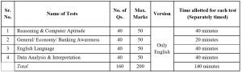

Syllabus and Exam pattern of SIB CLARK & SIB PO 2019

## South Indian Bank (SIB) Recruitment 2019- 545 Vacancies

<table style="height: 436px; width: 92.6488%; border-collapse: collapse; border-style: double;"><tbody><tr style="height: 22px;"><td style="width: 50%; height: 16px; text-align: center;">Exam Name</td><td style="width: 50%; height: 16px; text-align: center;">
<strong>South Indian Bank (SIB) Recruitment 2019</strong>
</td></tr><tr style="height: 36px;"><td style="width: 50%; height: 28px; text-align: center;">Bank Name</td><td style="width: 50%; height: 28px; text-align: center;">
South Indian Bank
</td></tr><tr style="height: 22px;"><td style="width: 50%; height: 10px; text-align: center;">Post Name</td><td style="width: 50%; height: 10px; text-align: center;">PROBATIONARY CLERKS

PROBATIONARY OFFICERS</td></tr><tr style="height: 22px;"><td style="width: 50%; height: 22px; text-align: center;">Total Vacancy</td><td style="width: 50%; height: 22px; text-align: center;">545</td></tr><tr style="height: 22px;"><td style="width: 50%; height: 22px; text-align: center;">Job Location</td><td style="width: 50%; height: 22px; text-align: center;">Across India</td></tr><tr style="height: 25px;"><td style="width: 50%; text-align: center; height: 25px;">Exam Mode</td><td style="width: 50%; text-align: center; height: 25px;">Online Test</td></tr><tr style="height: 82px;"><td style="width: 50%; text-align: center; height: 82px;">Mode Of Selection</td><td style="width: 50%; text-align: center; height: 82px;"><ol><li>Online Test</li><li>Group Discussion and Personal Interview</li></ol></td></tr><tr style="height: 25px;"><td style="width: 50%; text-align: center; height: 25px;">Official Website</td><td style="width: 50%; text-align: center; height: 25px;"><a href="https://www.southindianbank.com" target="_blank" rel="noopener noreferrer">www.southindianbank.com</a></td></tr></tbody></table>

## South Indian Bank (SIB) Recruitment selection process For SIB CLARK & SIB PO 2019

- Initial shortlisting will be done based on the marks scored in the Online Test
- Final Selection will be based on the consolidated marks obtained for Online Test and Personal Interview.
- Bank reserves the right to make required modifications in the selection process considering the number of applications for the post.

## South Indian Bank (SIB) Recruitment Exam pattern For SIB CLARK & SIB PO 2019

<table style="height: 91px; width: 91.1293%; border-collapse: collapse; border-style: double;"><tbody><tr><td style="width: 50%; text-align: center;">Stage 1</td><td style="width: 50%; text-align: center;">Online Exam (center wise exam)</td></tr><tr><td style="width: 50%; text-align: center;">Stage 2</td><td style="width: 50%; text-align: center;">Group Discussion and Personal Interview</td></tr></tbody></table>

## South Indian Bank (SIB) Recruitment Syllabus For SIB CLARK & SIB PO 2019

- There will be ¼ penalty for wrong answers.
- Tests will be made available only in English.

## South Indian Bank (SIB) Recruitment Syllabus

### SIB Syllabus For Reasoning:

- Syllogism
- Puzzles
- Linear Seating Arrangements
- Distance and Directions
- Statements and Arguments
- Statements and Assumption
- Number and Alphabet Series
- Blood Relations
- Circular Seating Arrangements
- Statements and Conclusion
- Assertion and Reasoning

### SIB Syllabus For Computer Aptitude:

- Microsoft Office (Word, Excel, PowerPoint, etc.)
- Computer Abbreviations
- Keyboard Shortcuts
- Database Management
- Internet
- Central Processing Unit (CPU)
- Operating Systems
- History and Evolution of Computers – Generations of Computers
- Computer Fundamentals
- Input and Output Devices (I/O Devices)
- Storages and Memories
- Basic Security Concepts
- Email
- Computer Terminologies

### SIB Syllabus For General/ Economy/ Banking Awareness:

- History of Banking, Rules, Laws, Abbreviations
- Banking Rates
- Countries and Capitals Countries and Currency
- Books and Authors
- Indian History And Polity
- Banking and Financial Institutions of India
- Indian Culture, Indian Geography, Indian Constitution
- Awards and Honours
- Indian Economy
- National and International Events of Importance
- Roles and Responsibilities of RBI

### SIB Syllabus For English Language:

- Tenses
- Parts of Speech (Noun, Pronoun, Verb, Adverb, Conjunction, Preparation, Adjective, etc.)
- Singular and Plural
- Subject-Verb Agreement
- Articles – A, An and The
- Voice Change – Active and Passive Voice
- Phrases and Idioms
- Narration – Direct and Indirect Speech

### SIB Syllabus For Data Analysis And Interpretation:

- Simple and Compound Interest
- Average
- Profit and Loss
- Percentage
- Ratio and Proportion

> More Govt Jobs **[Click Here](https://freegovtjobalert.in)**
