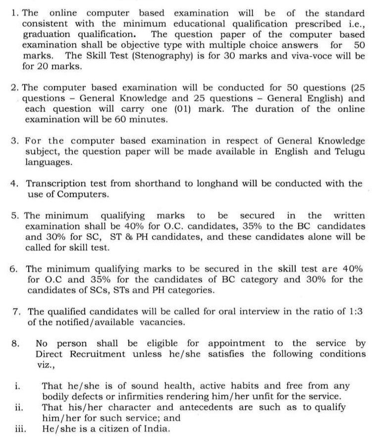

**Telangana High Court recruitment 2019:** Telangana high court has published a notification for various posts vacancy For Office Subordinate, Junior Assistant, Typist, Copyist, Process Server, Field Assistant, Stenographer Gr-III, Examiner, Record Assistant. Total 1539 Vacancies requirement In **Telangana High Court Job Vacancy 2019**. Telangana High Court Recruitment Online Form Start On 5-8-2019 to 4-9-2019. eligible candidates can apply before 4th September 2019. Candidates will get more information about these posts through the official Notifications. (Interested Candidates Can Read the Full Notification Before Apply Online)

## Telangana High Court Recruitment For Various post Vacancies Online Form

<table style="height: 628px; width: 84.9475%; border-collapse: collapse; border-style: double;"><tbody><tr style="height: 132px;"><td style="width: 100%; text-align: center; height: 24px;" colspan="2"><strong>Telangana High Court</strong>

Total 1539 Various post Vacancies</td></tr><tr style="height: 30px;"><td style="width: 100%; height: 30px; background-color: #2a5a8e; text-align: center;" colspan="2"><h3><strong>&nbsp;Important Dates</strong></h3></td></tr><tr style="height: 22px;"><td style="width: 50%; text-align: center; height: 22px;">Starting Date for Registration</td><td style="width: 50%; text-align: center; height: 22px;"><strong>05-08-2019</strong></td></tr><tr style="height: 22px;"><td style="width: 50%; text-align: center; height: 22px;">Last Date for Registration</td><td style="width: 50%; text-align: center; height: 22px;"><strong>04-09-2019</strong></td></tr><tr style="height: 30px;"><td style="width: 100%; height: 30px; background-color: #2a5a8e; text-align: center;" colspan="2"><h3><strong>&nbsp;Vacancy Details</strong></h3></td></tr><tr style="height: 22px;"><td style="text-align: center; height: 22px;" colspan="2"><table style="border-collapse: collapse; width: 100%;"><tbody><tr><td style="width: 30.2172%;"><strong>Post Name&nbsp;</strong></td><td style="width: 14.778%;"><strong>Total Vacancy</strong></td><td style="width: 55.0047%;"><strong>Qualification</strong></td></tr><tr><td style="width: 30.2172%;">Stenographer Gr III&nbsp;</td><td style="width: 14.778%;">54</td><td style="width: 55.0047%;"><ul><li>Graduate From any Recognized University</li><li>Knowledge Or Qualification in Computer Operation</li></ul></td></tr><tr><td style="width: 30.2172%;">Junior Assistant&nbsp;</td><td style="width: 14.778%;">277</td><td style="width: 55.0047%;"><ul><li>Passed Intermediate Examination Conducted By the State Board Of Intermediate Education</li><li>Knowledge Or Qualification in Computer Operation</li></ul></td></tr><tr><td style="width: 30.2172%;">Typist</td><td style="width: 14.778%;">146</td><td style="width: 55.0047%;"><ul><li>Passed Intermediate Examination Conducted By the State Board Of Intermediate Education</li><li>Knowledge Or Qualification in Computer Operation</li></ul></td></tr><tr><td style="width: 30.2172%;">Field Assistant</td><td style="width: 14.778%;">65</td><td style="width: 55.0047%;"><ul><li>Passed Intermediate Examination Conducted By the State Board Of Intermediate Education</li></ul></td></tr><tr><td style="width: 30.2172%;">Examiner&nbsp;</td><td style="width: 14.778%;">57</td><td style="width: 55.0047%;"><ul><li>Passed Intermediate Examination Conducted By the State Board Of Intermediate Education</li></ul></td></tr><tr><td style="width: 30.2172%;">Copyist</td><td style="width: 14.778%;">122</td><td style="width: 55.0047%;"><ul><li>Passed Intermediate Examination Conducted By the State Board Of Intermediate Education</li></ul></td></tr><tr><td style="width: 30.2172%;">Record Assistant&nbsp;</td><td style="width: 14.778%;">05</td><td style="width: 55.0047%;"><ul><li>Passed Intermediate Examination Conducted By the State Board Of Intermediate Education</li></ul></td></tr><tr><td style="width: 30.2172%;">Process Server</td><td style="width: 14.778%;">127</td><td style="width: 55.0047%;"><ul><li>Passed SSC Examination</li></ul></td></tr><tr><td style="width: 30.2172%;">Office Subordinate&nbsp;</td><td style="width: 14.778%;">686</td><td style="width: 55.0047%;"><ul><li>Passed 7th Class examination&nbsp;</li></ul></td></tr></tbody></table></td></tr><tr><td style="background-color: #2a5a8e; text-align: center;" colspan="2"><h3><strong>Age Limit</strong></h3></td></tr><tr><td style="width: 100%; text-align: center;" colspan="2"><ul><li style="text-align: left;">Minimum Age:&nbsp;<strong>18 Years</strong></li><li style="text-align: left;">Maximum Age:&nbsp;<strong>3</strong><strong>4 Years</strong></li><li style="text-align: left;">Age relaxation is applicable as per rules (Read Notification for more details)</li></ul></td></tr><tr style="height: 30px;"><td style="width: 100%; height: 30px; background-color: #2a5a8e; text-align: center;" colspan="2"><h3><strong>Application Fee&nbsp;</strong></h3></td></tr><tr style="height: 30px;"><td style="width: 100%; text-align: center; height: 30px;" colspan="2"><ul><li style="text-align: left;">For OC/ OBC:&nbsp;<strong>Rs. 800/-</strong></li><li style="text-align: left;">For SC/ ST:<strong>&nbsp;Rs. 400/-</strong></li><li style="text-align: left;">Payment Mode:&nbsp;<strong>Online/ Offline (Offline payment option will be disabled three days before the last date of submission of application)</strong></li></ul></td></tr><tr style="height: 30px;"><td style="width: 100%; height: 30px; background-color: #2a5a8e; text-align: center;" colspan="2"><h3><strong>Important Links</strong></h3></td></tr><tr style="height: 10px;"><td style="width: 50%; text-align: center; height: 10px;"><strong>Apply Online&nbsp;</strong></td><td style="width: 50%; text-align: center; height: 10px;"><strong><a style="color: #ff0000;" href="http://hc.ts.nic.in/hc2019/recruit31072019rc.html" target="_blank" rel="noopener noreferrer">Click Here</a></strong></td></tr><tr style="height: 36px;"><td style="width: 50%; text-align: center; height: 23px;"><strong>Notification</strong></td><td style="width: 50%; text-align: center; height: 23px;"><a style="color: #ff0000;" href="http://hc.ts.nic.in/hc2019/Subordinatecourtrecruitment_31072019.pdf" target="_blank" rel="noopener noreferrer"><strong>Click Here&nbsp;</strong></a></td></tr><tr style="height: 10px;"><td style="width: 50%; text-align: center; height: 10px;"><strong>&nbsp;Official Website</strong></td><td style="width: 50%; text-align: center; height: 10px;"><strong><a style="color: #ff0000;" href="http://hc.ts.nic.in/" target="_blank" rel="noopener noreferrer">Click Here</a>&nbsp;</strong></td></tr></tbody></table>

## Exam & Important Notes For Candidates:

## How To Apply For Telangana High Court Jobs?

1. The online application form contains two parts, 1. one tine profile registration form 2. application form
2. After completing part 1(one tine profile registration form) candidates get OTPR ID and Password. by using the same OTPR ID, candidates can apply for multiple Districts.
3. The candidates will receive a unique/individual application number for each district HE/SHE applies For.

> ### More Govt Jobs: [www.freegovtjobalert.in](https://freegovtjobalert.in)
