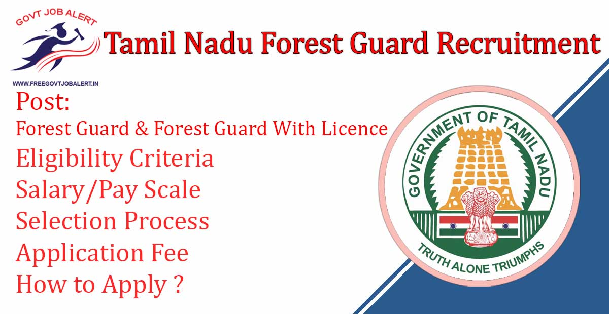
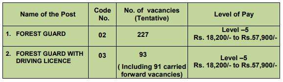

TN Forest Guard Recruitment 2019: Tamil Nadu Forest Uniformed Services Recruitment Committee has Recently Released Short Notice Regarding Filling up the post of Forest Guard & Forest Guard With Licence. As per TN Forest Guard Recruitment Short Notice, a total of 320 Vacancies are There In which 227 Forest Guard and 93 Forest Guard With Licence. Good Opportunity for those candidates who Looking for Forest Jobs in Tamil Nadu.

## **Tamil Nadu Forest Guard Recruitment 2019-20**

<table style="border-collapse: collapse; width: 100%;"><tbody><tr><td style="width: 50%; background-color: #2a5a8e; text-align: center;" colspan="2"><strong>TN Forest Guard Recruitment 2019</strong></td></tr><tr><td style="width: 50%; text-align: center;">Job Recruitment Board</td><td style="width: 50%; text-align: center;">Tamil Nadu Forest Uniformed Services Recruitment Committee</td></tr><tr><td style="width: 50%; text-align: center;">Notification No.</td><td style="width: 50%; text-align: center;">Advt No. 02/2019</td></tr><tr><td style="width: 50%; text-align: center;">Post</td><td style="width: 50%; text-align: center;">Forest Guard &amp; Forest Guard With Licence</td></tr><tr><td style="width: 50%; text-align: center;">Vacancies</td><td style="width: 50%; text-align: center;">320</td></tr><tr><td style="width: 50%; text-align: center;">Job Location</td><td style="width: 50%; text-align: center;">Anywhere in Tamil Nadu</td></tr><tr><td style="width: 50%; text-align: center;">Job Type</td><td style="width: 50%; text-align: center;"><a href="https://freegovtjobalert.in/tamilnadu-govt-jobs/" target="_blank" rel="noopener noreferrer">Tamilnadu State Jobs</a></td></tr><tr><td style="width: 50%; text-align: center;">Application Mode</td><td style="width: 50%; text-align: center;">Online</td></tr><tr><td style="width: 50%; text-align: center;">Admit Card</td><td style="width: 50%; text-align: center;">Available&nbsp;</td></tr></tbody></table>

Tamilnadu Forest Guard Recruitment Notification 2019 Will be Publish on his Officiel Website. To know about TN Forest Guard Recruitment details Like Education Qualification, Age limits, Selection Process, Application fee, how o apply, etc. — given below on this page.

<table style="border-collapse: collapse;"><tbody><tr><td style="width: 50%; background-color: #2a5a8e; text-align: center;" colspan="2"><h3><strong>Important Dates</strong></h3></td></tr><tr><td style="width: 50%; text-align: center;">Short Notification Date</td><td style="width: 50%; text-align: center;">29-10-2019</td></tr><tr><td style="width: 50%; text-align: center;">Starting Date of Online Application</td><td style="width: 50%; text-align: center;">25-01-2020</td></tr><tr><td style="width: 50%; text-align: center;">Last Date of Online Application</td><td style="width: 50%; text-align: center;">14-02-2020</td></tr><tr><td style="width: 50%; text-align: center;">Online Computer Based Test Date</td><td style="width: 50%; text-align: center;">08-03-2020</td></tr><tr><td style="width: 50%; text-align: center;">Download Test Admit Card</td><td style="width: 50%; text-align: center;">29-02-2020 to 08-03-2020</td></tr></tbody></table>

### **TN Forest Guard Vacancy Details**

- Forest Guard: 227 Posts
- Forest Guard With Licence: 93 Posts

### **Eligibility Criteria For TN Forest Guard Recruitment** 

Education Qualification

- A pass in Higher Secondary Course with Physics, Chemistry, Biology, Zoology or Botany as one of the Subject.

Age Limits

- General & Ex-Servicemen Candidates: 21 to 30 Years
- SC/ST/BC/DWBCM Candidates: 21 to 35 Years

### **TN Forest Guard Salary/Pay Scale**

### **Selection Process For TN Forest Guard**

1. Written Test
2. Skil Test
3. Interview 

### **TN Forest Guard Application Fee**

- General Candidates: Rs. 300/-
- SC/ST Candidates: Rs. 150/-
- Payment Mode: Online

### **How to Apply for TN Forest Guard Recruitment** 

1. Candidates Go to **forests.tn.gov.in**
2. Find _Direct recruitment for the posts of Forest Guard and Forest Guard with Driving Licence during 2019-20 - Advance Notice,_ Download And Check Notification.
3. Click on Apply and Enter your Details 
4. Upload Required Images
5. Pay Application Fee
6. Submit Application
7. Download & Save For Future Use.
8. Done

### **TN Forest Guard Recruitment Important Links**

- TNFUSRC Forest Guard 2020 Exam Admit Card [Download](https://freegovtjobalert.in/tnfusrc-forest-guard-exam-admit-card/)
- TNFUSRC Forest Guard Online Form 2019: [Click Here](https://tnfusrc.in/drfgjan20/)
- TN Forest Guard Recruitment Short Notice: [Click Here](https://www.forests.tn.gov.in/app/webroot/img/document/news/usrc/FG-FGDL-2019/FG_FGDL-Advance-eng.pdf)
- Tamil Nadu Forest Official website: [Click Here](https://www.forests.tn.gov.in/)

Candidates can visit www.forests.tn.gov.in to get more details about Tamil Nadu Forest Uniformed Services Recruitment Committee. Full information will be updated at Some time. To more details about TN Forest Guard Recruitment, Upcoming TN Forest Vacancy, Admit Card, Syllabus, Result, Etc. It will be published on Official website. Also, visit Regularly our website [www.freegovtjobalert.in](https://freegovtjobalert.in) for getting the Latest job Updates.
