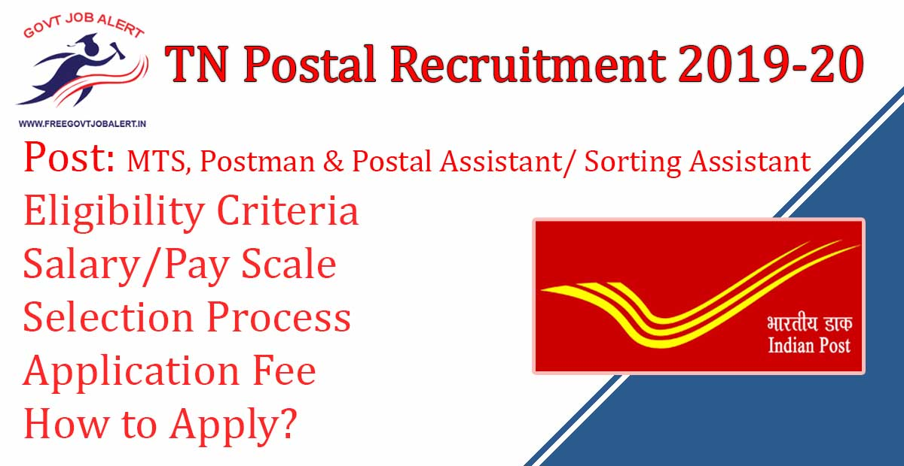

TN Postal Recruitment 2019: Tamil Nadu Post Office Has Released Notification Regarding Fill up Vacancy in Tamil Nadu Postal Circle. Application Are Invited From Meritorious Sportspersons for Appointment as Postal Assistant/Sorting Assistant, Postman/Mail Guard, and Multi Tasking Staff against the Vacancy in Tamilnadu Postal Circle. Interested Candidates Can Post TN Postal Circle Postal Asst, Postman, MTS Offline Application Form 2019 Before Last Date 31-12-2019.

## **TN Postal Recruitment 2019-20**

<table style="border-collapse: collapse; width: 100%;"><tbody><tr><td style="width: 50%; background-color: #2a5a8e; text-align: center;" colspan="2"><strong>Tamil Nadu Postal Circle Recruitment 2019</strong></td></tr><tr><td style="width: 50%; text-align: center;">Job Recruitment Board</td><td style="width: 50%; text-align: center;">Tamil Nadu Postal Circle</td></tr><tr><td style="width: 50%; text-align: center;">Notification No.</td><td style="width: 50%; text-align: center;">REP/2-2/SQ/2019</td></tr><tr><td style="width: 50%; text-align: center;">Post</td><td style="width: 50%; text-align: center;">MTS, Postman &amp; Postal Assistant/ Sorting Assistant</td></tr><tr><td style="width: 50%; text-align: center;">Vacancies</td><td style="width: 50%; text-align: center;">231</td></tr><tr><td style="width: 50%; text-align: center;">Job Location</td><td style="width: 50%; text-align: center;">Tamil Nadu State</td></tr><tr><td style="width: 50%; text-align: center;">Job Type</td><td style="width: 50%; text-align: center;">TN Post Office Jobs</td></tr><tr><td style="width: 50%; text-align: center;">Application Mode</td><td style="width: 50%; text-align: center;">Offline</td></tr></tbody></table>

Tamil Nadu Post Office Recruitment 2019 Notification Published on his Official Website With Application Form. The Candidates Must Have 10th Pass, 12th Pass, and knowledge local language. Applicants Should Have Age Between 18 to 27 Years. Selected Candidates Will be Posted in Tamilnadu Postal Circle. Eligible Candidates, Please Read Notification Carefully Before Post Application Form.

<table style="border-collapse: collapse;"><tbody><tr><td style="width: 50%; background-color: #2a5a8e; text-align: center;" colspan="2"><h3><strong>TN Postal Recruitment Important Dates</strong></h3></td></tr><tr><td style="width: 50%; text-align: center;">Last Date for Application</td><td style="width: 50%; text-align: center;">31-12-2019</td></tr><tr><td style="width: 50%; text-align: center;">Last Date for Application Fee at Post Office</td><td style="width: 50%; text-align: center;">28-12-2019</td></tr></tbody></table>

TN Post Office Job Vacancy Details Like Education Qualification, Age Limits, Salary/Pay Scale, Application Fee, how to apply, etc. It is given Below.

### **TN Post Office Vacancy Details**

- Postal Assistant/Sorting Assistant: 89 Posts
- Postman: 65 Posts
- Multi-Tasking Staff: 77 Posts

### **TN Postal Recruitment Eligibility Criteria**

Education Qualification

Postal Assistant/Sorting Assistant:

- 12th Passed From a Recognized Board.
- Required of Computer Knowledge.

Postman:

- 12th Passed From a Recognized Board.
- Knowledge of local Language.
- Required of Computer Knowledge.

Multi-Tasking Staff:

- 10th Passed From a Recognized Board.
- Knowledge of local Language.

Age Limits

- Minimum 18 Year
- Maximum:
    - Postal Assistant/Sorting Assistant/Postman:  27 Years
    - Multi-Tasking Staff: 25 Years

### **TN Postal Recruitment Salary/Pay Scale**

- Postal Assistant/Sorting Assistant: Rs. 25,500 - 81,100 (Level 4 in Pay Matrix)
- Postman: Rs. 21,700 - 69,100 (Level 3 in Pay Matrix)
- Multi-Tasking Staff: Rs. 18,000 - 56,900 (Level 1 in Pay Matrix)

### **Selection Process For TN Postal Recruitment**

- Test/Interview

### **TN Postal Recruitment Application Fee**

- Rs. 100/-
- Payment via Post Office 

### **How to Apply for TN Postal Recruitment**

1. Candidates Download Tamil Nadu Post Office Vacancy Form
2. Fill up Application Form
3. Attach Recent Passport Size Photograph and Document Copies
4. The post following Address: The Assistant Director (Recruitment), 0/o the Chief Postmaster General, Tamil Nadu Circle, Chennai – 600002

### **Important Links for TN Postal Recruitment**

- TN Post Office Recruitment Application Form 2019: [Click Here](https://tamilnadupost.nic.in/rec/SQ%20TN%20Notification2019.pdf)
- Download 231 TN Post Office Recruitment Notification 2019: [Click Here](https://tamilnadupost.nic.in/rec/SQ%20TN%20Notification2019.pdf)
- Tamil Nadu Post Office Official Website: [Click Here](https://tamilnadupost.nic.in/)

Candidates can visit https://tamilnadupost.nic.in/ to get more details about the TN Post Office Job 2019. To More Information About Tamilnadu Post Office upcoming vacancy 2019-20, latest Updates, Admit Card, Syllabus, Result, Etc. It will be published on the official website. Also, visit Regularly our website [www.freegovtjobalert.in](https://freegovtjobalert.in) for getting the Latest job Updates.
