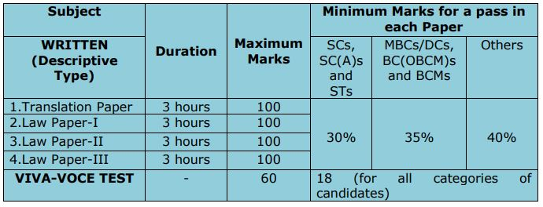

**TNPSC Civil Judge Exam** Preparation is start for those Candidates who applied and many candidates already Prepared for Court Jobs. we have Provide **TNPSC Civil Judge Exam Syllabus and Exam Pattern in Detail**. maybe all candidates know TNPSC Civil Judge Selection Process if you don't know we mentioned Link in Page Below. if you don't know the Exam pattern you can do not prepare for civil judge exam and cant Get Passing Marks in Exam. so, candidates please check carefully this page for **TNPSC Civil Judge exam preparation**.

## TNPSC Civil Judge Syllabus & Exam Pattern 2019

<table style="border-collapse: collapse; width: 76.652%; height: 199px;"><tbody><tr><td style="width: 100%; text-align: center;" colspan="2">TNPSC Civil Judge Recruitment 2019</td></tr><tr><td style="width: 43.2471%; text-align: center;">Job Recruitment Board</td><td style="width: 56.7529%; text-align: center;">Tamil Nadu Public Service Commission (TNPSC)</td></tr><tr><td style="width: 43.2471%; text-align: center;">Post name</td><td style="width: 56.7529%; text-align: center;">Civil Judge</td></tr><tr><td style="width: 43.2471%; text-align: center;">No of Vacancies</td><td style="width: 56.7529%; text-align: center;">176</td></tr><tr><td style="width: 43.2471%; text-align: center;">Job Category</td><td style="width: 56.7529%; text-align: center;">Court Jobs</td></tr><tr><td style="width: 43.2471%; text-align: center;">Job Location</td><td style="width: 56.7529%; text-align: center;">Tamil Nadu State</td></tr></tbody></table>

**TNPSC Civil Judge Exam Pattern 2019**

**TNPSC Preliminary Examination Pattern 2019 | Cut Off Marks**

\[caption id="attachment\_970" align="aligncenter" width="720"\] **TNPSC Preliminary Examination Pattern**\[/caption\]

- The Preliminary Examination will consist of one paper containing 100 multiple choice questions based on the syllabus given below.
- It will be conducted in the forenoon session. The papers will be set in both English and Tamil and each question shall carry one mark; and, 0.25 mark will be deducted for each incorrect answer.
- The duration of the Preliminary Examination will be three hours.
- The Preliminary Examination is conducted for the purpose of shortlisting the candidates and the marks obtained in the Preliminary Examination shall not be counted for determining the final order of merit of the candidates.

**TNPSC Civil Judge Syllabus for the Preliminary Examination:**

**PART-A**

- The Code of Civil Procedure, 1908
- The Negotiable Instruments Act, 1981
- The Transfer of Property Act, 1882
- The Indian Contract Act, 1872
- The Specific Relief Act, 1963
- The Constitution of India
- The Tamil Nadu Buildings (Lease and Rent Control) Act, 1960 and Tamil Nadu Regulation of Rights and Responsibilities of Landlords and Tenants Act, 2017 (Tamil Nadu Act 42 of 2017)

**PART-B**

- The Code of Criminal Procedure, 1973
- The Indian Penal Code, 1860
- The Indian Evidence Act, 1872
- The Criminal Law (Amendment) Acts
- The Criminal Minor Acts (including Information Technology Act, 2000; The Protection of Children from Sexual Offences Act, 2012).

**PART-C**

- General Knowledge (Degree standard),
- Test of Reasoning and Mental ability (S.S.L.C. standard).

**TNPSC Main Examination Pattern 2019 | Cut Off Marks**

**TNPSC Civil Judge Syllabus for the Main Written Examination**

1. Translation Paper: Translation of passages from English to Tamil and from Tamil to English. The passages will be from Pleadings, Depositions, Orders, Judgments, and Documents.
2. Law Paper – I: The Code of Civil Procedure, 1908; The Code of Criminal Procedure, 1973; The Indian Evidence Act, 1872; Principles of pleading and the Constitution of India (as Amended).
3. Law Paper-II: Framing of Issues and Writing of Judgments in Civil Cases.
4. Law Paper –III: Framing of charges and Writing of Judgments in Criminal Cases.

**Viva-Voce Test:**

- Viva-voce test shall be for sixty (60) marks and candidates of all categories shall obtain minimum 18 marks for a pass in the Viva-voce.
- The object of the viva-voce test is to assess the suitability of the candidate for the cadre by judging the mental alertness, general knowledge, knowledge of law, grasp of procedural laws and principles of law, clear and logical exposition, balance of judgment, skills, attitude, ethics, power of assimilation, power of communication, character, suitability and intellectual depth, the like of the candidate, his/her tact and ability to handle various situations in the Court, Administrative and Management Skills.
- Candidates of all categories who have obtained the minimum pass mark 18 in the viva-voce test alone are eligible for being considered for the selection.

**TNPSC Civil Judge Recruitment Important Links**

- **TNPSC Recruitment 2019 for 176 Civil Judge Vacancy Details: [Click Here](https://freegovtjobalert.in/tnpsc-recruitment-2019-for-176-civil-judge-vacancy-tnpsc-gov-in/)**
- **TNPSC Civil Judge Recruitment Application Form: [Click Here](https://apply.tnpscexams.in/apply-now?app_id=UElZMDAwMDAwMQ==)**
- **TNPSC Civil Judge selection process: [Click Here](https://freegovtjobalert.in/tnpsc-civil-judge-selection-process/)**
- **TNPSC Civil Judge Recruitment 2019 Notification: [Click Here](https://freegovtjobalert.in/wp-content/uploads/2019/09/TNPSC-Civil-Judge-Notification.pdf)**
- **TNPSC Official Website: [Click Here](http://www.tnpsc.gov.in/)**
