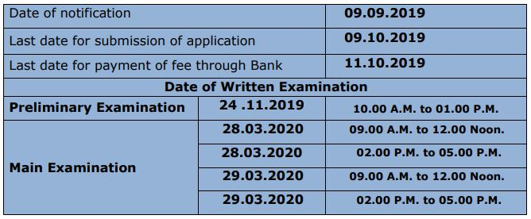

Tamil Nadu Public Service Commission has Released Notification For Recruit of the civil Judge Post. As Per TNPSC notification Total of 176 Vacancies for above Post. All TNPSC exams are Conducted by Tamilnadu Public Service Commission Board for Filling all Tamil Nadu Govt Job Vacancies. Good Chance For Those Candidates who Looking For Court Jobs In Tamil Nadu and Now they Find it TNPSC Civil Judge Vacancy. Eligible and Interested candidates can apply for TNPSC Civil Judge Application Form 2019. TN Civil Judge Online Form Date 09-09-2019 to 09-10-2019. To know About TNPSC Civil Judge Recruitment 2019 Details Like Eligibility Criteria, Age Limits, Selection Process, Application Fee, TNPSC hall ticket Date, How To apply, Etc. Given in this page below.

## TNPSC Civil Judge Recruitment 2019 Details

<table style="height: 532px; width: 84.9475%; border-collapse: collapse; border-style: double;"><tbody><tr style="height: 80px;"><td style="width: 100%; text-align: center; height: 50px;" colspan="2">Tamil Nadu Public Service Commission

TNPSC Recruitment 2019

TNPSC Civil Judge Vacancy

176 Vacancies</td></tr><tr style="height: 30px;"><td style="width: 100%; height: 30px; background-color: #2a5a8e; text-align: center;" colspan="2"><h3><strong>TNPSC exam Important Dates</strong></h3></td></tr><tr style="height: 22px;"><td style="width: 100%; text-align: center; height: 22px;" colspan="2"></td></tr><tr style="height: 30px;"><td style="width: 100%; height: 30px; background-color: #2a5a8e; text-align: center;" colspan="2"><h3><strong>TNPSC notification&nbsp;Vacancy Details</strong></h3></td></tr><tr style="height: 22px;"><td style="text-align: center; height: 22px; width: 50%;">Job Recruitment Board</td><td style="text-align: center; width: 50%; height: 22px;">Tamilnadu Public Service Commission Board</td></tr><tr style="height: 25px;"><td style="text-align: center; width: 50%; height: 25px;">Post</td><td style="text-align: center; width: 50%; height: 25px;">Civil Judge</td></tr><tr style="height: 22px;"><td style="text-align: center; width: 50%; height: 22px;">Name of Service</td><td style="text-align: center; width: 50%; height: 22px;">Tamil Nadu State Judicial Service</td></tr><tr style="height: 25px;"><td style="text-align: center; width: 50%; height: 25px;">No of Vacancies</td><td style="text-align: center; width: 50%; height: 25px;">176 (Including Carried Forward)</td></tr><tr style="height: 25px;"><td style="text-align: center; width: 50%; height: 25px;">Job Location</td><td style="text-align: center; width: 50%; height: 25px;">Tamil Nadu State</td></tr><tr style="height: 25px;"><td style="text-align: center; width: 50%; height: 25px;">Job Category</td><td style="text-align: center; width: 50%; height: 25px;">Court Jobs</td></tr><tr style="height: 25px;"><td style="text-align: center; width: 50%; height: 25px;">Application Mode</td><td style="text-align: center; width: 50%; height: 25px;">Online</td></tr><tr style="height: 30px;"><td style="width: 100%; height: 30px; background-color: #2a5a8e; text-align: center;" colspan="2"><h3><strong>Eligibility Criteria&nbsp;</strong></h3></td></tr><tr style="height: 14px;"><td style="text-align: center; height: 14px; width: 100%;" colspan="2"><ul><li style="text-align: left;">Must be a citizen of India</li><li style="text-align: left;">Should possess adequate knowledge to read, write and speak in English and Tamil.</li></ul>
<strong>Education Qualification:</strong>

1.For Practising Advocates/Pleaders and Assistant Public Prosecutors:

<ul><li style="text-align: left;">Must possess a Degree in Law of a University in India&nbsp;</li><li style="text-align: left;">Must be 3 Years practicing as an Advocate or Pleader in any Court</li></ul>
2.For Fresh Law Graduates:

<ul><li style="text-align: left;">Must be a fresh Law Graduate possessing a degree in Law from a recognized University</li><li style="text-align: left;">Must be eligible to be enrolled as an advocate.</li><li style="text-align: left;">Must have obtained the Bachelor‟s Degree of Law within a period of three years</li></ul>
<strong>Age Limits:</strong>

<ul><li style="text-align: left;">Minimum 22 Years</li><li style="text-align: left;">Maximum 40 Years</li></ul></td></tr><tr style="height: 15px;"><td style="width: 100%; height: 15px; background-color: #2a5a8e; text-align: center;" colspan="2"><h3><strong>Pay Scale</strong></h3></td></tr><tr style="height: 39px;"><td style="width: 100%; text-align: center; height: 39px;" colspan="2"><strong>Rs. 27700/- to Rs. 44770/-</strong></td></tr><tr style="height: 30px;"><td style="width: 100%; height: 30px; background-color: #2a5a8e; text-align: center;" colspan="2"><h3><strong>Application Fee&nbsp;</strong></h3></td></tr><tr style="height: 30px;"><td style="width: 100%; text-align: center; height: 30px;" colspan="2"><ul><li style="text-align: left;">Registration Fee:&nbsp;<strong>Rs. 150/-</strong></li><li style="text-align: left;">Examination Fee:<strong>&nbsp;Rs. 500/-</strong></li><li style="text-align: left;">For SC/ ST/ PWD:<strong>&nbsp;NIL</strong></li><li style="text-align: left;">Payment Mode: Online</li></ul></td></tr><tr style="height: 30px;"><td style="width: 100%; height: 30px; background-color: #2a5a8e; text-align: center;" colspan="2"><h3><strong>Important Links&nbsp;</strong></h3></td></tr><tr style="height: 10px;"><td style="width: 50%; text-align: center; height: 10px;"><strong>Apply Online&nbsp;</strong></td><td style="width: 50%; text-align: center; height: 10px;"><strong><a href="https://apply.tnpscexams.in/apply-now?app_id=UElZMDAwMDAwMQ==" target="_blank" rel="noopener noreferrer">Click Here</a></strong></td></tr><tr><td style="width: 50%; text-align: center;"><strong>TNPSC Civil Judge Syllabus &amp; Exam Pattern</strong></td><td style="width: 50%; text-align: center;"><strong><a href="https://freegovtjobalert.in/tnpsc-civil-judge-syllabus-exam-pattern-2019/" target="_blank" rel="noopener noreferrer">Click Here</a></strong></td></tr><tr><td style="width: 50%; text-align: center;"><strong>TNPSC Civil Judge selection process</strong></td><td style="width: 50%; text-align: center;"><a href="https://freegovtjobalert.in/tnpsc-civil-judge-selection-process/" target="_blank" rel="noopener noreferrer"><strong>Click Here</strong></a></td></tr><tr><td style="width: 50%; text-align: center;"><strong>TNPSC Syllabus PDF</strong></td><td style="width: 50%; text-align: center;"><a href="http://www.tnpsc.gov.in/syllabus/civil-judge.pdf" target="_blank" rel="noopener noreferrer"><strong>Click Here</strong></a></td></tr><tr style="height: 36px;"><td style="width: 50%; text-align: center; height: 23px;"><strong>Notification</strong></td><td style="width: 50%; text-align: center; height: 23px;"><a href="https://freegovtjobalert.in/wp-content/uploads/2019/09/TNPSC-Civil-Judge-Notification.pdf" target="_blank" rel="noopener noreferrer"><strong>Click Here</strong></a></td></tr><tr style="height: 10px;"><td style="width: 50%; text-align: center; height: 10px;"><strong>&nbsp;Official Website</strong></td><td style="width: 50%; text-align: center; height: 10px;"><a href="http://www.tnpsc.gov.in/" target="_blank" rel="noopener noreferrer"><strong>Click Here</strong></a></td></tr></tbody></table>

### How To Apply For TNPSC Civil Judge Post?

1. Applicants should apply only through online mode in the Commission‟s Websites [www.tnpsc.gov.in](http://www.tnpsc.gov.in)
2. One Time Registration (OTR) and “Applicant‟s Dashboard” are mandatory before applying for any post. Applicant should register only once in the One Time Registration by paying Rs.150/- as registration fee. Successfully registered One Time Registration is valid for 5 years from the date of Registration. All the applications should be submitted using the One Time Registration ID and password registered by the applicant.
3. To apply under One Time Registration system, applicants should have a scanned image of their photograph, certificates.
4. Applicants who wish to apply for this recruitment shall click “Apply” against the recruitment notified in the Commission‟s Website using the same USER ID and PASSWORD given for ONE TIME REGISTRATION.
5. After Login Check Your Details and Submit Application Form.
6. Pay Application Fee Via Online
7. After submitting the application, applicants can save their application in PDF format/take print out of the application.
8. Done

> TNPSC Recruitment notification 2019 PDF **[Download Here](https://freegovtjobalert.in/wp-content/uploads/2019/09/TNPSC-Civil-Judge-Notification.pdf)**
