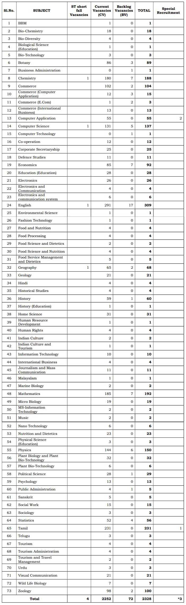

TRB Recruitment 2019: Teacher Recruitment Board, Tamil Nadu has released Notification for Recruitment of The Post of Assistant Professor. TRB TN has invited for direct recruitment from eligible candidates for the post of assistant professor in Tamil Nadu. Assistant Professor Service is Tamilnadu Collegiate Educational Service in Government Arts & science colleges and colleges Education. good chance for those candidates who looking for teacher jobs in Tamilnadu. Interested candidates, please check TRB TN jobs eligibility before apply online. The last date 30-10-2019 for submission of TRB TN Application Form on www.trb.tn.nic.in 2019.

## TRB TN Recruitment 2019 for 2331 Assistant Professor

Tamil Nadu Teacher Recruitment Board 2019 online form and official notification publish on TRB TN official Website. to know about TRB Recruitment details like syllabus, Education Qualification, Experience, Salary/Pay Scale, Etc. Given in this page below.

<table style="border-collapse: collapse; width: 100%;"><tbody><tr><td style="width: 50%; background-color: #2a5a8e;" colspan="2"><h3 style="text-align: center;"><strong>TRB Recruitment 2019</strong></h3></td></tr><tr><td style="width: 50%; text-align: center;">Job Recruitment Board</td><td style="width: 50%; text-align: center;">Teacher Recruitment Board, Tamil Nadu</td></tr><tr><td style="width: 50%; text-align: center;">Post</td><td style="width: 50%; text-align: center;">Assistant Professor</td></tr><tr><td style="width: 50%; text-align: center;">Vacancies</td><td style="width: 50%; text-align: center;">2331</td></tr><tr><td style="width: 50%; text-align: center;">Job Location</td><td style="width: 50%; text-align: center;">Tamil Nadu</td></tr><tr><td style="width: 50%; text-align: center;">Job Type</td><td style="width: 50%; text-align: center;">Teacher Jobs in Tamil Nadu</td></tr><tr><td style="width: 50%; text-align: center;">Job State</td><td style="width: 50%; text-align: center;">Tamil Nadu Govt Jobs</td></tr><tr><td style="width: 50%; text-align: center;">Application Mode</td><td style="width: 50%; text-align: center;">Online</td></tr></tbody></table>

 

<table style="border-collapse: collapse; width: 100%; height: 129px;"><tbody><tr style="height: 28px;"><td style="width: 50%; height: 28px; background-color: #2a5a8e; text-align: center;" colspan="2"><h3><strong>Important dates</strong></h3></td></tr><tr style="height: 20px;"><td style="width: 50%; height: 20px; text-align: center;">Date of First Notification</td><td style="width: 50%; height: 20px; text-align: center;">28-08-2019</td></tr><tr style="height: 20px;"><td style="width: 50%; height: 20px; text-align: center;">Date of Second Notification</td><td style="width: 50%; height: 20px; text-align: center;">04-10-2019</td></tr><tr style="height: 42px;"><td style="width: 50%; height: 10px; text-align: center;">Date of Commencement of Application through online mode</td><td style="width: 50%; height: 10px; text-align: center;">04-10-2019</td></tr><tr style="height: 42px;"><td style="width: 50%; height: 29px; text-align: center;">Last Date for Submission of Application through online mode</td><td style="width: 50%; height: 29px; text-align: center;">30-10-2019</td></tr><tr style="height: 42px;"><td style="width: 50%; height: 22px; text-align: center;">Date of Certificate Verification and Interview</td><td style="width: 50%; height: 22px; text-align: center;">Will Be Announced Later</td></tr></tbody></table>

### TRB TN Vacancy Details

<table style="border-collapse: collapse; width: 100%;"><tbody><tr><td style="width: 11.346%; text-align: center;">A.</td><td style="width: 55.3206%; text-align: center;">Backlog Vacancies</td><td style="width: 33.3333%; text-align: center;">72</td></tr><tr><td style="width: 11.346%; text-align: center;">B.</td><td style="width: 55.3206%; text-align: center;">Shortfall Vacancies</td><td style="width: 33.3333%; text-align: center;">4</td></tr><tr><td style="width: 11.346%; text-align: center;">C.</td><td style="width: 55.3206%; text-align: center;">Current Vacancies</td><td style="width: 33.3333%; text-align: center;">2252</td></tr><tr><td style="width: 11.346%; text-align: center;">D.</td><td style="width: 55.3206%; text-align: center;">To teach differently-abled (Deaf Candidates) in Tamil and Computer Application subjects (Spl recruitment for Presidency College, Chennai –5)</td><td style="width: 33.3333%; text-align: center;">3*</td></tr><tr><td style="width: 11.346%; text-align: center;" colspan="2">Total</td><td style="width: 33.3333%; text-align: center;">2331</td></tr></tbody></table>

**Subject wise Vacancies**

### Education Qualification-TRB TN Recruitment 2019

- A Pass in Post-Graduate Degree in the relevant subject with a minimum of 55% marks and a pass in the NET/ SLET/ SET / SLST / CSIR / JRF as per UGC Norms in the relevant subject.

OR

- A Pass in Post-Graduate Degree in the relevant subject with a minimum of 55% marks and Ph.D in the relevant subject awarded as per UGC norms (Certificate of compliance to be obtained from competent authority of the concerned University – to be submitted at the time of Certificate Verification).

### Age Limits

- Candidates should not have completed 57 years as on 01-07-2019 as the age of superannuation is 58 years.

### Salary/Pay Scale

- Rs. 57,700 to 1,82,400 (Level-10)

### Application fee

- General/OBC Candidates: Rs. 600/-
- SC/ST Candidates: Rs. 300/-

### TRB TN Selection Process 2019

1. Teaching Experience
2. Qualification
3. Interview

### TRB TN Exam Pattern 2019

<table style="border-collapse: collapse; width: 100%; height: 327px;"><tbody><tr style="height: 10px;"><td style="width: 4.99369%; text-align: center; height: 10px; background-color: #2a5a8e;">-</td><td style="width: 77.9724%; text-align: center; height: 10px; background-color: #2a5a8e;"><strong>Scheme of Selection</strong></td><td style="width: 17.0339%; text-align: center; height: 10px; background-color: #2a5a8e;"><strong>Maximum Marks</strong></td></tr><tr style="height: 149px;"><td style="width: 4.99369%; text-align: center; height: 149px;">1.</td><td style="width: 77.9724%; text-align: center; height: 149px;"><strong>Teaching Experience</strong>

(Teaching Experience in Universities/ Government / Aided Colleges /under approved posts of Self Financing Colleges / Medical / Engineering / Law Colleges in the relevant subject alone will be considered. (2 marks for each year and subject to a maximum of 15 marks). The candidate teaching experience in the relevant subject alone will be considered)</td><td style="width: 17.0339%; text-align: center; height: 149px;">15 Marks</td></tr><tr style="height: 144px;"><td style="width: 4.99369%; text-align: center; height: 144px;">2.</td><td style="width: 77.9724%; text-align: center; height: 144px;"><strong>Qualification</strong>

<strong>A.</strong>For Ph.D in concerned subject: 9 Marks

<strong>B.</strong>For M.Phil with SLET / NET / SET: 6 Marks

<strong>C.</strong>For PG &amp; SLET / NET / SET: 5 Marks</td><td style="width: 17.0339%; text-align: center; height: 144px;">9 Marks</td></tr><tr style="height: 24px;"><td style="width: 4.99369%; text-align: center; height: 24px;">3.</td><td style="width: 77.9724%; text-align: center; height: 24px;"><strong>Interview</strong></td><td style="width: 17.0339%; text-align: center; height: 24px;">10 Marks</td></tr></tbody></table>

### How to apply for TRB TN Recruitment

1. Candidates First Goto: [www.trb.tn.nic.in](http://trb.tn.nic.in)
2. Find And Click on "Assistant Professors for Government Arts & Science Colleges and Colleges of Education 2018 - 2019 - Online Application"
3. Click on Online application
4. Fill up the Application Form
5. Upload Required Images/Certificate
6. Pay Application Fee Through Online
7. Submit Application
8. Download & save Application For Future Use
9. Done

**The certificates to be uploaded during online registration is as follows:**

- SSLC Mark Sheet
- 10+2 Mark Sheet
- Degree Certificate
- PG Degree Certificate
- PG Consolidated Mark Sheet
- NET / SLET etc., Certificate
- M.Phil Degree if any
- Ph.D Degree if any
- Experience Certificates
- Community Certificate
- Proof for claiming Tamil Medium reservation (PSTM) if any
- NOC, if the candidate is Government Servant.

**These certificates shall be uploaded in JPG/JPEG /PNG format of size:**

- 60-120 KB

### Important Links for TRB Recruitment

- Direct Apply Online For TRB TN Recruitment 2019: [**Click Here**](http://trb.tn.nic.in/arts_2019/msg5.htm)
- TRB TN Recruitment Notification 2019 PDF: [**Click Here**](https://freegovtjobalert.in/wp-content/uploads/2019/10/TRB-TN-Recruitment-Notification-2019-PDF.pdf)
- TRB TN Official Website: [**Click Here**](http://trb.tn.nic.in/)
