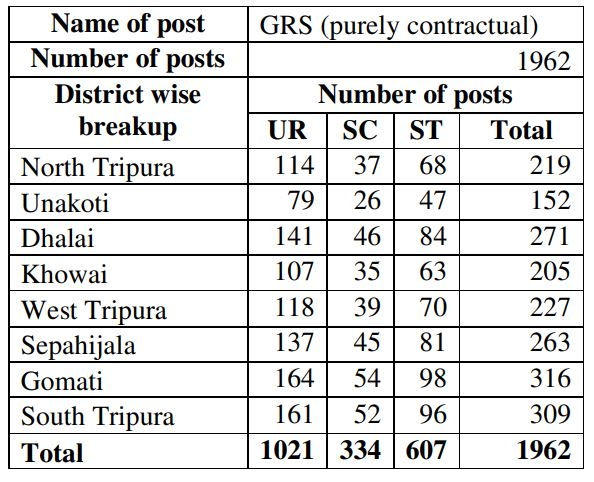

Tripura Gram Rozgar Sahayak Recruitment 2019: Rural Development Department has published notification about Tripura Gram Rozgar Sahayak vacancy 2019 on the official website @rural.tripura.gov.in. the candidates who permanent residence in Tripura, are eligible to apply for Tripura GRS Recruitment 2019. The Tripura Rural Development Department has Released vacancies for interested and eligible candidates for filling up 1962 vacancies of Gram Rozgar Sahayak Recruitment 2019. The interested candidates can apply online for Tripura Gram Rozgar Sahayak Recruitment 2019 through official website portal at rural.tripura.gov.in The Online Registration of Application is available for RRD GRS Post Vacancy Under MGNREGS from Date 08-08-2019 To 29-08-2019.

## Tripura Gram Rozgar Sahayak vacancy 2019 Details

<table style="height: 654px; width: 84.9475%; border-collapse: collapse; border-style: double;"><tbody><tr style="height: 80px;"><td style="width: 100%; text-align: center; height: 50px;" colspan="2"><strong>Rural Development Department Recruitment</strong>
Tripura Gram Rozgar Sahayak Vacancy
Tripura GRS 1962 vacancies</td></tr><tr style="height: 30px;"><td style="width: 100%; height: 30px; background-color: #2a5a8e; text-align: center;" colspan="2"><h3><strong>&nbsp;Important Dates</strong></h3></td></tr><tr style="height: 22px;"><td style="width: 50.5%; text-align: center; height: 22px;">Starting Date for Registration</td><td style="width: 49.5%; text-align: center; height: 22px;"><strong>08-08-2019</strong></td></tr><tr style="height: 22px;"><td style="width: 50.5%; text-align: center; height: 22px;">Last Date for Registration</td><td style="width: 49.5%; text-align: center; height: 22px;"><strong>29-08-2019</strong></td></tr><tr><td style="width: 50.5%; text-align: center;">Last Date of Payment of Fees</td><td style="width: 49.5%; text-align: center;"><strong>29-08-2019</strong></td></tr><tr><td style="width: 50.5%; text-align: center;">Admit Card Download</td><td style="width: 49.5%; text-align: center;"><strong>02-09-2019 to 14-09-2019</strong></td></tr><tr><td style="width: 50.5%; text-align: center;">Date of OMR exam</td><td style="width: 49.5%; text-align: center;"><strong>15-09-2019</strong></td></tr><tr><td style="width: 50.5%; text-align: center;">Time and duration of OMR exam</td><td style="width: 49.5%; text-align: center;"><strong>11:00 AM to 1:00 PM(2 Hours)</strong></td></tr><tr><td style="width: 50.5%; text-align: center;">Date of Computer Skill Test</td><td style="width: 49.5%; text-align: center;"><strong>30-09-2019</strong></td></tr><tr><td style="width: 50.5%; text-align: center;">Date of Interview</td><td style="width: 49.5%; text-align: center;"><strong>01-11-2019</strong></td></tr><tr><td style="width: 50.5%; text-align: center;">Final Result</td><td style="width: 49.5%; text-align: center;"><strong>31-12-2019</strong></td></tr><tr style="height: 30px;"><td style="width: 100%; height: 30px; background-color: #2a5a8e; text-align: center;" colspan="2"><h3><strong>&nbsp;Vacancy Details</strong></h3></td></tr><tr style="height: 22px;"><td style="text-align: center; height: 22px; width: 50.5%;">Job Recruitment Board</td><td style="text-align: center; width: 49.5%;">Tripura Rural Development Department</td></tr><tr><td style="text-align: center; width: 50.5%;">Post Name</td><td style="text-align: center; width: 49.5%;">Gram Rozgar Sahayak (GRS)</td></tr><tr><td style="text-align: center; width: 50.5%;">No of Vacancies</td><td style="text-align: center; width: 49.5%;">1962 Posts</td></tr><tr><td style="text-align: center; width: 50.5%;">Category&nbsp;</td><td style="text-align: center; width: 49.5%;">Tripura Government Jobs</td></tr><tr><td style="text-align: center; width: 50.5%;">Job Location&nbsp;</td><td style="text-align: center; width: 49.5%;">Tripura</td></tr><tr><td style="text-align: center; width: 50.5%;">Mode of Application</td><td style="text-align: center; width: 49.5%;">Online</td></tr><tr><td style="background-color: #2a5a8e; text-align: center;" colspan="2"><h3><strong>District And Category wise Vacancy Details</strong></h3></td></tr><tr><td style="text-align: center; width: 50.5%;" colspan="2">&nbsp;</td></tr><tr style="height: 30px;"><td style="width: 100%; height: 30px; background-color: #2a5a8e; text-align: center;" colspan="2"><h3><strong>Eligibility Criteria&nbsp;</strong></h3></td></tr><tr style="height: 14px;"><td style="width: 50.5%; text-align: center; height: 14px;"><strong>Education Qualification</strong></td><td style="width: 49.5%; text-align: center; height: 14px;"><strong>Age Limits</strong></td></tr><tr style="height: 30px;"><td style="width: 50.5%; text-align: center; height: 30px;">1.Madhyamik / Matriculation examination pass.

2.Working knowledge of computers and android phones to be tested through computer skill test (no certificate required for this).</td><td style="width: 49.5%; text-align: center; height: 30px;">Minimum 18 Years

Maximum 40 Years

(Upper age limit is relaxable by 5 years in case of SC/ST/PWD category. Upper age limit is also relaxable for Ex-Serviceman (ESM) as per norms. )</td></tr><tr><td style="width: 50.5%; background-color: #2a5a8e; text-align: center;" colspan="2"><h3><strong>Salary/Pay Scale</strong></h3></td></tr><tr><td style="width: 50.5%; text-align: center;" colspan="2">Pay Scale: Rs 15,000/-&nbsp; Per Month</td></tr><tr style="height: 30px;"><td style="width: 100%; height: 30px; background-color: #2a5a8e; text-align: center;" colspan="2"><h3><strong>Application Fee&nbsp;</strong></h3></td></tr><tr style="height: 30px;"><td style="width: 100%; text-align: center; height: 30px;" colspan="2">UR Candidates: Rs.200/-

SC/ST/PWD Candidates: Rs.150/-

Pay The Application Fees Via Debit/Credit Card, NetBanking, And E-Challan. Application Fee once paid, will NOT be refunded in any Situation</td></tr><tr style="height: 30px;"><td style="width: 100%; height: 30px; background-color: #2a5a8e; text-align: center;" colspan="2"><h3><strong>Important Links&nbsp;</strong></h3></td></tr><tr style="height: 10px;"><td style="width: 50.5%; text-align: center; height: 10px;"><strong>Apply Online&nbsp;</strong></td><td style="width: 49.5%; text-align: center; height: 10px;"><a href="https://www.tripurard.in/Candidate/Index.aspx" target="_blank" rel="noopener noreferrer"><strong>Click Here</strong></a></td></tr><tr style="height: 36px;"><td style="width: 50.5%; text-align: center; height: 23px;"><strong>Notification</strong></td><td style="width: 49.5%; text-align: center; height: 23px;"><a href="https://freegovtjobalert.in/wp-content/uploads/2019/08/Tripura-GRS-Recruitment-Notification-2019.pdf" target="_blank" rel="noopener noreferrer"><strong>Click Here&nbsp;</strong></a></td></tr><tr style="height: 10px;"><td style="width: 50.5%; text-align: center; height: 10px;"><strong>&nbsp;Official Website</strong></td><td style="width: 49.5%; text-align: center; height: 10px;"><a href="https://rural.tripura.gov.in/" target="_blank" rel="noopener noreferrer"><strong>Click Here</strong></a></td></tr></tbody></table>

### **How To Apply Tripura Gram Rozgar Sahayak Application Online Form?**

1. Candidates Goto Tripur Rural Development Department Official Website: [www.tripurard.in](https://www.tripurard.in/)
2. Find ADVERTISEMENT FOR RECRUITMENT TO THE POST OF GRS (CONTRACTUAL) UNDER MGNREGS and you can also see Apply Online**.**
3. Click On **Apply Online**.
4. Candidates are to register your self and create a profile.
5. After Registration, you can get Registration Number. This registration number will be USER NAME for the candidate. (Save Your Registration Number For Future Use)
6. After Complet registration Process, applicant login can be done by using the registration number. Portal will send OTP to the registered mobile number and portal will allow login after the received OTP is entered.
7. After login candidates can check your details and upload photos: 1. candidates Images 2. candidates Signature Image in JPEG Format Only. (Photo Size: 4KB to 75KB)
8. Pay Tripura Gram Rozgar Sahayak Application Fee to be only through an online portal.
9. Done

> Interested Candidates Read **RDD Tripura Gram Rozgar Sahayak Recruitment 2019 [Notification](https://freegovtjobalert.in/wp-content/uploads/2019/08/Tripura-GRS-Recruitment-Notification-2019.pdf)** Carefully Before Apply Online
