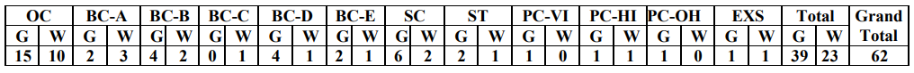

**TSCAB recruitment 2019**: Telangana State Co-operative Apex Bank Recently Publish Notification For Staff Assistant Vacancy. Online Application Are Invited For Appointment to The Post of **Staff Assistant in Telangana State Co-operative Apex Bank**. As per **TSCAB recruitment 2019 notification** Total 62 Vacancies in Apex Bank. Interested candidates can apply for TSCAB staff assistant Vacancy before 30-09-2019. To know About **TSCAB recruitment 2019 Details** Like Education Qualification, Age Limits, **TSCAB staff assistant salary**, Selection Process, Etc. Given In this Page Below.

## TSCAB Staff Assistant Vacancy Details

<table style="height: 638px; width: 84.9475%; border-collapse: collapse; border-style: double;"><tbody><tr style="height: 80px;"><td style="width: 100%; text-align: center; height: 50px;" colspan="2">Telangana State Co-operative Apex Bank Ltd.

TSCAB recruitment 2019

Staff Assistant 62 Posts</td></tr><tr style="height: 30px;"><td style="width: 100%; height: 30px; background-color: #2a5a8e; text-align: center;" colspan="2"><h3><strong>Staff Assistant Important Dates</strong></h3></td></tr><tr style="height: 22px;"><td style="width: 50%; text-align: center; height: 22px;">Opening Date for ON-LINE Registration of Application</td><td style="width: 50%; text-align: center; height: 22px;"><strong>08-09-2019</strong></td></tr><tr style="height: 22px;"><td style="width: 50%; text-align: center; height: 22px;">Closing date for ON-LINE Registration of Application</td><td style="width: 50%; text-align: center; height: 22px;"><strong>30-09-2019</strong></td></tr><tr style="height: 25px;"><td style="width: 50%; text-align: center; height: 25px;">Date For Payment of Application Fee</td><td style="width: 50%; text-align: center; height: 25px;"><strong>08-09-2019 to 30-09-2019</strong></td></tr><tr style="height: 25px;"><td style="width: 50%; text-align: center; height: 25px;">Tentative date of online test</td><td style="width: 50%; text-align: center; height: 25px;"><strong>02-11-2019</strong></td></tr><tr style="height: 30px;"><td style="width: 100%; height: 30px; background-color: #2a5a8e; text-align: center;" colspan="2"><h3><strong>TSCAB staff assistants Vacancy Details</strong></h3></td></tr><tr style="height: 22px;"><td style="text-align: center; height: 22px; width: 50%;">Job Recruitment Board</td><td style="text-align: center; width: 50%; height: 22px;">TSCAB Recruitment</td></tr><tr style="height: 25px;"><td style="text-align: center; width: 50%; height: 25px;">Post</td><td style="text-align: center; width: 50%; height: 25px;">Staff Assistant</td></tr><tr style="height: 25px;"><td style="text-align: center; width: 50%; height: 25px;">No of Vacancies</td><td style="text-align: center; width: 50%; height: 25px;">62</td></tr><tr style="height: 25px;"><td style="text-align: center; width: 50%; height: 25px;">Job Location</td><td style="text-align: center; width: 50%; height: 25px;">Telangana</td></tr><tr style="height: 25px;"><td style="text-align: center; width: 50%; height: 25px;">Job Category</td><td style="text-align: center; width: 50%; height: 25px;"><a href="https://freegovtjobalert.in/bank-jobs-recruitment/" target="_blank" rel="noopener noreferrer">Bank Jobs</a></td></tr><tr style="height: 25px;"><td style="text-align: center; width: 50%; height: 25px;">Application Mode</td><td style="text-align: center; width: 50%; height: 25px;">Online</td></tr><tr style="height: 25px;"><td style="text-align: center; width: 100%; height: 25px;" colspan="2"><strong>Category Wise Vacancy Details</strong>

</td></tr><tr style="height: 30px;"><td style="width: 100%; height: 30px; background-color: #2a5a8e; text-align: center;" colspan="2"><h3><strong>Eligibility Criteria For TSCAB staff assistants</strong></h3></td></tr><tr style="height: 14px;"><td style="width: 50%; text-align: center; height: 14px;"><strong>Education Qualification</strong></td><td style="width: 50%; text-align: center; height: 14px;"><strong>Age Limits</strong></td></tr><tr style="height: 30px;"><td style="width: 50%; text-align: center; height: 30px;"><ul><li style="text-align: left;">Any Graduate from a recognized University.</li><li style="text-align: left;">Proficiency in the Telugu language.</li><li style="text-align: left;">Knowledge of English is required.</li><li style="text-align: left;">Basic Knowledge in Computer is required</li></ul></td><td style="width: 50%; text-align: center; height: 30px;">Minimum 20 Years

Maximum 28 Years

(Check Notification For Age Relaxation)</td></tr><tr style="height: 30px;"><td style="width: 100%; background-color: #2a5a8e; text-align: center; height: 30px;" colspan="2"><h3><strong>TSCAB staff assistant salary</strong></h3></td></tr><tr style="height: 25px;"><td style="width: 100%; text-align: center; height: 25px;" colspan="2">Rs.11765–Rs.31540</td></tr><tr style="height: 30px;"><td style="width: 100%; height: 30px; background-color: #2a5a8e; text-align: center;" colspan="2"><h3><strong>TSCAB staff assistants Application Fee&nbsp;</strong></h3></td></tr><tr style="height: 30px;"><td style="width: 100%; text-align: center; height: 30px;" colspan="2"><ul><li style="text-align: left;">General/BC Candidates: Rs. 600/-</li><li style="text-align: left;">SC/ST/PWD/EXSM: Rs. 300/-</li><li style="text-align: left;">Application Fee Payment Mode: Online</li><li style="text-align: left;">Application Fee including Bank and other Charges (Non-Refundable)</li></ul></td></tr><tr style="height: 30px;"><td style="width: 100%; height: 30px; background-color: #2a5a8e; text-align: center;" colspan="2"><h3><strong>Important Links For staff assistants</strong></h3></td></tr><tr style="height: 10px;"><td style="width: 50%; text-align: center; height: 10px;"><strong>Apply Online&nbsp;</strong></td><td style="width: 50%; text-align: center; height: 10px;"><strong><a href="https://ibpsonline.ibps.in/dccbsahsep19/basic_details.php" target="_blank" rel="noopener noreferrer">Registration</a> | <a href="https://ibpsonline.ibps.in/dccbsahsep19/" target="_blank" rel="noopener noreferrer">Login</a></strong></td></tr><tr><td style="width: 50%; text-align: center;"><strong>Syllabus And Exam Pattern</strong></td><td style="width: 50%; text-align: center;"><a href="https://freegovtjobalert.in/tscab-staff-assistant-syllabus-2019-pdf-exam-pattern/" target="_blank" rel="noopener noreferrer"><strong>Click Here</strong></a></td></tr><tr><td style="width: 50%; text-align: center;"><strong>Selection Process</strong></td><td style="width: 50%; text-align: center;"><a href="https://freegovtjobalert.in/tscab-staff-assistant-selection-process/" target="_blank" rel="noopener noreferrer"><strong>Click Here</strong></a></td></tr><tr style="height: 36px;"><td style="width: 50%; text-align: center; height: 23px;"><strong>Notification</strong></td><td style="width: 50%; text-align: center; height: 23px;"><a href="https://freegovtjobalert.in/wp-content/uploads/2019/09/Notification-TSCAB-Staff-Assistant-Posts.pdf" target="_blank" rel="noopener noreferrer"><strong>Click Here</strong></a></td></tr><tr style="height: 10px;"><td style="width: 50%; text-align: center; height: 10px;"><strong>&nbsp;Official Website</strong></td><td style="width: 50%; text-align: center; height: 10px;"><a href="https://tscab.org/" target="_blank" rel="noopener noreferrer"><strong>Click Here</strong></a></td></tr></tbody></table>

### **How To Apply TSCAB recruitment staff assistant Post?**

1. Candidates to go to the TSCAB’s website https://tscab.org click on the option "**APPLY ONLINE**" which will open a new screen.
2. To register application, choose the tab "**Click here for New Registration**" and enter Name, Contact details, and Email-id. A Provisional Registration Number and Password will be generated by the system and displayed on the screen.
3. Candidate should note down the Provisional Registration Number and Password. An Email & SMS indicating the Provisional Registration number and Password will also be sent.
4. In case the candidate is unable to complete the application form in one go, he/she can save the data already entered by choosing "SAVE AND NEXT" tab. Prior to submission of the online application, candidates are advised to use the "SAVE AND NEXT" facility to verify the details in the online application form and modify the same if required.
5. Candidates are advised to carefully fill and verify the details filled in the online application themselves as no change will be possible/ entertained after clicking the FINAL SUBMIT BUTTON.
6. The Name of the candidate or his /her Father/ Husband etc. should be spelled correctly in the application as it appears in the Certificates/ Mark sheets/ Identity proof. Any change/alteration found may disqualify the candidature.
7. Validate your details and Save your application by clicking the 'Validate your details' and 'Save & Next' button.
8. Candidates can proceed to upload Photo & Signature as per the specifications are given in the Guidelines for Scanning and Upload of Photograph and Signature detailed under point "C".
9. Candidates can proceed to fill other details of the Application Form.
10. Click on the Preview Tab to preview and verify the entire application form before **FINAL SUBMIT**.
11. Modify details, if required, and click on 'FINAL SUBMIT' ONLY after verifying and ensuring that the photograph, signature uploaded and other details filled by you are correct.
12. Click on **'Payment'** Tab and proceed for payment.
13. Click on 'Submit' button.
14. Done
