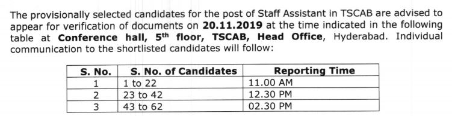

TSCAB recruitment 2019: (TSCAB Staff Assistant Result & DV Date Announced)Telangana State Co-operative Apex Bank Published Notification on 08-09-2019 For Staff Assistant Vacancy. Online Application Are Invited For Appointment to The Post of Staff Assistant in Telangana State Co-operative Apex Bank. As per TSCAB recruitment 2019 notification Total of 62 Vacancies in Apex Bank. Interested candidates had applied and Attend the Exam on Date 02-11-2019. And Now Published Results and Document Verification Date Announced.

## **TSCAB Staff Assistant Result & DV Date Announced**

> TSCAB Staff Assistant Selected Candidates Name & Roll Number Wise Details [Here](http://tscab.org/wp-content/uploads/2019/11/Results-to-the-post-of-Staff-Asst.-in-TSCAB.pdf)

The Following Documents are to be Produced in Original Along With the Medical  Report of the Pre-Recruitment Helth Checkup in Prescribed format from the doctor not below the rank of the assistant civil surgeon at the time of Verification:

- Identity Proof:
    - Identity Card/Address Proof/Pan Card/ Voter ID/ Adhar Card/ Driving License, etc.
- Proof Of Date of Birth
- Educational Qualifications
- Cast Certificate
- Experience Certificate
- Bonafide Certificate
- Proof in Support of physically Challenge/ Handicapped
- Three Passport Size Photographs

The Candidates are Advised to Submit Self-attested Photostat Copies of all the above Documents at the Verification time. 

- TSCAB Staff Assistant Vacancy Details: [Click Here](https://freegovtjobalert.in/tscab-recruitment-2019-apply-online-for-62-staff-assistant-vacancy/)
- TSCAB Staff Assistant Result & DV Date Announced Notification: [Click Here](http://tscab.org/wp-content/uploads/2019/11/Cerificates-verification.pdf)
- TSCAB Staff Assistant Result PDF: [Click Here](http://tscab.org/wp-content/uploads/2019/11/Results-to-the-post-of-Staff-Asst.-in-TSCAB.pdf)
