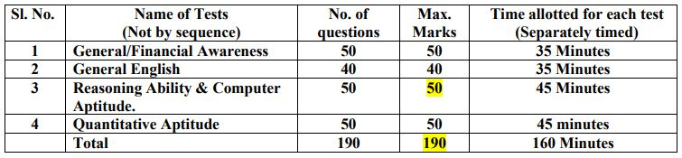

Telangana State Cooperative Apex Bank Ltd has Selection Process Depends on Exam Pattern. TSCAB Staff Assistant Online Test Conduct by IBPS. Here Applied Candidates Can Get TSCAB Staff Assistant Syllabus For Preparing of Examination and also know TSCAB Exam Pattern. It is important for the candidate to know how many questions are there for the exam, how many marks are there, how much time is there, all the information will be found in this page below.

## TSCAB Staff Assistant Syllabus & Exam Pattern

### TSCAB Staff Assistant Exam Pattern

- Online Test/Examination: 200 marks
- Objective type of test.
- The Online Test/Examination will be conducted in English.

**Penalty for Wrong Answers:**

- There will be a penalty for wrong answers marked in the Objective Tests. For each question for which a wrong answer has been given by the candidate one fourth or 0.25 of the marks assigned to that question will be deducted as penalty to arrive at corrected score.
- If a question is left blank, i.e., no answer is marked by the candidate, there will be no penalty for that question.

**Cut Off Score:**

- If the examination is held in more than one session, the scores across various sessions will be equated to adjust for slight differences in difficulty level of different test batteries used across sessions.
- More than one session is required if the nodes capacity is less or some technical disruption takes place at any center or for any candidate.
- Each candidate will have to secure a minimum score in each of the tests as well as on the total score.
- The cut-off points to qualify in each of the tests will be decided based on the group norms. Mere passing in individual tests may not be sufficient as candidates should also score sufficiently high on Total in order of merit.

### TSCAB Staff Assistant Syllabus 2019

<table style="border-collapse: collapse; width: 87.5483%; height: 635px;"><tbody><tr style="height: 22px;"><td style="width: 33.3333%; height: 22px; text-align: center;"><strong>General Awareness Study Materials:</strong></td><td style="width: 33.3333%; height: 22px; text-align: center;"><strong>Reasoning Ability&nbsp;</strong></td><td style="width: 33.3333%; height: 22px; text-align: center;"><strong>Quantitative Aptitude Study Materials</strong></td></tr><tr style="height: 613px;"><td style="width: 33.3333%; height: 613px;"><ul><li>Knowledge of Current affairs</li><li>Culture and history of India including freedom struggle</li><li>Environmental issues concerning India and the World</li><li>General scientific and technological developments etc.</li><li>Indian Economy</li><li>Indian geography</li><li>Indian Polity and constitution</li></ul></td><td style="width: 33.3333%; height: 613px;"><ul><li>Classification</li><li>Coding and Decoding</li><li>Series</li><li>Direction and Distance</li><li>Time Sequence, Number and Ranking Test</li><li>Number Puzzle</li><li>Logical Sequence of Words</li><li>Venn Diagrams</li><li>Blood Relation</li><li>Analogy</li><li>Syllogism</li><li>Mathematical Operation</li><li>Arithmetical Reasoning</li><li>Clock and Calendar</li><li>Matrix Reasoning</li><li>Statement and Reasoning</li><li>Completion of Figure</li><li>Visual Reasoning</li><li>Cube and Dice</li><li>Paper Cutting and Folding</li></ul></td><td style="width: 33.3333%; height: 613px;"><ul><li>HCF &amp; LCM</li><li>Algebraic Expressions and in Equalities</li><li>Average</li><li>Percentage</li><li>Profit and Loss</li><li>Number System &amp; Simplification</li><li>Probability</li><li>Simple &amp; Compound interest</li><li>Ratio and Proportion&amp; Partnership</li><li>Time and Work &amp; Pipes and Cisterns</li><li>Speed, Time &amp; Distance (Train, Boats &amp; Stream)</li><li>Mensuration</li><li>Trigonometry</li><li>Geometry</li><li>Mixture &amp; Allegations</li><li>Data Interpretation</li><li>Number Series</li><li>Speed, Distance and Time</li><li>Time and Work</li><li>Number System</li></ul></td></tr></tbody></table>

### TSCAB Recruitment Staff Assistant Important Links

- TSCAB Recruitment 2019 | 62 Staff Assistant Vacancy Details: [Click Here](https://freegovtjobalert.in/tscab-recruitment-2019-apply-online-for-62-staff-assistant-vacancy/)
- TSCAB Staff Assistant Online Form 2019 Apply Now: **[Registration](https://ibpsonline.ibps.in/dccbsahsep19/basic_details.php) | [Login](https://ibpsonline.ibps.in/dccbsahsep19/)**
- TSCAB Staff Assistant Selection Process: [Click Here](https://freegovtjobalert.in/tscab-staff-assistant-selection-process/)
- TSCAB Recruitment 2019 Notification PDF: [Click Here](https://freegovtjobalert.in/wp-content/uploads/2019/09/Notification-TSCAB-Staff-Assistant-Posts.pdf)
- TSCAB Official Website: [Click Here](https://tscab.org/)
