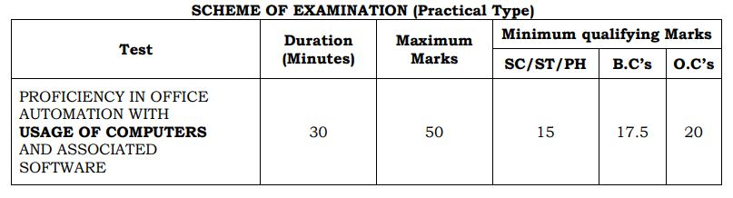

TSSPDCL JACO Syllabus 2019: The Southern Power Distribution Company of Telangana Limited Has Provide the Syllabus and the Exam Pattern for the Post of Junior Assistant Cum Computer Operator. Syllabus & Exam Pattern is Important For Every Exam. Before Start the preparation Applicants can Download TSSPDCL JACO Syllabus PDF From Here.

## TSSPDCL JACO Syllabus 2019-Download Junior Assistant Syllabus PDF

<table style="border-collapse: collapse; width: 100%;"><tbody><tr><td style="width: 50%; background-color: #2a5a8e;" colspan="2"><h3 style="text-align: center;">TSSPDCL Recruitment 2019</h3></td></tr><tr><td style="width: 50%; text-align: center;">Job Recruitment Board</td><td style="width: 50%; text-align: center;">Southern Power Distribution Company of Telangana Limited</td></tr><tr><td style="width: 50%; text-align: center;">Notification No.</td><td style="width: 50%; text-align: center;">03/2019</td></tr><tr><td style="width: 50%; text-align: center;">Post</td><td style="width: 50%; text-align: center;">Junior Assistant Cum Computer Operator</td></tr><tr><td style="width: 50%; text-align: center;">Vacancies</td><td style="width: 50%; text-align: center;">500 Posts</td></tr><tr><td style="width: 50%; text-align: center;">Job Location</td><td style="width: 50%; text-align: center;">Telangana State</td></tr><tr><td style="width: 50%; text-align: center;">Job Type</td><td style="width: 50%; text-align: center;">State Govt job</td></tr><tr><td style="width: 50%; text-align: center;">Exam Date</td><td style="width: 50%; text-align: center;">22-12-2019</td></tr><tr><td style="width: 50%; text-align: center;">JACO Syllabus</td><td style="width: 50%; text-align: center;">Available&nbsp;</td></tr><tr><td style="width: 50%; text-align: center;">Application Mode</td><td style="width: 50%; text-align: center;">Online</td></tr></tbody></table>

[TSSPDCL Junior Assistant Cum Computer Operator Recruitment](https://freegovtjobalert.in/tsspdcl-recruitment-junior-assistant/) Notification 2019 has published on his official website. As Per TSSPDCL Recruitment Notification 2019 A Total of 500 Vacancies Are There. Candidates Should Have the Degree of B.A/ B.Com/ B.Sc. Applicants Age Should Between 18 to 34 years. Good Opportunity For those candidates Who Finding Govt Job In Telangana, can apply online TSSPDCL Recruitment 2019. Selected Candidates Will be Posted in Telangana.

### TSSPDCL Junior Assistant Exam Pattern 2019

<table style="border-collapse: collapse; width: 100%;"><tbody><tr><td style="width: 47.5771%; text-align: center; background-color: #2a5a8e;"><strong>Subject</strong></td><td style="width: 19.0529%; text-align: center; background-color: #2a5a8e;"><strong>Questions</strong></td><td style="width: 14.5374%; text-align: center; background-color: #2a5a8e;"><strong>Duration</strong></td><td style="width: 18.8326%; text-align: center; background-color: #2a5a8e;"><strong>Maximum Marks</strong></td></tr><tr><td style="width: 47.5771%; text-align: center;">Section: A Numerical ability and Logical Reasoning</td><td style="width: 19.0529%; text-align: center;">40</td><td style="width: 14.5374%; text-align: center;" rowspan="3">120 Minutes</td><td style="width: 18.8326%; text-align: center;">40</td></tr><tr><td style="width: 47.5771%; text-align: center;">Section: B Computer Awareness</td><td style="width: 19.0529%; text-align: center;">20</td><td style="width: 18.8326%; text-align: center;">20</td></tr><tr><td style="width: 47.5771%; text-align: center;">Section: C English Language proficiency and General Knowledge</td><td style="width: 19.0529%; text-align: center;">20</td><td style="width: 18.8326%; text-align: center;">20</td></tr><tr><td style="width: 81.1674%; text-align: center;" colspan="3"><strong>Total Marks</strong></td><td style="width: 18.8326%; text-align: center;"><strong>80</strong></td></tr></tbody></table>

### TSSPDCL Junior Assistant Cum Computer Operator Syllabus

**SECTION – A: (ENGLISH AND TELUGU) - 40 Marks**

- Numerical ability - Indices, Ratios, Proportions, Profit & Loss, Mensuration, Algebra, Geometry and Statistics etc.
- Logical Reasoning and decision making and problem-solving.

**SECTION – B: - 20 Marks**

Computer Awareness:

- MS-Office
- Basic concepts of Computers
- Computer Applications & Skills
- Accounts-related Software

**SECTION – C: - 20 Marks**

- English Language proficiency:
    - Vocabulary
    - Comprehension passages & re-arrangement of sentences
    - Synonyms & Antonyms
- General Knowledge:
    - Current affairs
    - Consumer Relations.
    - General Science in everyday life.
    - Environmental Issues and Disaster Management.
    - History, Geography and Economy of India and Telangana.
    - History of Telangana and Telangana Movement.
    - Society, Culture, Heritage, Arts and Literature of Telangana.

The test shall comprise the following four parts:-

<table style="border-collapse: collapse; width: 100%;"><tbody><tr><td style="width: 11.477%; text-align: center; background-color: #2a5a8e;"><strong>Parts</strong></td><td style="width: 67.4143%; text-align: center; background-color: #2a5a8e;"><strong>Name of the Question to be answered</strong></td><td style="width: 21.1086%; text-align: center; background-color: #2a5a8e;"><strong>Marks</strong></td></tr><tr><td style="width: 11.477%; text-align: center;">A</td><td style="width: 67.4143%; text-align: center;">Example: Typing a letter/passage/paragraph ( about 100-150 words ) in MS-Word</td><td style="width: 21.1086%; text-align: center;">20</td></tr><tr><td style="width: 11.477%; text-align: center;">B</td><td style="width: 67.4143%; text-align: center;">Example: Preparation of a Table/Graph in MS-Excel</td><td style="width: 21.1086%; text-align: center;">15</td></tr><tr><td style="width: 11.477%; text-align: center;">C</td><td style="width: 67.4143%; text-align: center;">Example: Preparation of PowerPoint Presentations/Slides (Two) on MS-PowerPoint.</td><td style="width: 21.1086%; text-align: center;">10</td></tr><tr><td style="width: 11.477%; text-align: center;">D</td><td style="width: 67.4143%; text-align: center;">Example: Displaying the content of E-mail (Inbox)</td><td style="width: 21.1086%; text-align: center;">05</td></tr><tr><td style="width: 78.8913%; text-align: center;" colspan="2"><strong>Total</strong></td><td style="width: 21.1086%; text-align: center;"><strong>50</strong></td></tr></tbody></table>

### TSSPDCL JACO Syllabus 2019 [PDF](https://freegovtjobalert.in/wp-content/uploads/2019/10/Notification-TSSPDCL-Jr-Asst-cum-Computer-Operator-Posts.pdf)

<table style="border-collapse: collapse; width: 100%;"><tbody><tr><td style="width: 15.1239%; text-align: center; background-color: #2a5a8e;"><strong>Name</strong></td><td style="width: 71.4766%; text-align: center; background-color: #2a5a8e;"><strong>Contents Part-A</strong></td><td style="width: 13.3994%; text-align: center; background-color: #2a5a8e;"><strong>Marks</strong></td></tr><tr><td style="width: 15.1239%; text-align: center;">MS-Word</td><td style="width: 71.4766%;">1. Create and save a document using MS WORD<ul><li>Deletion of Character, Word, line and block of text</li><li>Undo and redo process</li><li>Moving, Copying and renaming</li></ul>2. Format the Text document<ul><li>Character formatting</li><li>Paragraph formatting</li><li>Page formatting</li></ul>3. Spell check the document<ul><li>&nbsp;Finding and Replacing text</li><li>Bookmarks and Searching for a Bookmarks</li><li>Checking Spelling and Grammar automatically</li><li>Checking Spelling and Grammar using Dictionary</li></ul>4. Print the document<ul><li>Print Preview</li><li>Print Dialog box</li></ul>5. Mail Merge in Ms-word<ul><li>Create main document and data file for mail merging</li><li>Merging the files</li><li>From letters using mail merging</li><li>Mailing labels using mail merging</li></ul>6. Table creation in Ms-word<ul><li>Create a table in the document</li><li>Add row, column to a table</li><li>Changing column width and row height.</li><li>Merge, split cells of table.</li><li>Use formulae in tables.</li><li>sorting data in a table.</li><li>formatting a table.</li></ul></td><td style="width: 13.3994%; text-align: center;">20</td></tr><tr><td style="width: 99.9999%; background-color: #2a5a8e; text-align: center;" colspan="3"><strong>Contents Part-B</strong></td></tr><tr><td style="width: 15.1239%; text-align: center;">EXCEL</td><td style="width: 71.4766%;"><ol><li>Create and save a new workbook in Excel</li><li>Entering Data into Worksheet</li><li>Editing data of Worksheet</li><li>Formatting the text in the cells</li><li>Formatting the numbers in the cells.</li><li>Formatting cells.</li><li>Copying format of cell along with data format.</li><li>Changing the height and width of cells.</li><li>Freezing Titles, splitting screen</li><li>Enter formulae for calculation in the cells.</li><li>Copying the formula over a range of cells.</li><li>Inserting built-in functions into the cells.</li><li>Create graphs for the data using Chart Wizard.</li><li>Format graphs in Excel.</li><li>Printing of worksheet.</li></ol></td><td style="width: 13.3994%; text-align: center;">15</td></tr><tr><td style="width: 99.9999%; background-color: #2a5a8e; text-align: center;" colspan="3"><strong>Contents Part-C</strong></td></tr><tr><td style="width: 15.1239%; text-align: center;">POWERPOINT</td><td style="width: 71.4766%;">1. Create and save a new presentation using MS PowerPoint<ul><li>layout of opening screen in PowerPoint</li><li>the toolbars in MS PowerPoint</li></ul>2. Choose Auto Layout for a new slide.

3. Insert text and pictures into a blank slide.

4. Insert new slides into the presentation.

5. Apply slide transition effects.

6. Slide show.

7. Set animation to text and pictures in a slide.

8. Set the sounds, order, and timing for animation.</td><td style="width: 13.3994%; text-align: center;">10</td></tr><tr><td style="width: 99.9999%; background-color: #2a5a8e; text-align: center;" colspan="3"><strong>Contents Part-D</strong></td></tr><tr><td style="width: 15.1239%; text-align: center;">INTERNET</td><td style="width: 71.4766%;">1. Browse the Net using Browser software (Internet Explorer, Mozilla Firefox, Google Chrome, etc.,).

2. Search the Web using Search Engines.

3. Create an E-mail account.

4. Send and receive E-mail.

5. E-commerce transactions</td><td style="width: 13.3994%; text-align: center;">05</td></tr><tr><td style="width: 86.6005%; text-align: center;" colspan="2">Total</td><td style="width: 13.3994%; text-align: center;">50</td></tr></tbody></table>

### TSSPDCL Recruitment Important Links

- TSSPDCL Junior Assistant Cum Computer Operator Online Form 2019: [Click Here](https://tssouthernpower.cgg.gov.in/TSSPDCLWEB19/home2407ssmar.tsspdcl)
- TSSPDCL Junior Assistant Cum Computer Operator Recruitment Notification 2019 PDF: [Click Here](https://freegovtjobalert.in/wp-content/uploads/2019/10/Notification-TSSPDCL-Jr-Asst-cum-Computer-Operator-Posts.pdf)
- TSSPDCL Official Website: [Click Here](https://www.tssouthernpower.com/)
