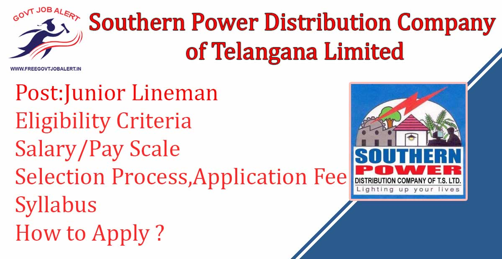
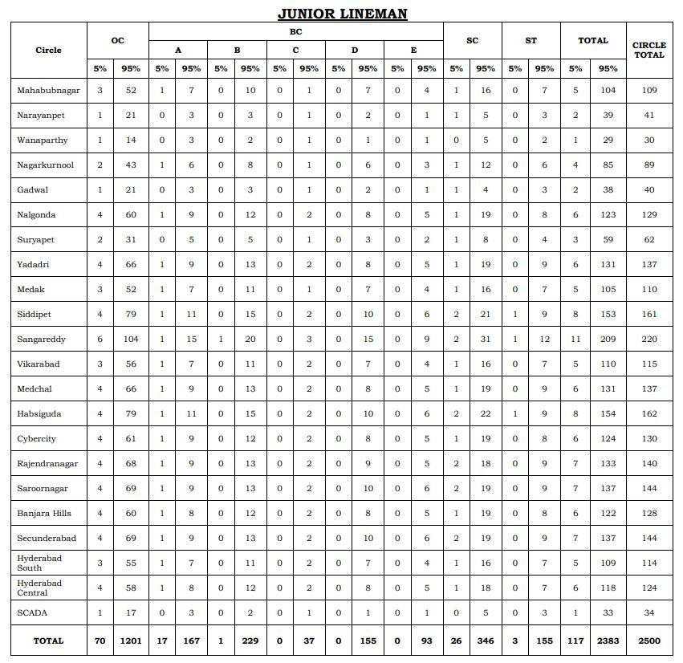

TSSPDCL Jr Lineman Recruitment 2019: The Southern Power Distribution Company of Telangana Limited Has Released Notification For the Recruitment of the post of Junior Lineman. TSSPDCL has Online Applications are invited from Eligible Candidates for Direct recruitment to the Post of Junior Lineman. As Per TSSPDCL Recruitment Notification 2019 A Total of 2500 Vacancies Are There. TSSPDCL Junior Lineman Online Form 2019 has Start on 22-10-2019 to 10-11-2019.

## TSSPDCL Recruitment 2019 For Junior Lineman Post

<table style="border-collapse: collapse; width: 100%;"><tbody><tr><td style="width: 50%; background-color: #2a5a8e;" colspan="2"><h3 style="text-align: center;">TSSPDCL Recruitment 2019</h3></td></tr><tr><td style="width: 50%; text-align: center;">Job Recruitment Board</td><td style="width: 50%; text-align: center;">Southern Power Distribution Company of Telangana Limited</td></tr><tr><td style="width: 50%; text-align: center;">Notification No.</td><td style="width: 50%; text-align: center;">01/2019</td></tr><tr><td style="width: 50%; text-align: center;">Post</td><td style="width: 50%; text-align: center;">Junior Lineman</td></tr><tr><td style="width: 50%; text-align: center;">Vacancies</td><td style="width: 50%; text-align: center;">2500 Posts</td></tr><tr><td style="width: 50%; text-align: center;">Job Location</td><td style="width: 50%; text-align: center;">Telangana State</td></tr><tr><td style="width: 50%; text-align: center;">Job Type</td><td style="width: 50%; text-align: center;">State Govt job</td></tr><tr><td style="width: 50%; text-align: center;">Application Mode</td><td style="width: 50%; text-align: center;">Online</td></tr></tbody></table>

TSSPDCL Junior Lineman Recruitment Notification 2019 has published on his official website. Candidates Should Have Candidates Should Have Must possess SSLC/SSC/10th Class with I.T.I qualification in Electrical Trade/ Wireman or 2 years Intermediate Vocational course in Electrical Trade. Applicants Age Should Between 18 to 35 years. Good Opportunity For those candidates Who Finding Govt Job In Telangana, can apply online TSSPDCL Recruitment 2019. Selected Candidates Will be Posted in Telangana. to Know About TSSPDCL Vacancy Details Like Education Qualification, Salary/Pay Scale, Age limits, Selection Process, How to Apply, etc Given Below on this page.

<table style="border-collapse: collapse;"><tbody><tr><td style="width: 50%; background-color: #2a5a8e;" colspan="2"><h3 style="text-align: center;">Important Dates</h3></td></tr><tr><td style="width: 50%; text-align: center;">Starting date for Payment of Fee</td><td style="width: 50%; text-align: center;">21-10-2019</td></tr><tr><td style="width: 50%; text-align: center;">Starting date of application submission</td><td style="width: 50%; text-align: center;">22-10-2019</td></tr><tr><td style="width: 50%; text-align: center;">Last date for payment of Fee Online</td><td style="width: 50%; text-align: center;">10-11-2019</td></tr><tr><td style="width: 50%; text-align: center;">Last date for submission of Online Application</td><td style="width: 50%; text-align: center;">10-11-2019</td></tr><tr><td style="width: 50%; text-align: center;">Downloading of Hall tickets</td><td style="width: 50%; text-align: center;">05-12-2019</td></tr><tr><td style="width: 50%; text-align: center;">Date of examination</td><td style="width: 50%; text-align: center;">15-12-2019</td></tr></tbody></table>

### TSSPDCL Vacancy Details

- Junior Lineman: 2500 Posts

Education Qualification:

- Candidates Must possess SSLC/SSC/10th Class with I.T.I. qualification in Electrical Trade/ Wireman or 2 years Intermediate Vocational course in Electrical Trade only from a recognized Institution/ Board of combined A.P/Telangana State Education Department as on the date of notification.

Age Limits:

- Minimum: 18 Years
- Maximum:
    - General Candidates: 35 Years
    - SC/ST/BC Candidates: 40 Years
    - PH Candidates: 45 Years

### TSSPDCL Jr Lineman Salary/Scale of Pay

- Rs. 24340/- - 39405/- Per Month

Training cum Probation:

- The candidates appointed to the post shall be placed on training cum probation for a period of 2 years.
- At the time of joining, they shall have to deposit their original certificates such as Date of Birth (SSC), Degree, Caste and Study / Residence Certificates, etc.
- During the training cum probation period, they will be paid initial scale of pay of Junior Assistant-cum-Computer Operator with usual allowances admissible at the place of posting.

Place of posting:

- The candidates appointed shall be required to work at field or substations of TSSPDCL.

### Scheme of Examination For TSSPDCL Junior Lineman

- The written test comprising of 80 marks consisting of 80 multiple choice questions and each question carries 1 mark.
- Section A consisting of 65 questions on core I.T.I subject.
- Section B consisting of 15 questions on General Knowledge.
- The duration of the written examination will be 2 hrs. (120 minutes).

### TSSPDCL Junior Lineman Admit Card/Hall Ticket

The Hall tickets will be placed on the website well before the date of examination. The candidate has to download the Hall Ticket from the website only. Hall tickets will not be sent to the candidates by post. The Hall Ticket has to be preserved till the final selection.

### TSSPDCL Jr Lineman Selection Process

- Written Test

### Application Fee

- General Candidates: Rs. 100(Processing Fee) + Rs. 120(Examination Fee) = Rs. 220/-
- SC/ST/BC/PH Candidates: Nil
- Payment Mode: Online

### How to Apply For TSSPDCL Jr Lineman Recruitment

1. Candidates First Go to [Here](https://tssouthernpower.cgg.gov.in)
2. Select Notification and Pay Application Fee
3. Then Select Post and Fill up Application Form
4. Then upload passport size photograph with signature
5. After Check all Details and Click on Submit Button
6. Download & Save Application PDF For Future Use
7. Done

### TSSPDCL Recruitment Important Links

- TSSPDCL Junior Lineman Online Form 2019: [Click Here](https://tssouthernpower.cgg.gov.in/TSSPDCLWEB19/home2407ssmar.tsspdcl)
- TSSPDCL JLM Syllabus & Exam Pattern 2019: [Click Here](https://freegovtjobalert.in/tsspdcl-junior-lineman-syllabus/)
- TSSPDCL Jr Lineman Recruitment Notification 2019 PDF: [Click Here](https://freegovtjobalert.in/wp-content/uploads/2019/10/Notification-TSSPDCL-Jr-Lineman-2500-Posts.pdf)
- TSSPDCL Official Website: [Click Here](https://www.tssouthernpower.com/)
