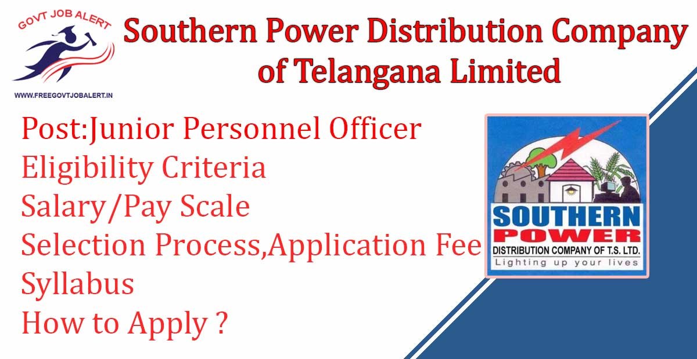
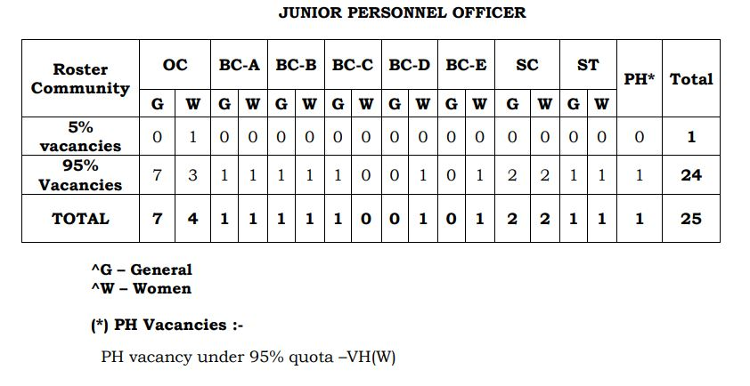

TSSPDCL Jr Personnel Officer Recruitment 2019: The Southern Power Distribution Company of Telangana Limited Has Released Notification For the Recruitment of the post of Junior Personnel Officer. TSSPDCL has Online Applications are invited from Eligible Candidates for Direct recruitment to the Post of Junior Personnel Officer. As Per TSSPDCL Recruitment Notification 2019 A Total of 25 Vacancies Are There. TSSPDCL Junior Personnel Officer Online Form 2019 has Start on 22-10-2019 to 10-11-2019.

## TSSPDCL Recruitment 2019 For Junior Personnel Officer Post

<table style="border-collapse: collapse; width: 100%;"><tbody><tr><td style="width: 50%; background-color: #2a5a8e;" colspan="2"><h3 style="text-align: center;">TSSPDCL Recruitment 2019</h3></td></tr><tr><td style="width: 50%; text-align: center;">Job Recruitment Board</td><td style="width: 50%; text-align: center;">Southern Power Distribution Company of Telangana Limited</td></tr><tr><td style="width: 50%; text-align: center;">Notification No.</td><td style="width: 50%; text-align: center;">02/2019</td></tr><tr><td style="width: 50%; text-align: center;">Post</td><td style="width: 50%; text-align: center;">Junior Personnel Officer</td></tr><tr><td style="width: 50%; text-align: center;">Vacancies</td><td style="width: 50%; text-align: center;">25 Posts</td></tr><tr><td style="width: 50%; text-align: center;">Job Location</td><td style="width: 50%; text-align: center;">Telangana State</td></tr><tr><td style="width: 50%; text-align: center;">Job Type</td><td style="width: 50%; text-align: center;">State Govt job</td></tr><tr><td style="width: 50%; text-align: center;">Application Mode</td><td style="width: 50%; text-align: center;">Online</td></tr></tbody></table>

TSSPDCL Junior Personnel Officer Recruitment Notification 2019 has published on his official website. Candidates Should Have the Degree of B.A/ B.Com/ B.Sc. Applicants Age Should Between 18 to 34 years. Good Opportunity For those candidates Who Finding Govt Job In Telangana, can apply online TSSPDCL Recruitment 2019. Selected Candidates Will be Posted in Telangana. to Know About TSSPDCL Vacancy Details Like Education Qualification, Salary/Pay Scale, Age limits, Selection Process, How to Apply, etc Given Below on this page.

<table style="border-collapse: collapse;"><tbody><tr><td style="width: 50%; background-color: #2a5a8e;" colspan="2"><h3 style="text-align: center;">Important Dates</h3></td></tr><tr><td style="width: 50%; text-align: center;">Starting date for Payment of Fee</td><td style="width: 50%; text-align: center;">21-10-2019</td></tr><tr><td style="width: 50%; text-align: center;">Starting date of application submission</td><td style="width: 50%; text-align: center;">22-10-2019</td></tr><tr><td style="width: 50%; text-align: center;">Last date for payment of Fee Online</td><td style="width: 50%; text-align: center;">10-11-2019</td></tr><tr><td style="width: 50%; text-align: center;">Last date for submission of Online Application</td><td style="width: 50%; text-align: center;">10-11-2019</td></tr><tr><td style="width: 50%; text-align: center;">Downloading of Hall tickets</td><td style="width: 50%; text-align: center;">05-12-2019</td></tr><tr><td style="width: 50%; text-align: center;">Date of examination</td><td style="width: 50%; text-align: center;">15-12-2019</td></tr></tbody></table>

### TSSPDCL Vacancy Details

- Junior Personnel Officer: 25 Posts

Education Qualification:

- Candidates must hold the degree of B.A., or B.Sc., or B.Com., of any University in India established or incorporated by or under a Central Act, Provincial Act or a State Act or any equivalent qualification and approved by the Government of Telangana.

Age Limits:

- Minimum: 18 Years
- Maximum:
    - General Candidates: 34 Years
    - SC/ST/BC Candidates: 39 Years
    - PH Candidates: 44 Years

### TSSPDCL Jr Personnel Officer Salary/Scale of Pay

- Rs. 34925/- - 66420/- Per Month

Training cum Probation:

- The candidates appointed to the post shall be placed on training cum probation for a period of 2 years.
- At the time of joining, they shall have to deposit their original certificates such as Date of Birth (SSC), Degree, Caste and Study / Residence Certificates, etc.
- During the training cum probation period, they will be paid initial scale of pay of Junior Assistant-cum-Computer Operator with usual allowances admissible at the place of posting.

Place of posting:

- The candidates appointed shall be required to work wherever posted in the jurisdiction of TSSPDCL for a minimum period of 3 years.

### Scheme of Examination For TSSPDCL Junior Personnel Officer

- The written test shall comprise 100 marks consisting of 100 multiple choice questions and each question carrying 1 mark.
- The Section-A (ENGLISH AND TELUGU) consisting of 50 questions on Human Resource Management, Industrial Laws, General Laws & Labour Laws, etc.,
- Section-B consisting of 20 questions on Computer Awareness.
- Section-C consisting of 30 questions on Test of English Language, General Awareness, Logical Reasoning and Numerical ability and History related to Telangana Culture & Movement.
- The duration of the written examination will be 2 hrs. (120 minutes).

### TSSPDCL Junior Personnel Officer Admit Card/Hall Ticket

The Hall tickets will be placed on the website well before the date of examination. The candidate has to download the Hall Ticket from the website only. Hall tickets will not be sent to the candidates by post. The Hall Ticket has to be preserved till the final selection.

### TSSPDCL Jr Personnel Officer Selection Process

- Written Test

### Application Fee

- General Candidates: Rs. 100(Processing Fee) + Rs. 120(Examination Fee) = Rs. 220/-
- SC/ST/BC/PH Candidates: Nil
- Payment Mode: Online

### How to Apply For TSSPDCL Jr Personnel Officer Recruitment

1. Candidates First Go to [Here](https://tssouthernpower.cgg.gov.in)
2. Select Notification and Pay Application Fee
3. Then Select Post and Fill up Application Form
4. Then upload passport size photograph with signature
5. After Check all Details and Click on Submit Button
6. Download & Save Application PDF For Future Use
7. Done

### TSSPDCL Recruitment Important Links

- TSSPDCL Junior Personnel Officer Online Form 2019: [Click Here](https://tssouthernpower.cgg.gov.in/TSSPDCLWEB19/home2407ssmar.tsspdcl)
- TSSPDCL JPO Syllabus & Exam Pattern 2019: [Click Here](https://freegovtjobalert.in/tsspdcl-junior-personnel-officer-syllabus/)
- TSSPDCL Jr Personnel Officer Recruitment Notification 2019 PDF: [Click Here](https://freegovtjobalert.in/wp-content/uploads/2019/10/Notification-TSSPDCL-Jr-Personal-Officer-Posts.pdf)
- TSSPDCL Official Website: [Click Here](https://www.tssouthernpower.com/)
