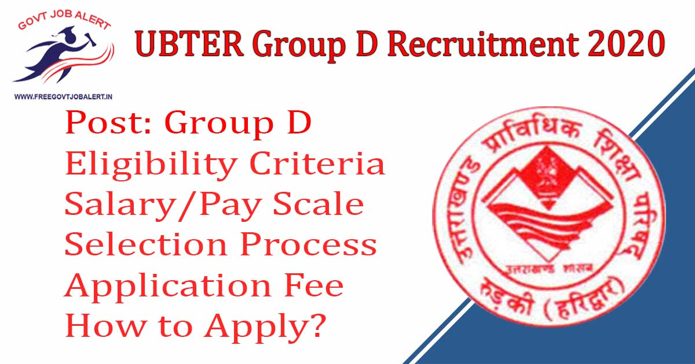
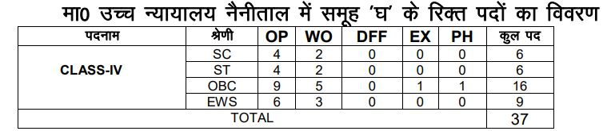

UBTER Group D Recruitment 2019: Uttarakhand Board of Technical Education, Aamwala, Dehradun has invited online for Group D Post Vacancy. As Per UBTER Recruitment 2019 Notification A Total of 37 Vacancies in Group D Posts. UBTER Group D Recruitment Online Form 2019 has started on 10th December 2019 www.ubtergd.in

## **UBTER Group D Recruitment 2019**

<table style="border-collapse: collapse; width: 100%;"><tbody><tr><td style="width: 50%; background-color: #2a5a8e; text-align: center;" colspan="2"><h3><strong>UBTER Recruitment 2019</strong></h3></td></tr><tr><td style="width: 50%; text-align: center;">Job Recruitment Board</td><td style="width: 50%; text-align: center;">Uttarakhand Board of Technical Education</td></tr><tr><td style="width: 50%; text-align: center;">Notification No.</td><td style="width: 50%; text-align: center;">1297/2019</td></tr><tr><td style="width: 50%; text-align: center;">Post</td><td style="width: 50%; text-align: center;">Group D</td></tr><tr><td style="width: 50%; text-align: center;">Vacancies</td><td style="width: 50%; text-align: center;">37</td></tr><tr><td style="width: 50%; text-align: center;">Job Location</td><td style="width: 50%; text-align: center;">Uttrakhand</td></tr><tr><td style="width: 50%; text-align: center;">Job Type</td><td style="width: 50%; text-align: center;">State Govt Jobs</td></tr><tr><td style="width: 50%; text-align: center;">Application Mode</td><td style="width: 50%; text-align: center;">Online</td></tr></tbody></table>

UBTER Group D Recruitment 2019 Notification And Apply Online Link available on his official website. Those Candidates are eligible to apply who passed their Class 8th level of Examination. Applicants must Age Between 18 to 42 Years. Selected Candidates Placed in Uttrakhand State. Good Chance for those candidates who are Finding Govt Jobs In Uttrakhand, They can Fill up Uttrakhand Group D Jobs Online Form Before the Last Date.

<table style="border-collapse: collapse;"><tbody><tr><td style="width: 50%; background-color: #2a5a8e; text-align: center;" colspan="2"><h3><strong>Important Dates</strong></h3></td></tr><tr><td style="width: 50%; text-align: center;">Notification Date</td><td style="width: 50%; text-align: center;">09-12-2019</td></tr><tr><td style="width: 50%; text-align: center;">Starting Date of Online Application</td><td style="width: 50%; text-align: center;">10-12-2019</td></tr><tr><td style="width: 50%; text-align: center;">Last Date of Online Application</td><td style="width: 50%; text-align: center;">04-01-2020</td></tr><tr><td style="width: 50%; text-align: center;">UBTER Group D Written Exam Date</td><td style="width: 50%; text-align: center;">02-02-2020</td></tr></tbody></table>

UBTER Group D Recruitment 2019 Details Like Education Qualification, Age Limits, Application Fee, Salary, How to apply, etc. - given below.

### **UBTER Group D Vacancy Details**

- UBTER Group D Vacancy: 37 Posts

### **UBTER Group D Recruitment 2019-Eligibility Criteria**

Age Limits

- Minimum 18 Years
- Maximum 42 Years
- For Age Relaxation Plese Check Notification.

Education Qualification

- Candidates Should Have Passed 8th Classed.

### **UBTER Group D Recruitment 2019- Salary/Pay Scale**

- Rs. 18000 to 56900 P.M

### **UBTER Group D Selection Process**

- Objective Type Questions with Multiple Choices Exam

### **Application Fee UBTER Group D Recruitment 2019**

- General/OBC Candidates: Rs. 600/-
- ST/SC Candidates: Rs. 400/-
- Viklang Candidates: No Fee
- Payment Mode: Online

### **How to Apply For UBTER Group D PostsRecruitment 2019**

1. Candidates Go to Here: http://www.ubtergd.in
2. Click on "Click Here to Apply Now"
3. Fill up Application Form and Register 
4. Upload Recruited Document/ Images
5. Pay Application Fee Via Online
6. Submit Application Fee
7. Download & Save Application Form For Future Use.

### **Important Links For UBTER Group D Vacancy 2019**

- UBTER Group D Recruitment Online Form 2019: [Click Here](http://www.ubtergd.in/Applicant/Registration.aspx?STAT=N|0)
- Download UBTER 37 Group D Vacancy Notification 2019 PDF: [Click Here](http://www.ubtergd.in/Documents/Advertisement.pdf)
- UBTER Official Website: [Click Here](http://www.ubter.in/)

Candidates can visit http://www.ubtergd.in to get more details about UBTER Group D Recruitment 2019. To More Information About UBTER upcoming vacancies 2020, latest Updates, Admit Card, Syllabus, Result, Etc. It will be published on the official website. Also, visit Regularly our website [www.freegovtjobalert.in](https://freegovtjobalert.in) for getting the Latest job Updates.
