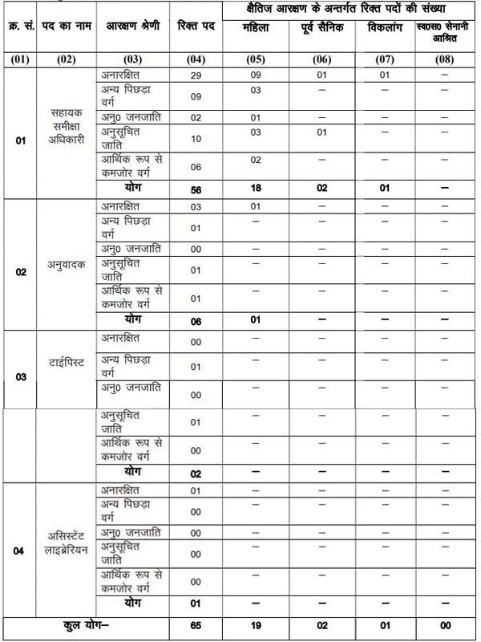

**UKPSC Recruitment 2019**: Uttarakhand Public Service Commission has Released Recruitment notification of 65 Various Vacancies. The UKPSC invites online application from eligible candidates for the post of Assistant Review Officer, Typist, Assistant Librarian, Translator. To know About UKPSC Vacancy Details Like Education Qualification, Age Limits, Application Fee, Selection Process, Salary/Pay Scale, How to apply, Etc Given below in this page.

## UKPSC Recruitment 2019: Apply online for ARO, Typist, Librarian, Translator Post

<table style="border-collapse: collapse; width: 100%;"><tbody><tr><td style="width: 50%; text-align: center;" colspan="2"><strong>Uttarakhand Public Service Commission(UKPSC)</strong>

Advt No: 01/advt/E-3/2018-19

65 Various Posts</td></tr><tr><td style="width: 50%; text-align: center;">Job Recruitment Board</td><td style="width: 50%; text-align: center;">Uttarakhand Public Service Commission(UKPSC)</td></tr><tr><td style="width: 50%; text-align: center;">Post</td><td style="width: 50%; text-align: center;">Various</td></tr><tr><td style="width: 50%; text-align: center;">Vacancies</td><td style="width: 50%; text-align: center;">65</td></tr><tr><td style="width: 50%; text-align: center;">Job Location</td><td style="width: 50%; text-align: center;"><a href="https://freegovtjobalert.in/uttarakhand-govt-jobs/" target="_blank" rel="noopener noreferrer">Uttarakhand</a></td></tr><tr><td style="width: 50%; text-align: center;">Application Mode</td><td style="width: 50%; text-align: center;">Online</td></tr></tbody></table>

**UKPSC Jobs 2019** Details have been released on the official website. Total of 65 Vacancies in various post. Interested & Eligible Candidates Can fill up UKPSC Recruitment Online Form 2019 Before Date 30-10-2019. we provide details about UKPSC Recruitment Notification 2019 and Direct Apply online link.

<table style="border-collapse: collapse; width: 100%; height: 60px;"><tbody><tr style="height: 20px;"><td style="width: 50%; height: 20px; background-color: #2a5a8e; text-align: center;" colspan="2"><h3><strong>Important Date for UKPSC Recruitment&nbsp;</strong></h3></td></tr><tr style="height: 20px;"><td style="width: 50%; height: 20px; text-align: center;">Starting date of online application</td><td style="width: 50%; height: 20px; text-align: center;">07-10-2019</td></tr><tr style="height: 20px;"><td style="width: 50%; height: 20px; text-align: center;">Last Date of Online Application</td><td style="width: 50%; height: 20px; text-align: center;">30-10-2019</td></tr></tbody></table>

### UKPSC Vacancy Details

- Assistant Review Officer: 56 Posts
- Typist: 02 Post
- Translator: 06 Posts
- Assistant Librarian: 01 Post

**Category Wise Vacancy Details**

### Eligible Criteria for UKPSC Recruitment

**Education Qualification**

<table style="border-collapse: collapse; width: 100%;"><tbody><tr><td style="width: 21.5859%; text-align: center; background-color: #2a5a8e;"><strong>Post</strong></td><td style="width: 78.4141%; text-align: center; background-color: #2a5a8e;"><strong>Education Qualification</strong></td></tr><tr><td style="width: 21.5859%; text-align: center;">Assistant Review Officer</td><td style="width: 78.4141%; text-align: center;"><ul><li style="text-align: left;">Candidates must have Bachelor degree</li><li style="text-align: left;">Speed of 9000 Key Depression per hour in English typing would be essential.</li><li style="text-align: left;">Test of Basic Knowledge of Computer Operation shall be Conducted, which will include:<ul><li style="text-align: left;">Windows &amp; Internet</li><li style="text-align: left;">MS Word</li><li style="text-align: left;">MS Excel</li><li style="text-align: left;">MS Powerpoint</li></ul></li></ul></td></tr><tr><td style="width: 21.5859%; text-align: center;">Typist</td><td style="width: 78.4141%; text-align: center;"><ul><li style="text-align: left;">Candidates must have Bachelor degree</li><li style="text-align: left;">Minimum Speed of 9000 key Key Depression per hour on computer.</li></ul></td></tr><tr><td style="width: 21.5859%; text-align: center;">Translator</td><td style="width: 78.4141%; text-align: center;"><ul><li style="text-align: left;">Graduate in any Stream with Diploma/Certificate Course in translation from Hindi to English and vice versa from university.</li><li style="text-align: left;">2 Years Experience</li></ul></td></tr><tr><td style="width: 21.5859%; text-align: center;">Assistant Librarian</td><td style="width: 78.4141%; text-align: center;"><ul><li style="text-align: left;">Degree in law and Diploma in Library Science from recognized university</li><li style="text-align: left;">Basic Knowledge of computer operation</li></ul></td></tr></tbody></table>

**Age Limits**

 

- Minimum Age Limit: 21 Years
- Maximum Age Limit: 42 Years
- Age Relaxation is Applicable as per rules

 

### UKPSC Salary/ Pay Scale

- Assistant Review Officer: Level-7 (Basic Salary – Rs. 44900/-)
- Typist: Level-5 (Basic Salary – Rs. 29200/-)
- Translator: Level-5 (Basic Salary – Rs. 29200/-)
- Assistant Librarian: Level-8 (Basic Salary – Rs. 47200/-)

### UKPSC Selection Process

- The selection will be on the basis of Interview/ written test.

### Application Fee

- General/OBC Candidates: Rs. 185.40 (Rs. 35.40 processing fee)
- SC/ST Candidates: Rs. 95.40 (Rs. 35.40 processing fee)
- PH Candidates: Rs. 35.40 Only processing fees
- Payment Method: Online (Pay the Examination Fee through Debit Card, Credit Card, Net Banking)

### How to apply for UKPSC Recruitment Posts

1. Candidates Goto UKPSC Official Website: [https://ukpsc.gov.in](https://ukpsc.gov.in)
2. Then Goto **Exam Recruitment** Section
3. Find And Click on **मा0 उच्च न्यायालय नैनीताल में सहायक समीक्षा अधिकारी/अनुवादक/टाईपिस्ट/असिस्टेंट लाइब्रेरियन परीक्षा-2018 के संबंध में शुद्धि-पत्र एवं आॅनलाईन आवेदन के संबंध में। (07-10-2019)**
4. Click On Apply online
5. Registration on UKPSC, Then Login with your User name & Password
6. Select Post and apply
7. Fill up Application Form
8. Upload Documents/Images
9. Pay Application Fee
10. Final Submit Application
11. Download & save Application
12. Done

### UKPSC Recruitment Important links

- Direct Apply Online For UKPSC Vacancy: **Click Here**
- UKPSC Recruitment Notification 2019 PDF: **Click Here**
- UKPSC Official Website: **Click Here**
