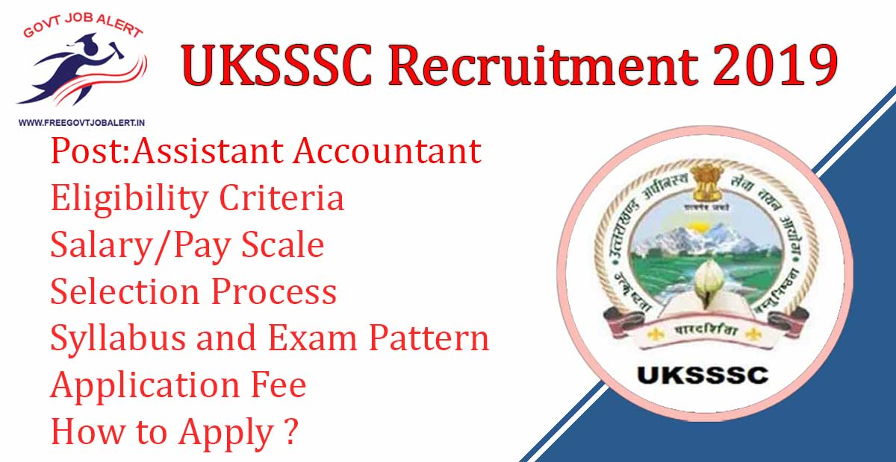
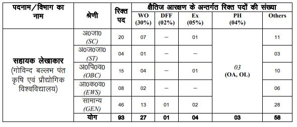

UKSSSC assistant accountant recruitment 2019-20: Uttarakhand Subordinate Service Selection Commission Has Released Notification for the recruitment of the post of Assistant Accountant. Govind Ballabh pant Krishi Evam Praudyogik Vishwa Vidyalaya by UKSSSC has invites online Application for Direct Recruitment of the Post of Assistant Accountant. Good Chance for Those Candidates Who Finding government jobs in Uttarakhand 2019 they Apply Online Before Last Date at www.uksssc.gov.in 2019

## UKSSSC Recruitment 2019 For Assistant Accountant Vacancy Details

<table style="border-collapse: collapse; width: 100%; height: 196px;"><tbody><tr style="height: 28px;"><td style="width: 50%; background-color: #2a5a8e; text-align: center; height: 28px;" colspan="2"><h3>UKSSSC Recruitment 2019</h3></td></tr><tr style="height: 24px;"><td style="width: 50%; text-align: center; height: 24px;">Job Recruitment Board</td><td style="width: 50%; text-align: center; height: 24px;">Uttarakhand Subordinate Service Selection Commission</td></tr><tr style="height: 24px;"><td style="width: 50%; text-align: center; height: 24px;">Notification No.</td><td style="width: 50%; text-align: center; height: 24px;">21/2019</td></tr><tr style="height: 24px;"><td style="width: 50%; text-align: center; height: 24px;">Post</td><td style="width: 50%; text-align: center; height: 24px;">Assistant Accountant</td></tr><tr style="height: 24px;"><td style="width: 50%; text-align: center; height: 24px;">Vacancies</td><td style="width: 50%; text-align: center; height: 24px;">93 Posts</td></tr><tr style="height: 24px;"><td style="width: 50%; text-align: center; height: 24px;">Job Location</td><td style="width: 50%; text-align: center; height: 24px;">Uttrakhand State</td></tr><tr style="height: 24px;"><td style="width: 50%; text-align: center; height: 24px;">Job Type</td><td style="width: 50%; text-align: center; height: 24px;">State jobs</td></tr><tr style="height: 24px;"><td style="width: 50%; text-align: center; height: 24px;">Application Mode</td><td style="width: 50%; text-align: center; height: 24px;">Online</td></tr></tbody></table>

UKSSSC assistant accountant recruitment Notification 2019 has Published on His Offical Website. As Per UKSSSC Vacancy Notification a total of 93 vacancies are there. Applicants Should have Bachelor's Degree in BBA/ Post Graduation in Accountancy. Candidates must have Age Between 21 to 42 Years. Selected Candidates Will be Posted in Uttrakhand State. Eligible & Interested Candidates can Apply Online For Assistant Accountant post. to know about UKSSSC assistant accountant recruitment Details Like Education Qualification, Salary/Pay Scale, Age Limits, How to apply, etc Given Below on this page.

<table style="border-collapse: collapse;"><tbody><tr><td style="width: 50%; background-color: #2a5a8e;" colspan="2"><h3 style="text-align: center;">UKSSSC assistant accountant Important Dates</h3></td></tr><tr><td style="width: 50%; text-align: center;">Notification Date</td><td style="width: 50%; text-align: center;">25-10-2019</td></tr><tr><td style="width: 50%; text-align: center;">Starting Date of Online Application</td><td style="width: 50%; text-align: center;">31-10-2019</td></tr><tr><td style="width: 50%; text-align: center;">Last Date of Online Application</td><td style="width: 50%; text-align: center;">15-12-2019</td></tr><tr><td style="width: 50%; text-align: center;">Last Date of Application Fee</td><td style="width: 50%; text-align: center;">17-12-2019</td></tr><tr><td style="width: 50%; text-align: center;">Written Exam Date</td><td style="width: 50%; text-align: center;">January 2020</td></tr></tbody></table>

### **UKSSSC Vacancy 2019 Details**

- Assistant Accountant: 93 Posts

### **Eligibility Criteria For UKSSSC Assistant Accountant Recruitment** 

**Education Qualification**

- Candidates Should Have Completed BBA or Post Graduation in Accountancy From Recognized University.
- Hindi Typing skills of 4000 key depressions per hour

**Age Limits**

- Minimum 21 Years
- Maximum 42 Years

### **Salary/Pay Scale For UKSSSC Assistant Accountant Recruitment**

- Rs. 5200/- to Rs. 20,200/- Per Month

### **Application Fee For UKSSSC Assistant Accountant Recruitment**

- General/OBC/EWS Candidates: Rs. 300/-
- ST/SC/Divyang Candidates: Rs. 150/-
- Payment Mode: Online(Net Banking, Debit/Credit Card)

### **Selection Process For UKSSSC Assistant Accountant Recruitment**

1. Written Test
2. Interview

### **UKSSSC Assistant Accountant Written Exam Syllabus and Exam Pattern**

- Objective Type with Multiple Choice
- 100 Question/ 02 Hours
- 0.25 Negative Marks For Wrong Answers
- Minimum Marks
    - General: 45 Marks
    - ST/SC: 35 Marks

> ### UKSSSC Assistant Accountant Syllabus [Click Here](http://sssc.uk.gov.in/pages/display/137-syllabus(%E0%A4%AA%E0%A4%BE%E0%A4%A0%E0%A5%8D%E0%A4%AF%E0%A4%95%E0%A5%8D%E0%A4%B0%E0%A4%AE)-of-general-paper-and-latest-advt.(date-10-10-2019)) 

### **How to fill up UKSSSC Assistant Accountant Recruitment Online Form 2019**

1. Applicants Go to UKSSSC Official Website: http://sssc.uk.gov.in/
2. Register Your Self on UKSSSC Website.
3. Get User Name & Password on Email or Mobile Number.
4. Then Login With your User Name & Password.
5. Find UKSSSC Assistant Accountant Recruitment Notification 2019
6. Click on Apply Now button
7. Fill up Required Details
8. Upload Required Document and Images
9. Pay Application Fee Via Online
10. Submit Application
11. Download & Save Application For Future Use.
12. Done.

### **UKSSSC Assistant Accountant Recruitment Important Links**

- UKSSSC Assistant Accountant Online Form 2019: Click Here
- UKSSSC Assistant Accountant Recruitment Notification 2019 PDF: [Click Here](https://freegovtjobalert.in/wp-content/uploads/2019/10/Notification-UKSSSC-Asst-Accountant.pdf)
- UKSSSC Official Website: [Click Here](http://sssc.uk.gov.in/)
