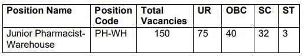

**UPMSCL Recruitment 2019**: Uttar Pradesh Medical Supplies Corporation Ltd. Released a notification for Vacancy of Junior Pharmacist job(UPMSCL Vacancy Junior Pharmacist). as per notification Total **150 junior Pharmacist Vacancy** in Uttar Pradesh Medical Supplies Corporation Limited. **UPMSCL Junior Pharmacist- Warehouse Job** posting For warehouse across Uttar Pradesh. The Online Application for UPMSCL Junior Pharmacist-warehouse, starts on Date 15-08-2019 to 30-08-2019(11:59:59 PM). Interested candidates can apply online at upmsc.in before the Last date has gone. we mention all **UPMSCL Recruitment** Details like UPMSCL Junior Pharmacist online form, Education qualification, Age Limits, Salary/Pay Scale, Etc. in this page below...

## UPMSCL Junior Pharmacist-Warehouse Vacancy Details

<table style="height: 654px; width: 84.9475%; border-collapse: collapse; border-style: double;"><tbody><tr style="height: 80px;"><td style="width: 100%; text-align: center; height: 50px;" colspan="2"><strong>Uttar Pradesh Medical Supplies Corporation Ltd.</strong>
Junior Pharmacist-Warehouse Vacancy
150 Vacancies</td></tr><tr style="height: 30px;"><td style="width: 100%; height: 30px; background-color: #2a5a8e; text-align: center;" colspan="2"><h3><strong>&nbsp;Important Dates</strong></h3></td></tr><tr style="height: 22px;"><td style="width: 50%; text-align: center; height: 22px;">Starting Date for Registration</td><td style="width: 50%; text-align: center; height: 22px;"><strong>15-08-2019</strong></td></tr><tr style="height: 22px;"><td style="width: 50%; text-align: center; height: 22px;">Last Date for Registration</td><td style="width: 50%; text-align: center; height: 22px;"><strong>30-08-2019</strong></td></tr><tr style="height: 30px;"><td style="width: 100%; height: 30px; background-color: #2a5a8e; text-align: center;" colspan="2"><h3><strong>&nbsp;Vacancy Details</strong></h3></td></tr><tr style="height: 22px;"><td style="text-align: center; height: 22px; width: 50%;">Job Recruitment Board</td><td style="text-align: center; width: 50%;">Uttar Pradesh Medical Supplies Corporation Ltd.</td></tr><tr><td style="text-align: center; width: 50%;">Post Name</td><td style="text-align: center; width: 50%;">Junior Pharmacist-Warehouse</td></tr><tr><td style="text-align: center; width: 50%;">No of Vacancies</td><td style="text-align: center; width: 50%;">150 Post</td></tr><tr><td style="text-align: center; width: 50%;">Job Category</td><td style="text-align: center; width: 50%;">Uttar Pradesh a contractual basis job</td></tr><tr><td style="text-align: center; width: 50%;">Job Location</td><td style="text-align: center; width: 50%;">Across Uttar Pradesh</td></tr><tr><td style="text-align: center; width: 50%;">Application Mode</td><td style="text-align: center; width: 50%;">Online</td></tr><tr><td style="width: 100%; background-color: #2a5a8e; text-align: center;" colspan="2"><strong>Category Wise UPMSCL Junior Pharmacist Vacancy Details</strong></td></tr><tr><td style="text-align: center; width: 100%;" colspan="2"></td></tr><tr style="height: 30px;"><td style="width: 100%; height: 30px; background-color: #2a5a8e; text-align: center;" colspan="2"><h3><strong>Eligibility Criteria&nbsp;</strong></h3></td></tr><tr style="height: 14px;"><td style="width: 50%; text-align: center; height: 14px;"><strong>Education Qualification</strong></td><td style="width: 50%; text-align: center; height: 14px;"><strong>Age Limits</strong></td></tr><tr style="height: 30px;"><td style="width: 50%; text-align: center; height: 30px;"><ul><li style="text-align: left;">D. Pharm./ B. Pharm/ Pharm. D. from a recognized University/institution.</li><li style="text-align: left;">At least 1 (one) year of experience in Drugs Store Management/ Drugs Supply Chain management.</li></ul></td><td style="width: 50%; text-align: center; height: 30px;"><ul><li style="text-align: left;">UR: 35 Years</li></ul>
<strong>Age Relaxation:</strong>

<ul><li style="text-align: left;">OBC: 38 Years</li><li style="text-align: left;">SC, ST: 40 Years</li><li style="text-align: left;">UR PwD: 45 Years</li><li style="text-align: left;">OBC PWD: 48 Years</li><li style="text-align: left;">SC, ST PWD: 50 Years</li></ul></td></tr><tr><td style="width: 50%; text-align: left;" colspan="2"><strong>Desirable:</strong><ul><li>Preference shall be given to candidates having registration with Uttar Pradesh Pharmacy Council.</li><li>Preference shall be given to those candidates who have experience in Government or Government Supported Projects and have a good working knowledge of computers/ MS Office.</li></ul><strong>Contract Type and Period:</strong><ul><li>The position is on offer on a contractual basis, initially for a period of three years, extendable thereafter, based on performance and subject to further approval by the UPMSCL.</li></ul><strong>Probation Period:</strong><ul><li>From the date of joining the employee shall remain on probation for a period of two months and the performance shall be assessed by a Committee constituted by the Managing Director, UPMSCL. If the performance is found unsatisfactory, the services may be terminated after one the month of receipt of notice in this respect.</li></ul></td></tr><tr><td style="width: 100%; background-color: #2a5a8e; text-align: center;" colspan="2"><h3><strong>Selection Process for Junior Pharmacist- Warehouse</strong></h3></td></tr><tr><td style="text-align: center;" colspan="2"><ol><li style="text-align: left;">Selection shall be made on the basis of written test.</li><li style="text-align: left;">Minimum qualifying marks for the written test shall be as follows:</li></ol><ul><li style="text-align: left;">33% for Un-Reserved categories</li><li style="text-align: left;">30% for OBC</li><li style="text-align: left;">24% for SC, ST</li></ul></td></tr><tr><td style="background-color: #2a5a8e; text-align: center;" colspan="2"><h3><strong>UPMSCL Vacancy Junior Pharmacist Salary/Pay Scale</strong></h3></td></tr><tr><td style="width: 100%; text-align: center;" colspan="2">Rs. 30,000 Per Month</td></tr><tr style="height: 30px;"><td style="width: 100%; height: 30px; background-color: #2a5a8e; text-align: center;" colspan="2"><h3><strong>Application Fee&nbsp;</strong></h3></td></tr><tr style="height: 30px;"><td style="width: 100%; text-align: center; height: 30px;" colspan="2">None</td></tr><tr style="height: 30px;"><td style="width: 100%; height: 30px; background-color: #2a5a8e; text-align: center;" colspan="2"><h3><strong>Important Links&nbsp;</strong></h3></td></tr><tr style="height: 10px;"><td style="width: 50%; text-align: center; height: 10px;"><strong>Apply Online&nbsp;</strong></td><td style="width: 50%; text-align: center; height: 10px;"><strong><a style="color: #ff0000;" href="https://upmscl.samshrm.com/Register" target="_blank" rel="noopener noreferrer">Register</a>&nbsp;| <a style="color: #ff0000;" href="https://upmscl.samshrm.com/Login" target="_blank" rel="noopener noreferrer">Login</a></strong></td></tr><tr style="height: 36px;"><td style="width: 50%; text-align: center; height: 23px;"><strong>Notification</strong></td><td style="width: 50%; text-align: center; height: 23px;"><strong><a style="color: #ff0000;" href="https://freegovtjobalert.in/wp-content/uploads/2019/08/Detailed_Advertisement-Junior_Pharmacist_UPMSCL.pdf" target="_blank" rel="noopener noreferrer">Click Here</a></strong></td></tr><tr style="height: 10px;"><td style="width: 50%; text-align: center; height: 10px;"><strong>&nbsp;Official Website</strong></td><td style="width: 50%; text-align: center; height: 10px;"><strong><a style="color: #ff0000;" href="http://www.upmsc.in/" target="_blank" rel="noopener noreferrer">Click Here</a></strong></td></tr></tbody></table>

### How To Apply For UPMSCL Vacancy Junior Pharmacist Post?

1. Candidates first Goto: [https://upmscl.samshrm.com/](https://upmscl.samshrm.com/)
2. Click on the “NEW REGISTRATION” button fill-up the Registration Form. (If you are already a registered user, click on the “ALREADY REGISTERED” button and enter Login ID & Password to proceed. )
3. After submission of Registration Form, the applicant shall receive an SMS containing User Id and Password. Save ID & Password For Future Use.
4. Keep ready following documents before starting online submission of Application Form: 1.Profile image 2.Signature image 3.Certificate of Educational Qualification and Experience, which makes him/her eligible for applying for the post
5. After successful registration, the applicant can log in to apply for the position.
6. After login “JOB DASHBOARD” will be opened. The applicants can view position name, no. of vacancy, vacancy reservation info in “JOB DASHBOARD” section.
7. Click on the “आवेदन करें/ Apply Now” button to apply for the position you are eligible and wish to apply.
8. Once you click on the “आवेदन करें/ Apply Now” button following section will appear in the Application Form.
9. Please complete the PERSONAL SECTION and click on the “SUBMIT & PROCEED TO NEXT” button.
10. Please complete the QUALIFICATION SECTION and click on the “SUBMIT & PROCEED TO NEXT” button.
11. Please complete the EXPERIENCE SECTION and click on the “SUBMIT & PROCEED TO NEXT” button.
12. Please upload the required image and documents in the IMAGE & DOCUMENTS SECTION and click on the “SUBMIT & PROCEED TO NEXT” button.
13. After filling all the details, there is a provision for reviewing the details which applicants have filled in the Application Form by clicking on the “Preview Application” button before final submission.
14. Once Applicants are sure about the details filled by them in the application form, they can click on the “Confirm & Submit Application” button for final submission of their applications.
15. After successful submission of the UPMSCL Vacancy Junior Pharmacist Application Form, the applicant will receive an SMS on his/her RMN (Registered Mobile No.) containing the application reference no, which can be used for future reference.
16. UPMSCL Vacancy Junior Pharmacist Applicants can now print/ download their application form for their further reference.

> More Govt Jobs: [www.freegovtjobalert.in](https://freegovtjobalert.in)
