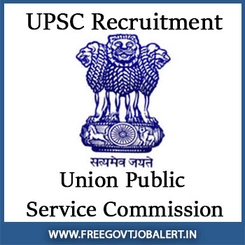

**UPSC Recruitment 2019**: Union Public Service Commission Invites Online Recruitment Application for Various Posts Vacancies. UPSC Recruitment of Assistant Library and Information Officer(Hindi), Deputy Curator, Manager, Senior Photographic Officer, Assistant Director, Executive Engineer. as Per **Upsc Recruitment Notification 2019** Total 13 Vacancies for Eligible Candidates Who Completed a Degree. Interested and Eligible Candidates Can Apply Online Before Date 29-08-2019 @Upsconline.nic.in. to Know About **UPSC Multiple Vacancies** All Details Like Eligibility Criteria, Education Qualification, Age Limits, Salary/pay Scale, Etc. in This Page Below

## UPSC Recruitment for Multiple Vacancies Details

<table style="height: 1904px; width: 75%; border-collapse: collapse; border-style: double;"><tbody><tr style="height: 80px;"><td style="width: 100.484%; text-align: center; height: 50px;" colspan="2"><strong>UNION PUBLIC SERVICE COMMISSION</strong>

UPSC Multiple vacancies

13 Vacancies</td></tr><tr style="height: 30px;"><td style="width: 100.484%; height: 30px; background-color: #2a5a8e; text-align: center;" colspan="2"><h3><strong>&nbsp;Important Dates</strong></h3></td></tr><tr style="height: 22px;"><td style="width: 50%; text-align: center; height: 22px;">Starting Date for Registration</td><td style="width: 50.4843%; text-align: center; height: 22px;"><strong>10-08-2019</strong></td></tr><tr style="height: 22px;"><td style="width: 50%; text-align: center; height: 22px;">Last Date for Registration</td><td style="width: 50.4843%; text-align: center; height: 22px;"><strong>29-08-2019</strong></td></tr><tr style="height: 30px;"><td style="width: 100.484%; height: 30px; background-color: #2a5a8e; text-align: center;" colspan="2"><h3><strong>&nbsp;Vacancy Details</strong></h3></td></tr><tr style="height: 22px;"><td style="width: 100.484%; text-align: center; height: 22px;" colspan="2"><table style="border-collapse: collapse; width: 99.0323%; height: 373px;"><tbody><tr style="height: 44px;"><td style="width: 52.3688%; height: 44px;"><strong>Post Name</strong></td><td style="width: 24.7039%; height: 44px;"><strong>No of Vacancy</strong></td><td style="width: 22.9272%; height: 44px;"><strong>Pay Scale</strong></td></tr><tr style="height: 22px;"><td style="width: 52.3688%; height: 22px;">Assistant Library and Information Officer (Hindi)</td><td style="width: 24.7039%; height: 22px;">01</td><td style="width: 22.9272%; height: 22px;">Level-7</td></tr><tr style="height: 22px;"><td style="width: 52.3688%; height: 22px;">Deputy Curator</td><td style="width: 24.7039%; height: 22px;">01</td><td style="width: 22.9272%; height: 22px;">Level-10</td></tr><tr style="height: 22px;"><td style="width: 52.3688%; height: 22px;">Manager</td><td style="width: 24.7039%; height: 22px;">04</td><td style="width: 22.9272%; height: 22px;">Level-10</td></tr><tr style="height: 22px;"><td style="width: 52.3688%; height: 22px;">Senior Photographic Officer</td><td style="width: 24.7039%; height: 22px;">02</td><td style="width: 22.9272%; height: 22px;">Level-10</td></tr><tr style="height: 22px;"><td style="width: 52.3688%; height: 22px;">Assistant Director</td><td style="width: 24.7039%; height: 22px;">01</td><td style="width: 22.9272%; height: 22px;">Level-10</td></tr><tr style="height: 22px;"><td style="width: 52.3688%; height: 22px;">Executive Engineer</td><td style="width: 24.7039%; height: 22px;">04</td><td style="width: 22.9272%; height: 22px;">Level-11</td></tr><tr><td style="width: 52.3688%;"><strong>Total</strong></td><td style="width: 24.7039%;"><strong>13</strong></td><td style="width: 22.9272%;"><strong>-</strong></td></tr></tbody></table></td></tr><tr style="height: 30px;"><td style="width: 100.484%; height: 30px; background-color: #2a5a8e; text-align: center;" colspan="2"><h3><strong>Eligibility Criteria&nbsp;</strong></h3></td></tr><tr style="height: 30px;"><td style="width: 50%; text-align: center; height: 30px;" colspan="2"><table style="border-collapse: collapse; width: 96.2903%; height: 982px;"><tbody><tr><td style="width: 24.9064%;"><strong>Post Name</strong></td><td style="width: 39.0917%;"><strong>Qualification</strong></td><td style="width: 19.3352%;"><strong>Experience</strong></td><td style="width: 16.6667%;"><strong>Age limit</strong></td></tr><tr><td style="width: 24.9064%;">Assistant Library and Information Officer (Hindi)</td><td style="width: 39.0917%;">Bachelor’s Degree from a recognized University with Hindi as a major subject Bachelor’s Degree in Library Science or Library and Information Science of a recognized University or Institute.</td><td style="width: 19.3352%;">Two years’ professional experience in a Library under Central or State Government</td><td style="width: 16.6667%;">30 Years</td></tr><tr><td style="width: 24.9064%;">Deputy Curator</td><td style="width: 39.0917%;">Master’s Degree in Fine Arts or Art History and Criticism</td><td style="width: 19.3352%;">At least three years experience</td><td style="width: 16.6667%;">35 Years</td></tr><tr><td style="width: 24.9064%;">Manager</td><td style="width: 39.0917%;">Bachelor of Engineering / Bachelor of Technology in Mechanical or Automobile Engineering.</td><td style="width: 19.3352%;">Three years of experience</td><td style="width: 16.6667%;">35 Years</td></tr><tr><td style="width: 24.9064%;">Senior Photographic Officer</td><td style="width: 39.0917%;">Degree from a recognized university.</td><td style="width: 19.3352%;">Three years’ experience in various branches of Photography</td><td style="width: 16.6667%;">35 Years</td></tr><tr><td style="width: 24.9064%;">Assistant Director</td><td style="width: 39.0917%;">Degree in Mechanical or Electrical or Chemical or Production or Industrial Engineering</td><td style="width: 19.3352%;">One years’ experience in Engineering Workshop or Industry or Training Institute.</td><td style="width: 16.6667%;">35 Years</td></tr><tr><td style="width: 24.9064%;">Executive Engineer</td><td style="width: 39.0917%;">Degree in Civil Engineering or B.E. (Civil) or B. Tech. (Civil) or B. Sc. Engineering (Civil) or A.M.I.E. (Civil)</td><td style="width: 19.3352%;">Seven years of professional experience in the field of Civil Engineering</td><td style="width: 16.6667%;">40 Years</td></tr></tbody></table></td></tr><tr style="height: 30px;"><td style="width: 100.484%; height: 30px; background-color: #2a5a8e; text-align: center;" colspan="2"><h3><strong>Application Fee&nbsp;</strong></h3></td></tr><tr style="height: 30px;"><td style="width: 100.484%; text-align: center; height: 30px;" colspan="2">General Candidates: Rs.25/-

SC/ST/PH/Women: Nil</td></tr><tr style="height: 30px;"><td style="width: 100.484%; height: 30px; background-color: #2a5a8e; text-align: center;" colspan="2"><h3><strong>Important Links&nbsp;</strong></h3></td></tr><tr style="height: 10px;"><td style="width: 50%; text-align: center; height: 10px;"><strong>Apply Online&nbsp;</strong></td><td style="width: 50.4843%; text-align: center; height: 10px;"><strong><a href="https://upsconline.nic.in/ora/RegistrationFinal.php" target="_blank" rel="noopener noreferrer">Registration</a> | <a href="https://upsconline.nic.in/ora/VacancyNoticePub.php" target="_blank" rel="noopener noreferrer">Login</a></strong></td></tr><tr style="height: 36px;"><td style="width: 50%; text-align: center; height: 23px;"><strong>Notification</strong></td><td style="width: 50.4843%; text-align: center; height: 23px;"><a href="https://freegovtjobalert.in/wp-content/uploads/2019/08/Upsc-Recruitment-Notification-2019.pdf" target="_blank" rel="noopener noreferrer"><strong>Click Here&nbsp;</strong></a></td></tr><tr style="height: 10px;"><td style="width: 50%; text-align: center; height: 10px;"><strong>&nbsp;Official Website</strong></td><td style="width: 50.4843%; text-align: center; height: 10px;"><a href="https://upsc.gov.in/" target="_blank" rel="noopener noreferrer"><strong>Click Here</strong></a></td></tr></tbody></table>

### How to Apply For UPSC Recruitment Multiple vacancies?

1. Candidates Goto UPSC Official Website: [upsc.gov.in](https://upsc.gov.in/)
2. Go To Recruitment section and select [Online Recruitment Application(ORA)](https://upsconline.nic.in/ora/VacancyNoticePub.php)
3. Select Post And click on **Apply Now**
4. Enter Your **Registration Id** & **Password** and Click on Login Button(If you don't have a **Registration Id** then Click on New Registration and register your self first and get **Registration Id**)
5. Check Your Information and apply 
6. Pay Fee Amount
7. Done

If you like to know more detail about UPSC Recruitment then check UPSC Recruitment [Official Notification](https://freegovtjobalert.in/wp-content/uploads/2019/08/Upsc-Recruitment-Notification-2019.pdf) 2019

> **More Govt Jobs: [www.freegovtjobalert.in](https://freegovtjobalert.in)**
