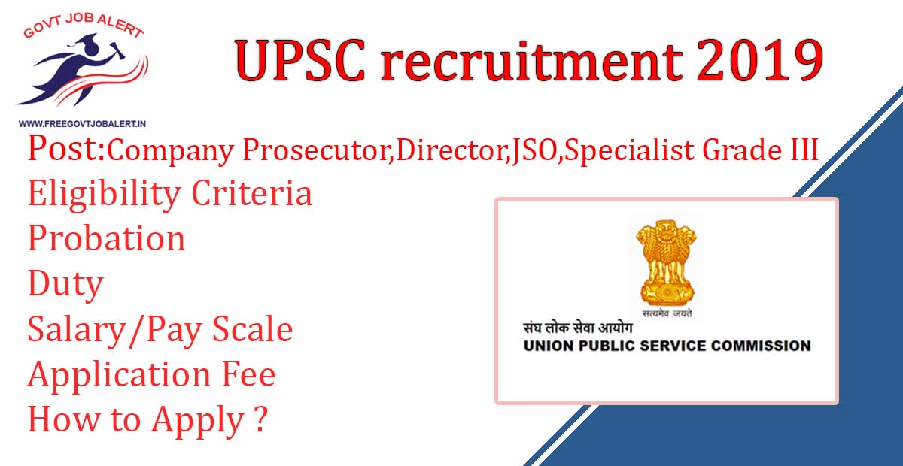

\[caption id="attachment\_1528" align="alignnone" width="1200"\] UPSC recruitment for Company Prosecutor, Junior Scientific Officer, Director, Specialist Grade III\[/caption\]

**UPSC recruitment 2019:** Union Public Service Commission has Released Notification For Filling Up 67 Various Posts. UPSC Invites Online applications for Recruitment by Selection for the post of Company Prosecutor, Junior Scientific Officer, Director, Specialist Grade III. Good Opportunity for Those candidates who Searching jobs under UPSC. UPSC recruitment 2019 apply online Before Last Date 14-11-2019 at upsconline.nic.in.

## UPSC Vacancy 2019 For 67 Various Posts

<table style="border-collapse: collapse; width: 100%; height: 60px;"><tbody><tr style="height: 20px;"><td style="width: 50%; background-color: #2a5a8e; text-align: center; height: 20px;" colspan="2"><h3>UPSC recruitment 2019</h3></td></tr><tr style="height: 20px;"><td style="width: 50%; height: 20px; text-align: center;">Job Recruitment Board</td><td style="width: 50%; height: 20px; text-align: center;">Union Public Service Commission</td></tr><tr style="height: 20px;"><td style="width: 50%; height: 20px; text-align: center;">Advertisement No.</td><td style="width: 50%; height: 20px; text-align: center;">14/2019</td></tr><tr><td style="width: 50%; text-align: center;">Post</td><td style="width: 50%; text-align: center;">Various</td></tr><tr><td style="width: 50%; text-align: center;">Vacancies</td><td style="width: 50%; text-align: center;">67 Posts</td></tr><tr><td style="width: 50%; text-align: center;">Job Location</td><td style="width: 50%; text-align: center;">Across India</td></tr><tr><td style="width: 50%; text-align: center;">Job Type</td><td style="width: 50%; text-align: center;">Central Govt Jobs</td></tr><tr><td style="width: 50%; text-align: center;">Application Mode</td><td style="width: 50%; text-align: center;">online</td></tr></tbody></table>

Union Public Service Commission [Free Govt Job Alert](https://freegovtjobalert.in) !! UPSC recruitment 2019 notification Has Publish on His Official Website. Applicants Can Get Direct Applining Link for UPSC recruitment 2019-20 From Here. UPSC jobs 2019 Notification to hire candidates who completed Degree in Law, bachelor’s degree, Master's Degree, MBBS. Candidates Should have Age Between 30 to 45 Years. Selected Candidates Will Posted in Across India. to know about UPSC recruitment notification 2019 Details Like Education Qualification, UPSC posts list and salary, Exam Pattern, Syllabus, How to UPSC online registration, etc. Given Below on this page.

<table style="border-collapse: collapse; width: 100%;"><tbody><tr><td style="width: 50%; background-color: #2a5a8e; text-align: center;" colspan="2"><h3>UPSC exam date 2020</h3></td></tr><tr><td style="width: 50%; text-align: center;">Last Date for Online Application</td><td style="width: 50%; text-align: center;">14-11-2019</td></tr><tr><td style="width: 50%; text-align: center;">Last Date for Printing of completely submitted online application</td><td style="width: 50%; text-align: center;">15-11-2019</td></tr></tbody></table>

### **UPSC Vacancy 2019**

- Company Prosecutor: 11 Posts
- Prosecutor: 01 Post
- Junior Scientific Officer: 02 Posts
- Director: 01 Post
- Specialist Grade III (Dermatology): 07 Posts
- Specialist Grade III (Obstetrics & Gynaecology): 09 Posts
- Specialist Grade III (Ophthalmology): 02 Posts
- Specialist Grade III (Orthopaedics): 09 Posts
- Specialist Grade III (Paediatrics): 18 posts
- Specialist Grade III (Psychiatrics): 07 Posts

### **UPSC Exam Eligibility**

<table class="front" style="width: 100%; height: 500px;"><tbody><tr style="height: 20px;"><td style="width: 18.2819%; height: 20px; background-color: #2a5a8e; text-align: center;" colspan="2"><strong>Company Prosecutor</strong></td></tr><tr style="height: 20px;"><td style="width: 18.2819%; height: 20px; text-align: center;" align="left" width="30%"><strong>Vacancy Number</strong></td><td style="width: 81.7181%; height: 20px;" align="left" width="70%">19101401226</td></tr><tr style="height: 20px;"><td style="width: 18.2819%; height: 20px; text-align: center;" align="left"><strong>Post</strong></td><td style="width: 81.7181%; height: 20px;" align="left">&nbsp;Company Prosecutor</td></tr><tr style="height: 20px;"><td style="width: 18.2819%; height: 20px; text-align: center;" align="left"><strong>Classification</strong></td><td style="width: 81.7181%; height: 20px;">-</td></tr><tr style="height: 20px;"><td style="width: 18.2819%; height: 20px; text-align: center;" align="left"><strong>Ministry/Administration</strong></td><td style="width: 81.7181%; height: 20px;" align="left">&nbsp;Ministry of Corporate Affairs</td></tr><tr style="height: 20px;"><td style="width: 18.2819%; height: 20px; text-align: center;" align="left"><strong>Department/Office</strong></td><td style="width: 81.7181%; height: 20px;" align="left">&nbsp;other</td></tr><tr style="height: 20px;"><td style="width: 18.2819%; height: 20px; text-align: center;" align="left"><strong>Organization</strong></td><td style="width: 81.7181%; height: 20px;" align="left">&nbsp;other</td></tr><tr style="height: 72px;" align="center"><td style="width: 18.2819%; height: 72px; text-align: center;" align="left"><strong>Age</strong></td><td style="width: 81.7181%; height: 72px;" align="left"><ul><li>General/EWS Candidates: 30 Years</li><li>OBC Candidates: 33 Years</li><li>ST/SC Candidates: 35 Years</li></ul></td></tr><tr style="height: 119px;" align="center"><td style="width: 18.2819%; height: 119px; text-align: center;" align="left"><strong>Essential Qualification</strong></td><td style="width: 81.7181%; height: 119px;" align="left"><strong>A.Education:</strong><ul><li>Degree in Law from a recognized University or Institution.</li></ul><strong>Note:</strong> Qualifications are relaxable at the discretion of the Union Public Service Commission for reasons to be recorded in writing, in the case of candidates otherwise well qualified.</td></tr><tr style="height: 64px;" align="center"><td style="width: 18.2819%; height: 64px; text-align: center;" align="left"><strong>Desirable Qualification&nbsp;</strong></td><td style="width: 81.7181%; height: 64px;" align="left">(i). Knowledge of Commercial Law. (ii). Experience in conducting Company Law cases. (iii). Government Diploma in Company Secretaries.</td></tr><tr style="height: 42px;" align="center"><td style="width: 18.2819%; height: 42px; text-align: center;" align="left" height="22"><strong>Duty(ies)</strong></td><td style="width: 81.7181%; height: 42px;" align="left">Legal/administrative in nature. Officer has to do prosecution work against companies, in all courts/tribunals of the country.</td></tr><tr style="height: 21px;" align="center"><td style="width: 18.2819%; height: 21px; text-align: center;" align="left" height="22"><strong>Probation</strong></td><td style="width: 81.7181%; height: 21px;" align="left">Two years</td></tr><tr style="height: 21px;" align="center"><td style="width: 18.2819%; height: 21px; text-align: center;" align="left" height="22"><strong>Head Quarter</strong></td><td style="width: 81.7181%; height: 21px;" align="left">Headquarters is in New Delhi with All India Service Liability.</td></tr><tr style="height: 21px;" align="center"><td style="width: 18.2819%; height: 21px; text-align: center;" align="left" height="22"><strong>Other Details</strong></td><td style="width: 81.7181%; height: 21px;" align="left">General Central Service, Group ‘B’, Gazetted, Ministerial. The posts are permanent.</td></tr></tbody></table>

 

<table class="front" style="width: 100%;"><tbody><tr><td style="width: 100%; background-color: #2a5a8e; text-align: center;" colspan="2"><strong>Prosecutor</strong></td></tr><tr><td style="width: 19.6035%; text-align: center;" align="left" width="30%"><strong>Vacancy Number</strong></td><td style="width: 80.3965%;" align="left" width="70%">19101402226</td></tr><tr><td style="width: 19.6035%; text-align: center;" align="left"><strong>Post</strong></td><td style="width: 80.3965%;" align="left">Prosecutor</td></tr><tr><td style="width: 19.6035%; text-align: center;" align="left"><strong>Classification</strong></td><td style="width: 80.3965%;">-</td></tr><tr><td style="width: 19.6035%; text-align: center;" align="left"><strong>Ministry/Administration</strong></td><td style="width: 80.3965%;" align="left">Ministry of Corporate Affairs</td></tr><tr><td style="width: 19.6035%; text-align: center;" align="left"><strong>Department/Office</strong></td><td style="width: 80.3965%;" align="left">other</td></tr><tr><td style="width: 19.6035%; text-align: center;" align="left"><strong>Organization</strong></td><td style="width: 80.3965%;" align="left">Serious Fraud Investigation Office SFIO</td></tr><tr align="center"><td style="width: 19.6035%; text-align: center;" align="left"><strong>Age</strong></td><td style="width: 80.3965%;" align="left"><ul><li>General/EWS Candidates: 30 Years</li><li>OBC Candidates: 33 Years</li><li>ST/SC Candidates: 35 Years</li></ul></td></tr><tr align="center"><td style="width: 19.6035%; text-align: center;" align="left"><strong>Essential Qualification</strong></td><td style="width: 80.3965%;" align="left"><strong>A.Education:</strong><ul><li>Graduate in any discipline plus a bachelor’s degree in Law from a recognized University or Institute.</li></ul>
OR

<ul><li>Integrated graduate in Law (5 years duration) from a recognized University or Institute.</li></ul><strong>B. Experience:</strong><ul><li>For Graduate in any discipline plus a bachelor’s degree in Law Holders- One year experience in handling litigation &amp; court matters/administration of Law in a Government organization.</li></ul>
OR

<ul><li>For Integrated graduate in Law (5 years duration) Holders 2 years’ experience in handling litigation &amp; court matters/administration of Law in a Government organization.</li></ul></td></tr><tr align="center"><td style="width: 19.6035%; text-align: center;" align="left"><strong>Desirable Qualification</strong></td><td style="width: 80.3965%;" align="left">(i). Additional one year experience in corporate/criminal Law matters. (ii). Masters in Law (LL.M) from a recognized University or Institute.</td></tr><tr align="center"><td style="width: 19.6035%; text-align: center;" align="left" height="22"><strong>Duty(ies)</strong></td><td style="width: 80.3965%;" align="left">(a) To assist the filing of prosecutions/complaints in all the cases that are investigated by the SFIO in the concerned courts and pursue their progress. (b)Coordination with the counsels detailed by the government. (c)Maintenance of database of court cases. (d) Any other work assigned from time to time.</td></tr><tr align="center"><td style="width: 19.6035%; text-align: center;" align="left" height="22"><strong>Probation</strong></td><td style="width: 80.3965%;" align="left">2 (Two) years subject to successful completion of mandatory induction training of two weeks duration, as prescribed and sponsored by SFIO.</td></tr><tr align="center"><td style="width: 19.6035%; text-align: center;" align="left" height="22"><strong>Head Quarter</strong></td><td style="width: 80.3965%;" align="left">New Delhi with All India service liability (AISL).</td></tr><tr align="center"><td style="width: 19.6035%; text-align: center;" align="left" height="22"><strong>Other Details</strong></td><td style="width: 80.3965%;" align="left">The post is General Central Service, Group ‘B’ Gazetted, Non-Ministerial. The posts are permanent.</td></tr></tbody></table>

 

<table class="front" style="width: 100%;"><tbody><tr><td style="width: 99.8899%; background-color: #2a5a8e; text-align: center;" colspan="2">&nbsp;<strong>Junior Scientific Officer (Toxicology)</strong></td></tr><tr><td style="width: 19.3833%; text-align: center;" align="left" width="30%"><strong>Vacancy Number</strong></td><td style="width: 80.5066%;" align="left" width="70%">19101403226</td></tr><tr><td style="width: 19.3833%; text-align: center;" align="left"><strong>Post</strong></td><td style="width: 80.5066%;" align="left">Junior Scientific Officer (Toxicology)</td></tr><tr><td style="width: 19.3833%; text-align: center;" align="left"><strong>Classification</strong></td><td style="width: 80.5066%;">-</td></tr><tr><td style="width: 19.3833%; text-align: center;" align="left"><strong>Ministry/Administration</strong></td><td style="width: 80.5066%;" align="left">Ministry of Home Affairs</td></tr><tr><td style="width: 19.3833%; text-align: center;" align="left"><strong>Department/Office</strong></td><td style="width: 80.5066%;" align="left">Directorate of Forensic Science Services</td></tr><tr><td style="width: 19.3833%; text-align: center;" align="left"><strong>Organization</strong></td><td style="width: 80.5066%;" align="left">Central Forensic Science Laboratory</td></tr><tr align="center"><td style="width: 19.3833%; text-align: center;" align="left"><strong>Age</strong></td><td style="width: 80.5066%;" align="left">Maximum: 30 Years

Relaxable for regularly appointed Central Government Servant up to five years as per instructions/orders issued by Govt. of India from time to time.</td></tr><tr align="center"><td style="width: 19.3833%; text-align: center;" align="left"><strong>Essential Qualification</strong></td><td style="width: 80.5066%;" align="left"><strong>A.Education:</strong><ul><li>Master’s Degree in Chemistry/Biochemistry/Pharmacology/ Pharmacy / Forensic Science with Chemistry as one of the subjects at Bachelor of Science level from a recognized university or equivalent*.</li></ul><strong>B. Experience:</strong><ul><li>Two years experience of Analytical method and research therein in the field of Toxicology.</li></ul></td></tr><tr align="center"><td style="width: 19.3833%; text-align: center;" align="left" height="22"><strong>Duty(ies)</strong></td><td style="width: 80.5066%;" align="left">Crime Scene Management, Crime Case Examination, giving evidence in the Courts of Law u/s 293 of Cr. PC, providing guidance to the junior scientific staff for case analysis, R&amp;D activities on Forensic Activities and imparting training in their respective field of forensic specialization to the trainees from different investigating agencies / forensic science labs and other organizations</td></tr><tr align="center"><td style="width: 19.3833%; text-align: center;" align="left" height="22"><strong>Probation</strong></td><td style="width: 80.5066%;" align="left">02 (Two) years</td></tr><tr align="center"><td style="width: 19.3833%; text-align: center;" align="left" height="22"><strong>Head Quarter</strong></td><td style="width: 80.5066%;" align="left">Head Quarter is at New Delhi with Laboratories at Kolkata, Chandigarh, Hyderabad, Bhopal, Guwahati, and Pune. In connection with performing his duties, the officer may be required to serve in any part of India.</td></tr><tr align="center"><td style="width: 19.3833%; text-align: center;" align="left" height="22"><strong>Other Details</strong></td><td style="width: 80.5066%;" align="left">General Central Services, Group ‘B’ Gazetted. Non-Ministerial. The posts are permanent.</td></tr></tbody></table>

 

<table class="front" style="width: 100%;"><tbody><tr><td style="width: 100%; background-color: #2a5a8e; text-align: center;" colspan="2"><strong>&nbsp;Director (Staff Training / Productivity)</strong></td></tr><tr><td style="width: 19.4934%; text-align: center;" align="left" width="30%"><strong>Vacancy Number</strong></td><td style="width: 80.5066%;" align="left" width="70%">19101404626</td></tr><tr><td style="width: 19.4934%; text-align: center;" align="left"><strong>Post</strong></td><td style="width: 80.5066%;" align="left">Director (Staff Training / Productivity)</td></tr><tr><td style="width: 19.4934%; text-align: center;" align="left"><strong>Classification</strong></td><td style="width: 80.5066%;">-</td></tr><tr><td style="width: 19.4934%; text-align: center;" align="left"><strong>Ministry/Administration</strong></td><td style="width: 80.5066%;" align="left">Ministry of Labour and Employment</td></tr><tr><td style="width: 19.4934%; text-align: center;" align="left"><strong>Department/Office</strong></td><td style="width: 80.5066%;" align="left">Other</td></tr><tr><td style="width: 19.4934%; text-align: center;" align="left"><strong>Organization</strong></td><td style="width: 80.5066%;" align="left">Directorate General of Factory Advice Service and Labour Institutes DGFASLI</td></tr><tr align="center"><td style="width: 19.4934%; text-align: center;" align="left"><strong>Age</strong></td><td style="width: 80.5066%;" align="left">Maximum: 50 Years

Relaxable for regularly appointed Central Government Servant up to five years as per instructions/orders issued by Govt. of India from time to time.</td></tr><tr align="center"><td style="width: 19.4934%; text-align: center;" align="left"><strong>Essential Qualification</strong></td><td style="width: 80.5066%;" align="left"><strong>A.Education:</strong><ul><li>Degree in Mechanical or Electrical or Chemical or Production or Industrial Engineering of a recognized University or equivalent.</li></ul>
OR

<ul><li>Degree in Mechanical or Electrical or Chemical or Production or Industrial Engineering followed by Post-graduate Diploma in Production Engineering or Industrial Engineering of a recognized University.</li></ul><strong>B. Experience:</strong><ul><li>Ten years’ experience in Engineering Workshop or Industry or training Institute for candidates possessing educational qualification&nbsp;</li></ul></td></tr><tr align="center"><td style="width: 19.4934%; text-align: center;" align="left"><strong>Desirable Qualification</strong></td><td style="width: 80.5066%;" align="left">(i) Master’s Degree in Engineering.

(ii) Experience in organizing, planning of conducting training programs for supervisors and other management personnel.

OR

Experience of Productivity Science Wing of Engineering Workshop or Industry or Training Institute.</td></tr><tr align="center"><td style="width: 19.4934%; text-align: center;" align="left" height="22"><strong>Duty(ies)</strong></td><td style="width: 80.5066%;" align="left">(i) Carrying out Training need identification Surveys Developing Training Material, Manual and Aids, and conducting in-Plant and Public Training Programmes. (ii) Undertaking Projects and Surveys in the field of Productivity. (iii) Conducting studies and Surveys in establishing Production norms and standards.</td></tr><tr align="center"><td style="width: 19.4934%; text-align: center;" align="left" height="22"><strong>Probation</strong></td><td style="width: 80.5066%;" align="left">One year.</td></tr><tr align="center"><td style="width: 19.4934%; text-align: center;" align="left" height="22"><strong>Head Quarter</strong></td><td style="width: 80.5066%;" align="left">Headquarters is in Mumbai with All India Service liability.</td></tr><tr align="center"><td style="width: 19.4934%; text-align: center;" align="left" height="22"><strong>Other Details</strong></td><td style="width: 80.5066%;" align="left">General Central Service, Group ‘A’, Gazetted, Non-Ministerial. The post is permanent.</td></tr></tbody></table>

 

<table class="front" style="width: 100%;"><tbody><tr><td style="width: 100%; background-color: #2a5a8e; text-align: center;" colspan="2">&nbsp;<strong>Specialist Grade III (Dermatology)</strong></td></tr><tr><td style="width: 19.3833%; text-align: center;" align="left" width="30%"><strong>Vacancy Number</strong></td><td style="width: 80.6167%;" align="left" width="70%">19101405126</td></tr><tr><td style="width: 19.3833%; text-align: center;" align="left"><strong>Post</strong></td><td style="width: 80.6167%;" align="left">Specialist Grade III (Dermatology)</td></tr><tr><td style="width: 19.3833%; text-align: center;" align="left"><strong>Classification</strong></td><td style="width: 80.6167%;">-</td></tr><tr><td style="width: 19.3833%; text-align: center;" align="left"><strong>Ministry/Administration</strong></td><td style="width: 80.6167%;" align="left">Government of NCT of Delhi</td></tr><tr><td style="width: 19.3833%; text-align: center;" align="left"><strong>Department/Office</strong></td><td style="width: 80.6167%;" align="left">DEPARTMENT OF HEALTH AND FAMILY WELFARE</td></tr><tr><td style="width: 19.3833%; text-align: center;" align="left"><strong>Organization</strong></td><td style="width: 80.6167%;" align="left">Other</td></tr><tr align="center"><td style="width: 19.3833%; text-align: center;" align="left"><strong>Age</strong></td><td style="width: 80.6167%;" align="left">Maximum 45 Years

SC/ST: 50 Years</td></tr><tr align="center"><td style="width: 19.3833%; text-align: center;" align="left"><strong>Essential Qualification</strong></td><td style="width: 80.6167%;" align="left"><strong>A.Education:</strong><ul><li>A recognized MBBS qualification included in the First or Second Schedule.</li></ul><strong>B. Experience:</strong><ul><li>Three years’ experience in the concerned Specialty after obtaining the first Post Graduate Degree or 5 years’ experience after obtaining the Post Graduate Diploma.</li></ul></td></tr><tr align="center"><td style="width: 19.3833%; text-align: center;" align="left" height="22"><strong>Duty(ies)</strong></td><td style="width: 80.6167%;" align="left">Candidates shall work in the dispensaries and hospitals of the Government of NCT of Delhi and shall be primarily handling patients of various types in these Hospitals and dispensaries for medical care. However, they can also be entrusted with other work including administrative and other related work as per exigencies of the Public Service.</td></tr><tr align="center"><td style="width: 19.3833%; text-align: center;" align="left" height="22"><strong>Probation</strong></td><td style="width: 80.6167%;" align="left">Two year.</td></tr><tr align="center"><td style="width: 19.3833%; text-align: center;" align="left" height="22"><strong>Head Quarter</strong></td><td style="width: 80.6167%;" align="left">Govt. of NCT of Delhi</td></tr><tr align="center"><td style="width: 19.3833%; text-align: center;" align="left" height="22"><strong>Other Details</strong></td><td style="width: 80.6167%;" align="left">Group ‘A’ Gazetted, Non-Ministerial, Delhi Health Services. The posts are permanent.</td></tr><tr align="center"><td style="width: 19.3833%; text-align: center;" align="left"><strong>Any Other Conditions</strong></td><td style="width: 80.6167%;" align="left">Persons appointed to the service shall not be allowed Private practice of any kind whatsoever including any consultation and laboratory practice</td></tr></tbody></table>

 

<table class="front" style="width: 100%;"><tbody><tr><td style="width: 100%; background-color: #2a5a8e; text-align: center;" colspan="2"><strong>Specialist Grade III (Obstetrics &amp; Gynaecology)</strong></td></tr><tr><td style="width: 19.3833%; text-align: center;" align="left" width="30%"><strong>Vacancy Number</strong></td><td style="width: 80.6167%;" align="left" width="70%">19101406126</td></tr><tr><td style="width: 19.3833%; text-align: center;" align="left"><strong>Post</strong></td><td style="width: 80.6167%;" align="left">Specialist Grade III (Obstetrics &amp; Gynaecology)</td></tr><tr><td style="width: 19.3833%; text-align: center;" align="left"><strong>Classification</strong></td><td style="width: 80.6167%;">-</td></tr><tr><td style="width: 19.3833%; text-align: center;" align="left"><strong>Ministry/Administration</strong></td><td style="width: 80.6167%;" align="left">Government of NCT of Delhi</td></tr><tr><td style="width: 19.3833%; text-align: center;" align="left"><strong>Department/Office</strong></td><td style="width: 80.6167%;" align="left">DEPARTMENT OF HEALTH AND FAMILY WELFARE</td></tr><tr><td style="width: 19.3833%; text-align: center;" align="left"><strong>Organization</strong></td><td style="width: 80.6167%;" align="left">Other</td></tr><tr align="center"><td style="width: 19.3833%; text-align: center;" align="left"><strong>Age</strong></td><td style="width: 80.6167%;" align="left">Maximum 45 Years

SC/ST: 50 Years</td></tr><tr align="center"><td style="width: 19.3833%; text-align: center;" align="left"><strong>Essential Qualification</strong></td><td style="width: 80.6167%;" align="left"><strong>A.Education:</strong><ul><li>A recognized MBBS qualification included in the First or Second Schedule.</li><li>Post-Graduate Degree/ Diploma/ M. D. (Obstetrics &amp; Gynaecology)/ M.S. (Obstetrics &amp; Gynaecology)/ Diploma in Gynaecology and Obstetrics.</li></ul><strong>B. Experience:</strong><ul><li>Three years’ experience in the concerned Specialty after obtaining the first Post Graduate Degree or 5 years’ experience after obtaining a Post Graduate Diploma.</li></ul></td></tr><tr align="center"><td style="width: 19.3833%; text-align: center;" align="left" height="22"><strong>Duty(ies)</strong></td><td style="width: 80.6167%;" align="left">Candidates shall work in the dispensaries and hospitals of the Government of NCT of Delhi and shall be primarily handling patients of various types in these Hospitals and dispensaries for medical care. However, they can also be entrusted with other work including administrative and other related work as per exigencies of the Public Service.</td></tr><tr align="center"><td style="width: 19.3833%; text-align: center;" align="left" height="22"><strong>Probation</strong></td><td style="width: 80.6167%;" align="left">Two year.</td></tr><tr align="center"><td style="width: 19.3833%; text-align: center;" align="left" height="22"><strong>Head Quarter</strong></td><td style="width: 80.6167%;" align="left">Govt. of NCT of Delhi.</td></tr><tr align="center"><td style="width: 19.3833%; text-align: center;" align="left" height="22"><strong>Other Details</strong></td><td style="width: 80.6167%;" align="left">Group ‘A’ Gazetted, Non-Ministerial, Delhi Health Services. The posts are permanent.</td></tr><tr align="center"><td style="width: 19.3833%; text-align: center;" align="left"><strong>Any Other Conditions</strong></td><td style="width: 80.6167%;" align="left">Persons appointed to the service shall not be allowed Private practice of any kind what so ever including any consultation and laboratory practice.</td></tr></tbody></table>

 

<table class="front" style="width: 100%;"><tbody><tr><td style="width: 100%; background-color: #2a5a8e; text-align: center;" colspan="2"><strong>Specialist Grade III (Ophthalmology)</strong></td></tr><tr><td style="width: 19.4934%; text-align: center;" align="left" width="30%"><strong>Vacancy Number</strong></td><td style="width: 80.5066%;" align="left" width="70%">19101407126</td></tr><tr><td style="width: 19.4934%; text-align: center;" align="left"><strong>Post</strong></td><td style="width: 80.5066%;" align="left">Specialist Grade III (Ophthalmology)</td></tr><tr><td style="width: 19.4934%; text-align: center;" align="left"><strong>Classification</strong></td><td style="width: 80.5066%;">-</td></tr><tr><td style="width: 19.4934%; text-align: center;" align="left"><strong>Ministry/Administration</strong></td><td style="width: 80.5066%;" align="left">Government of NCT of Delhi</td></tr><tr><td style="width: 19.4934%; text-align: center;" align="left"><strong>Department/Office</strong></td><td style="width: 80.5066%;" align="left">DEPARTMENT OF HEALTH AND FAMILY WELFARE</td></tr><tr><td style="width: 19.4934%; text-align: center;" align="left"><strong>Organization</strong></td><td style="width: 80.5066%;" align="left">Other</td></tr><tr align="center"><td style="width: 19.4934%; text-align: center;" align="left"><strong>Age</strong></td><td style="width: 80.5066%;" align="left">Maximum 45 Years

SC/ST: 50 Years</td></tr><tr align="center"><td style="width: 19.4934%; text-align: center;" align="left"><strong>Essential Qualification</strong></td><td style="width: 80.5066%;" align="left"><strong>A.Education:</strong><ul><li>A recognized MBBS qualification included in the First or Second Schedule.</li><li>Post-Graduate Degree/ Diploma/ M.D. (Ophthalmology)/ M.S. (Ophthalmology)/ Diploma in Ophthalmology/ Diploma in Ophthalmic Medicine and Surgery.</li></ul><strong>B. Experience:</strong><ul><li>Three years’ experience in the concerned Specialty after obtaining the first Post Graduate Degree or 5 years’ experience after obtaining a Post Graduate Diploma.</li></ul></td></tr><tr align="center"><td style="width: 19.4934%; text-align: center;" align="left" height="22"><strong>Duty(ies)</strong></td><td style="width: 80.5066%;" align="left">Candidates shall work in the dispensaries and hospitals of the Government of NCT of Delhi and shall be primarily handling patients of various types in these Hospitals and dispensaries for medical care. However, they can also be entrusted with other work including administrative and other related work as per exigencies of the Public Service.</td></tr><tr align="center"><td style="width: 19.4934%; text-align: center;" align="left" height="22"><strong>Probation</strong></td><td style="width: 80.5066%;" align="left">Two years.</td></tr><tr align="center"><td style="width: 19.4934%; text-align: center;" align="left" height="22"><strong>Head Quarter</strong></td><td style="width: 80.5066%;" align="left">Govt. of NCT of Delhi.</td></tr><tr align="center"><td style="width: 19.4934%; text-align: center;" align="left" height="22"><strong>Other Details</strong></td><td style="width: 80.5066%;" align="left">Group ‘A’ Gazetted, Non-Ministerial, Delhi Health Services. The post is permanent.</td></tr><tr align="center"><td style="width: 19.4934%; text-align: center;" align="left"><strong>Any Other Conditions</strong></td><td style="width: 80.5066%;" align="left">Persons appointed to the service shall not be allowed Private practice of any kind what so ever including any consultation and laboratory practice.</td></tr></tbody></table>

 

<table class="front" style="width: 100%;"><tbody><tr><td style="width: 100%; background-color: #2a5a8e; text-align: center;" colspan="2">&nbsp;<strong>Specialist Grade III (Orthopaedics)</strong></td></tr><tr><td style="width: 19.7137%; text-align: center;" align="left" width="30%"><strong>Vacancy Number</strong></td><td style="width: 80.2863%;" align="left" width="70%">19101408126</td></tr><tr><td style="width: 19.7137%; text-align: center;" align="left"><strong>Post</strong></td><td style="width: 80.2863%;" align="left">&nbsp;Specialist Grade III (Orthopaedics)</td></tr><tr><td style="width: 19.7137%; text-align: center;" align="left"><strong>Classification</strong></td><td style="width: 80.2863%;">-</td></tr><tr><td style="width: 19.7137%; text-align: center;" align="left"><strong>Ministry/Administration</strong></td><td style="width: 80.2863%;" align="left">Government of NCT of Delhi</td></tr><tr><td style="width: 19.7137%; text-align: center;" align="left"><strong>Department/Office</strong></td><td style="width: 80.2863%;" align="left">DEPARTMENT OF HEALTH AND FAMILY WELFARE</td></tr><tr><td style="width: 19.7137%; text-align: center;" align="left"><strong>Organization</strong></td><td style="width: 80.2863%;" align="left">Other</td></tr><tr align="center"><td style="width: 19.7137%; text-align: center;" align="left"><strong>Age</strong></td><td style="width: 80.2863%;" align="left">Maximum 45 Years

SC/ST: 50 Years</td></tr><tr align="center"><td style="width: 19.7137%; text-align: center;" align="left"><strong>Essential Qualification</strong></td><td style="width: 80.2863%;" align="left"><strong>A.Education:</strong><ul><li>A recognized MBBS qualification included in the First or Second Schedule.</li><li>Post-Graduate Degree/Diploma/ M.S. (Orthopaedics)/ Diploma in Orthopaedics.</li></ul><strong>B. Experience:</strong><ul><li>Three years’ experience in the concerned Specialty after obtaining the first Post Graduate Degree or 5 years’ experience after obtaining a Post Graduate Diploma.</li></ul></td></tr><tr align="center"><td style="width: 19.7137%; text-align: center;" align="left" height="22"><strong>Duty(ies)</strong></td><td style="width: 80.2863%;" align="left">Candidates shall work in the dispensaries and hospitals of the Government of NCT of Delhi and shall be primarily handling patients of various types in these Hospitals and dispensaries for medical care. However, they can also be entrusted with other work including administrative and other related work as per exigencies of the Public Service.</td></tr><tr align="center"><td style="width: 19.7137%; text-align: center;" align="left" height="22"><strong>Probation</strong></td><td style="width: 80.2863%;" align="left">Two years.</td></tr><tr align="center"><td style="width: 19.7137%; text-align: center;" align="left" height="22"><strong>Head Quarter</strong></td><td style="width: 80.2863%;" align="left">Govt. of NCT of Delhi</td></tr><tr align="center"><td style="width: 19.7137%; text-align: center;" align="left" height="22"><strong>Other Details</strong></td><td style="width: 80.2863%;" align="left">Group ‘A’ Gazetted, Non-Ministerial, Delhi Health Services. The post is permanent.</td></tr><tr align="center"><td style="width: 19.7137%; text-align: center;" align="left"><strong>Any Other Conditions</strong></td><td style="width: 80.2863%;" align="left">Persons appointed to the service shall not be allowed Private practice of any kind what so ever including any consultation and laboratory work.</td></tr></tbody></table>

 

<table class="front" style="width: 100%;"><tbody><tr><td style="width: 100%; background-color: #2a5a8e; text-align: center;" colspan="2"><strong>Specialist Grade III (Paediatrics)</strong></td></tr><tr><td style="width: 19.2731%; text-align: center;" align="left" width="30%"><strong>Vacancy Number</strong></td><td style="width: 80.7269%;" align="left" width="70%">19101409126</td></tr><tr><td style="width: 19.2731%; text-align: center;" align="left"><strong>Post</strong></td><td style="width: 80.7269%;" align="left">Specialist Grade III (Paediatrics)</td></tr><tr><td style="width: 19.2731%; text-align: center;" align="left"><strong>Classification</strong></td><td style="width: 80.7269%;">-</td></tr><tr><td style="width: 19.2731%; text-align: center;" align="left"><strong>Ministry/Administration</strong></td><td style="width: 80.7269%;" align="left">Government of NCT of Delhi</td></tr><tr><td style="width: 19.2731%; text-align: center;" align="left"><strong>Department/Office</strong></td><td style="width: 80.7269%;" align="left">DEPARTMENT OF HEALTH AND FAMILY WELFARE</td></tr><tr><td style="width: 19.2731%; text-align: center;" align="left"><strong>Organization</strong></td><td style="width: 80.7269%;" align="left">Other</td></tr><tr align="center"><td style="width: 19.2731%; text-align: center;" align="left"><strong>Age</strong></td><td style="width: 80.7269%;" align="left">Maximum 45 Years

SC/ST: 50 Years</td></tr><tr align="center"><td style="width: 19.2731%; text-align: center;" align="left"><strong>Essential Qualification</strong></td><td style="width: 80.7269%;" align="left"><strong>A.Education:</strong><ul><li>A recognized MBBS qualification included in the First or Second Schedule.</li><li>Post-Graduate Degree/ Diploma/ M. D. (Paediatrics)/ Diploma Paediatrics, Diploma in Child Health/ Diploma Paediatrics, Diploma in Child Health.</li></ul><strong>B. Experience:</strong><ul><li>Three years’ experience in the concerned Specialty after obtaining the first Post Graduate Degree or 5 years experience after obtaining the Post Graduate Diploma.</li></ul></td></tr><tr align="center"><td style="width: 19.2731%; text-align: center;" align="left" height="22"><strong>Duty(ies)</strong></td><td style="width: 80.7269%;" align="left">The Candidates shall work in the dispensaries and hospitals of the Government of NCT of Delhi and shall be primarily handling patients of various types in these Hospitals and dispensaries for medical care. However, they can also be entrusted with other work including administrative and other related work as per exigencies of the Public Service.</td></tr><tr align="center"><td style="width: 19.2731%; text-align: center;" align="left" height="22"><strong>Probation</strong></td><td style="width: 80.7269%;" align="left">Two year.</td></tr><tr align="center"><td style="width: 19.2731%; text-align: center;" align="left" height="22"><strong>Head Quarter</strong></td><td style="width: 80.7269%;" align="left">Govt. of NCT of Delhi.</td></tr><tr align="center"><td style="width: 19.2731%; text-align: center;" align="left" height="22"><strong>Other Details</strong></td><td style="width: 80.7269%;" align="left">Group ‘A’ Gazetted, Non-Ministerial, Delhi Health Services. The posts are permanent.</td></tr><tr align="center"><td style="width: 19.2731%; text-align: center;" align="left"><strong>Any Other Conditions</strong></td><td style="width: 80.7269%;" align="left">Persons appointed to the service shall not be allowed Private practice of any kind what so ever including any consultation and laboratory practice.</td></tr></tbody></table>

 

<table class="front" style="width: 100%;"><tbody><tr><td style="width: 100%; background-color: #2a5a8e; text-align: center;" colspan="2"><strong>Specialist Grade III (Psychiatrics)</strong></td></tr><tr><td style="width: 19.7137%; text-align: center;" align="left" width="30%"><strong>Vacancy Number</strong></td><td style="width: 80.2863%;" align="left" width="70%">19101410126</td></tr><tr><td style="width: 19.7137%; text-align: center;" align="left"><strong>Post</strong></td><td style="width: 80.2863%;" align="left">&nbsp;Specialist Grade III (Psychiatrics)</td></tr><tr><td style="width: 19.7137%; text-align: center;" align="left"><strong>Classification</strong></td><td style="width: 80.2863%;">-</td></tr><tr><td style="width: 19.7137%; text-align: center;" align="left"><strong>Ministry/Administration</strong></td><td style="width: 80.2863%;" align="left">Government of NCT of Delhi</td></tr><tr><td style="width: 19.7137%; text-align: center;" align="left"><strong>Department/Office</strong></td><td style="width: 80.2863%;" align="left">DEPARTMENT OF HEALTH AND FAMILY WELFARE</td></tr><tr><td style="width: 19.7137%; text-align: center;" align="left"><strong>Organization</strong></td><td style="width: 80.2863%;" align="left">Other</td></tr><tr align="center"><td style="width: 19.7137%; text-align: center;" align="left"><strong>Age</strong></td><td style="width: 80.2863%;" align="left">Maximum 45 Years

SC/ST: 50 Years</td></tr><tr align="center"><td style="width: 19.7137%; text-align: center;" align="left"><strong>Essential Qualification</strong></td><td style="width: 80.2863%;" align="left"><strong>A.Education:</strong><ul><li>A recognized MBBS qualification included in the First or Second Schedule.</li><li>Post-Graduate Degree/Diploma/ M.D. (Psychiatry)/ M.D. (Psychological one year course) Medicine/ M.D. in Medicine with Diploma in Psychological Medicine/ Diploma in Psychiatry (Edin)of two years course/ Diploma in Psychiatry (Mc. Gill) University/ Montreal, Canada of two years course/ Diploma in Psychological Medicine.</li></ul><strong>B. Experience:</strong><ul><li>Three years’ experience in the concerned Specialty after obtaining the first Post Graduate Degree or 5 years’ experience after obtaining the Post Graduate Diploma.</li></ul></td></tr><tr align="center"><td style="width: 19.7137%; text-align: center;" align="left" height="22"><strong>Duty(ies)</strong></td><td style="width: 80.2863%;" align="left">The Candidates shall work in the dispensaries and hospitals of the Government of NCT of Delhi and shall be primarily handling patients of various types in these Hospitals and dispensaries for medical care. However, they can also be entrusted with other work including administrative and other related work as per exigencies of the Public Service.</td></tr><tr align="center"><td style="width: 19.7137%; text-align: center;" align="left" height="22"><strong>Probation</strong></td><td style="width: 80.2863%;" align="left">Two year.</td></tr><tr align="center"><td style="width: 19.7137%; text-align: center;" align="left" height="22"><strong>Head Quarter</strong></td><td style="width: 80.2863%;" align="left">Govt. of NCT of Delhi.</td></tr><tr align="center"><td style="width: 19.7137%; text-align: center;" align="left" height="22"><strong>Other Details</strong></td><td style="width: 80.2863%;" align="left">Group ‘A’ Gazetted, Non-Ministerial, Delhi Health Services. The post is permanent.</td></tr><tr align="center"><td style="width: 19.7137%; text-align: center;" align="left"><strong>Any Other Conditions</strong></td><td style="width: 80.2863%;" align="left">Persons appointed to the service shall not be allowed Private practice of any kind what so ever including any consultation and laboratory practice.</td></tr></tbody></table>

### **UPSC Recruitment Posts list and Salary**

<table style="border-collapse: collapse; width: 100%; height: 240px;"><tbody><tr style="height: 24px;"><td style="width: 39.4273%; height: 24px; text-align: center;"><strong>Post Name</strong></td><td style="width: 60.5727%; height: 24px; text-align: center;"><strong>Salary/Pay Scale&nbsp;</strong></td></tr><tr style="height: 24px;"><td style="width: 39.4273%; height: 24px; text-align: center;">Company Prosecutor</td><td style="width: 60.5727%; height: 24px; text-align: center;">Level-7 in the Pay Matrix as per 7th CPC.</td></tr><tr style="height: 24px;"><td style="width: 39.4273%; height: 24px; text-align: center;">Prosecutor</td><td style="width: 60.5727%; height: 24px; text-align: center;">Level-8 in the Pay Matrix as per 7th CPC</td></tr><tr style="height: 24px;"><td style="width: 39.4273%; height: 24px; text-align: center;">Junior Scientific Officer</td><td style="width: 60.5727%; height: 24px; text-align: center;">Level-7 in the Pay Matrix as per 7th CPC.</td></tr><tr style="height: 24px;"><td style="width: 39.4273%; height: 24px; text-align: center;">Director</td><td style="width: 60.5727%; height: 24px; text-align: center;">Level- 12 in the Pay Matrix as per 7th CPC.</td></tr><tr style="height: 24px;"><td style="width: 39.4273%; height: 24px; text-align: center;">Specialist Grade III (Dermatology)</td><td style="width: 60.5727%; height: 24px; text-align: center;" rowspan="6">15600-39100/- plus GP 6600/- with NPA as per rules.</td></tr><tr style="height: 24px;"><td style="width: 39.4273%; height: 24px; text-align: center;">Specialist Grade III (Obstetrics &amp; Gynaecology)</td></tr><tr style="height: 24px;"><td style="width: 39.4273%; height: 24px; text-align: center;">Specialist Grade III (Ophthalmology)</td></tr><tr style="height: 24px;"><td style="width: 39.4273%; height: 24px; text-align: center;">Specialist Grade III (Orthopaedics)</td></tr><tr style="height: 24px;"><td style="width: 39.4273%; height: 24px; text-align: center;">Specialist Grade III (Paediatrics)</td></tr><tr style="height: 24px;"><td style="width: 39.4273%; height: 24px; text-align: center;">Specialist Grade III (Psychiatrics)</td></tr></tbody></table>

### **UPSC Recruitment** **Application Fee**

- General Candidates: Rs. 25/-
- SC/ST/PH/ Women Candidates: None
- Payment Mode: Online

### **How to Apply For UPSC Recruitment 2019 Various Vacancies**

1. Candidates Go to UPSC Official Website: https://upsconline.nic.in/
2. Go To Recruitment section and select **ONLINE RECRUITMENT APPLICATION (ORA) FOR VARIOUS RECRUITMENT POSTS**
3. Select Post And click on **Apply Now**
4. Enter Your **Registration Id** & **Password** and Click on Login Button(If you don't have a **Registration Id** then Click on New Registration and register your self first and get **Registration Id**)
5. Check and Fillup Your Information and Submit
6. Pay Application Fee Via Online
7. Download & Save Application For Future Use.
8. Done

### **Important Links For UPSC Recruitment 2019-20**

- UPSC Various Vacancies Online Form 2019: [Click Here](https://upsconline.nic.in/ora/VacancyNoticePub.php)
- UPSC recruitment 2019 for 67 Various Vacancies Notification PDF: [Click Here](https://freegovtjobalert.in/wp-content/uploads/2019/10/Notification-UPSC-Company-Prosecutor-Prosecutor-Jr-Scientific-Officer-Other-Posts.pdf)
- UPSC Official Website: [Click Here](https://www.upsc.gov.in/)
