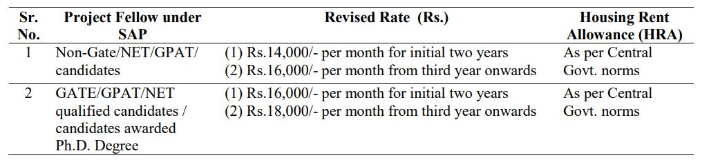

VNSGU Recruitment 2019: The Veer Narmad South Gujarat University has invited for the post of ONE Project Fellow under UGC-Special Assistance Programme at the level of DRS-II sanctioned vide letter No.: F.3-12/2018/DRS-II (SAP-II), dated 23/04/2018 initially up to 31/03/2019 and may be extended till 31/03/2023. The thrust area of research is Digital Image Processing and Computer Vision. The position is purely temporary with DRS-II-SAP duration.

## VNSGU Surat Recruitment 2019 For Project Fellow Post Details

<table style="border-collapse: collapse; width: 100%;"><tbody><tr><td style="width: 50%; background-color: #2a5a8e;" colspan="2"><h3 style="text-align: center;">VNSGU Recruitment 2019</h3></td></tr><tr><td style="width: 50%; text-align: center;">Job Recruitment Board</td><td style="width: 50%; text-align: center;">Veer Narmad South Gujarat University</td></tr><tr><td style="width: 50%; text-align: center;">Post</td><td style="width: 50%; text-align: center;">Project Fellow</td></tr><tr><td style="width: 50%; text-align: center;">Application Mode</td><td style="width: 50%; text-align: center;">Online</td></tr><tr><td style="width: 50%; text-align: center;">Job Location&nbsp;</td><td style="width: 50%; text-align: center;">Surat/Gujarat</td></tr></tbody></table>

<table style="border-collapse: collapse; width: 100%;"><tbody><tr><td style="width: 50%; background-color: #2a5a8e; text-align: center;" colspan="2">Important Dates</td></tr><tr><td style="width: 50%; text-align: center;">Last Date For Application Submission&nbsp;</td><td style="width: 50%; text-align: center;">19-10-2019</td></tr></tbody></table>

**Education Qualification:**

Master’s Degree in Computer Science, Computer Application, Information Technology, Computer Engineering with minimum 55% Marks (In case of SC/ST/PH 50% marks is required). For further terms and conditions kindly refer to the rules available on UGC Website.

**Desirable:** Knowledge of Computer Vision, Digital Image Processing and Programming skills in Python, Matlab, OpenCV and other related programming languages.

**Age Limit:** Candidate shall not be more than 40 years of age on the date of interview. Upper age limit may be relaxed as per Government of India rules.

**Selection Process:**

1. Written Test
2. Interview

**Fellowship:** Consolidated emoluments of Project Fellow will be as under or as revised from time to time as per UGC–SAP Guidelines.

### How to apply For VNSGU Recruitment Project Fellow Post

Eligible candidates may apply with full details on plain paper (including qualifications, photo, age, e-mail ID, contact number, etc. along with details of all mark sheets and certificates of qualifications, experiences, NET/GATE exam and research articles publications (if any) so as to reach the Co-ordinator, UGC-SAP (DRS-II), Department of Computer Science, VNSGU, Surat

**Instructions for the candidates**

- The applications will be scrutinized on the basis of qualifications, experience and suitability of the candidates in the program.
- Only shortlisted candidates from the initial screening will be called for written test and/or interview.
- Written test and/or interview date will be intimated by “E-mail/Telephonically only” to the shortlisted candidates.
- No TA/DA will be paid to the candidate if called for attending the written test and/or interview.

Send the application by mail, compsci@vnsgu.ac.in on or before 19/10/2019 and also send hard copy of application in an envelope with the title “Application for the Project Fellow under UGC-SAP (DRS-II) for the Department of Computer Science” to Co-ordinator UGC–SAP (DRS-II) at the address given below.

<table style="border-collapse: collapse; width: 100%;"><tbody><tr><td style="width: 50%; text-align: center;">Co-ordinator [UGC–SAP (DRS – II)] Dr. A. A. Desai, Professor &amp; Head Department of Computer Science Veer Narmad South Gujarat University, Surat-395007.</td><td style="width: 50%; text-align: center;">Deputy Co-ordinator [UGC–SAP (DRS – II)] Dr. R. D. Morena, Professor Department of Computer Science Veer Narmad South Gujarat University, Surat-395007.</td></tr></tbody></table>

### VNSGU Recruitment 2019 Important Links

- VNSGU Surat Recruitment 2019 For Project Fellow Post Notification PDF: [Click Here](https://freegovtjobalert.in/wp-content/uploads/2019/10/VNSGU-Surat-Recruitment-2019-For-Project-Fellow-Post-Notification-PDF.pdf)
- VNSGU Official Website: [Click Here](http://www.vnsgu.ac.in/)
