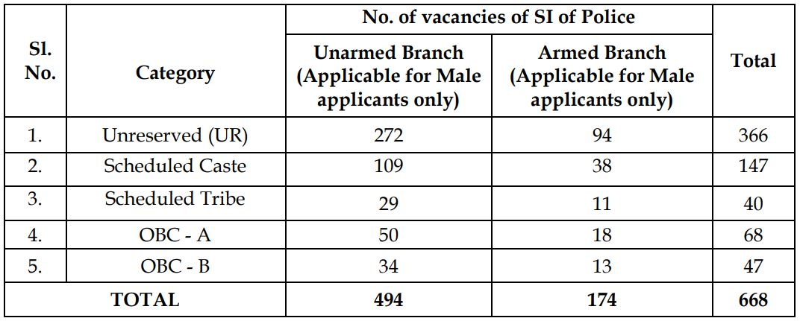

**West Bengal police recruitment 2019**: West Bengal police recruitment board has First Released Short Notice For SI of Police Vacancy 2019 and Recently Published full notification of Sub-inspector Unarmed Branch & Sub-inspector Armed Branch at **West Bengal police recruitment board**(WBPRB) Official Website (@wbprb.applythrunet.co.in). **WBPRB** are invited from Eligible Male Candidates who Having a bachelor’s degree and eligibility criteria can apply online or offline for **West Bengal Sub-Inspector Vacancy 2019**. interested and eligible candidates can apply for **WB Police Sub Inspector Online Application Form 2019** from date 10-08-2019 to 09-09-2019. to know about **Latest WB Police Jobs 2019** all details like Education qualification, Age Limits, Minimum Physical Standard, Physical Efficiency, Salary/Pay Scale How To Apply For **WB Police Online Form**, etc. in this page below.

## WB Police Sub Inspector Vacancy Details

<table style="height: 940px; width: 84.9475%; border-collapse: collapse; border-style: double;"><tbody><tr style="height: 80px;"><td style="width: 100%; text-align: center; height: 39px;" colspan="2"><strong>WEST BENGAL POLICE RECRUITMENT BOARD</strong>

West Bengal police si recruitment 2019

SI 668 Vacancies</td></tr><tr style="height: 30px;"><td style="width: 100%; height: 30px; background-color: #2a5a8e; text-align: center;" colspan="2"><h3><strong>&nbsp;Important Dates</strong></h3></td></tr><tr style="height: 22px;"><td style="width: 50%; text-align: center; height: 22px;">Starting Date for Registration</td><td style="width: 50%; text-align: center; height: 22px;"><strong>10-08-2019</strong></td></tr><tr style="height: 22px;"><td style="width: 50%; text-align: center; height: 22px;">Last Date for Registration</td><td style="width: 50%; text-align: center; height: 22px;"><strong>09-09-2019</strong></td></tr><tr style="height: 25px;"><td style="width: 50%; text-align: center; height: 25px;">Last Date For Fee Payment</td><td style="width: 50%; text-align: center; height: 25px;"><strong>12-09-2019</strong></td></tr><tr style="height: 30px;"><td style="width: 100%; height: 30px; background-color: #2a5a8e; text-align: center;" colspan="2"><h3><strong>&nbsp;Vacancy Details</strong></h3></td></tr><tr style="height: 22px;"><td style="text-align: center; height: 22px; width: 50%;">Job Recruitment Board</td><td style="text-align: center; width: 50%; height: 22px;">
<strong>WEST BENGAL POLICE RECRUITMENT BOARD</strong>
</td></tr><tr style="height: 22px;"><td style="text-align: center; width: 50%; height: 22px;">Post Name</td><td style="text-align: center; width: 50%; height: 22px;"><strong>Sub Inspector (UB)(AB)</strong></td></tr><tr style="height: 22px;"><td style="text-align: center; width: 50%; height: 22px;">Total Vacancies</td><td style="text-align: center; width: 50%; height: 22px;"><strong>668 Posts</strong></td></tr><tr style="height: 22px;"><td style="text-align: center; width: 50%; height: 22px;">Job State</td><td style="text-align: center; width: 50%; height: 22px;"><strong>West Bengal Govt Jobs</strong></td></tr><tr style="height: 22px;"><td style="text-align: center; width: 50%; height: 22px;">Job Location</td><td style="text-align: center; width: 50%; height: 22px;"><strong>West Bengal</strong></td></tr><tr style="height: 22px;"><td style="text-align: center; width: 50%; height: 22px;">Application Mode</td><td style="text-align: center; width: 50%; height: 22px;"><strong>Online / Offline</strong></td></tr><tr style="height: 30px;"><td style="width: 50%; background-color: #2a5a8e; text-align: center; height: 30px;" colspan="2"><h3><strong>Category Wise Vacancy Details</strong></h3></td></tr><tr style="height: 276px;"><td style="text-align: center; width: 50%; height: 276px;" colspan="2"></td></tr><tr style="height: 30px;"><td style="width: 100%; height: 30px; background-color: #2a5a8e; text-align: center;" colspan="2"><h3><strong>Eligibility Criteria&nbsp;</strong></h3></td></tr><tr style="height: 14px;"><td style="width: 50%; text-align: center; height: 14px;"><strong>Education Qualification</strong></td><td style="width: 50%; text-align: center; height: 14px;"><strong>Age Limits</strong></td></tr><tr style="height: 30px;"><td style="width: 50%; text-align: center; height: 30px;">&nbsp;Any Bachelor’s degree</td><td style="width: 50%; text-align: center; height: 30px;">Minimum 20 Years

Maximum 27 Years</td></tr><tr style="height: 30px;"><td style="width: 50%; background-color: #2a5a8e; text-align: center; height: 30px;" colspan="2"><h3><strong>Salary/Pay Scale</strong></h3></td></tr><tr style="height: 22px;"><td style="width: 50%; text-align: center; height: 22px;" colspan="2">Pay Scale Rs. 7,100 – 37,600/- + Grade Pay Rs. 3,900/- plus other admissible allowances.</td></tr><tr style="height: 30px;"><td style="width: 100%; height: 30px; background-color: #2a5a8e; text-align: center;" colspan="2"><h3><strong>Application Fee&nbsp;</strong></h3></td></tr><tr style="height: 30px;"><td style="width: 100%; text-align: center; height: 30px;" colspan="2"><ul><li style="text-align: left;">All categories of WB:&nbsp;<strong>Rs. 270/- (</strong>Application Fee:<strong> Rs. 250+</strong>Processing Fee<strong>: Rs. 20)</strong></li><li style="text-align: left;">For SC/ ST of WB:<strong>&nbsp;Rs. 20/- (Processing Fee only)</strong></li><li style="text-align: left;">Payment Mode (Online):<strong>&nbsp;Debit Cards/Credit Cards/Net-Banking</strong></li><li style="text-align: left;">Payment Mode (Offline):&nbsp;<strong>e-Payment and DOP/ UBI Bank</strong></li></ul></td></tr><tr style="height: 30px;"><td style="width: 100%; height: 30px; background-color: #2a5a8e; text-align: center;" colspan="2"><h3><strong>Important Links&nbsp;</strong></h3></td></tr><tr style="height: 10px;"><td style="width: 50%; text-align: center; height: 10px;"><strong>Apply Online&nbsp;</strong></td><td style="width: 50%; text-align: center; height: 10px;"><strong><a style="color: #ff0000;" title="WB Police" href="https://wbprb.applythrunet.co.in/Signup.aspx?L=A" target="_blank" rel="noopener noreferrer">Register</a>&nbsp;|&nbsp;<a style="color: #ff0000;" title="WB Police" href="https://wbprb.applythrunet.co.in/Login.aspx?L=A" target="_blank" rel="noopener noreferrer">Login</a></strong></td></tr><tr style="height: 25px;"><td style="width: 50%; text-align: center; height: 25px;"><strong>Download Offline Form</strong></td><td style="width: 50%; text-align: center; height: 25px;"><a style="color: #ff0000;" href="http://offlinewbprb.applythrunet.co.in/ApplicationFormSIOff.aspx" target="_blank" rel="noopener noreferrer"><strong>Click Here</strong></a></td></tr><tr style="height: 25px;"><td style="width: 50%; text-align: center; height: 25px;"><strong>SI Application Details</strong></td><td style="width: 50%; text-align: center; height: 25px;"><a style="color: #ff0000;" href="http://wbpolice.gov.in/WBP/Common/WBP_Recruitment_Notice.aspx?Id=2019/0017" target="_blank" rel="noopener noreferrer"><strong>Click Here</strong></a></td></tr><tr><td style="width: 50%; text-align: center;"><strong>Eligibility Criteria</strong></td><td style="width: 50%; text-align: center;"><a style="color: #ff0000;" href="https://freegovtjobalert.in/west-bengal-police-si-wb-si-eligibility-criteria/" target="_blank" rel="noopener noreferrer"><strong>Click Here</strong></a></td></tr><tr style="height: 36px;"><td style="width: 50%; text-align: center; height: 23px;"><strong>Notification</strong></td><td style="width: 50%; text-align: center; height: 23px;"><strong><a style="color: #ff0000;" href="https://freegovtjobalert.in/wp-content/uploads/2019/08/Notification-WB-Police-Sub-Inspector-Online-Posts.pdf" target="_blank" rel="noopener noreferrer">Online Mode</a> | <a style="color: #ff0000;" href="https://freegovtjobalert.in/wp-content/uploads/2019/08/Notification-WB-Police-Sub-Inspector-Offline-Posts.pdf" target="_blank" rel="noopener noreferrer">Offline Mode</a></strong></td></tr><tr style="height: 25px;"><td style="width: 50%; text-align: center; height: 25px;"><strong>Short Notification</strong></td><td style="width: 50%; text-align: center; height: 25px;"><a style="color: #ff0000;" href="https://freegovtjobalert.in/wp-content/uploads/2019/08/Short-Notice-WB-Police-Sub-Inspector-Posts.pdf" target="_blank" rel="noopener noreferrer"><strong>Click Here</strong></a></td></tr><tr style="height: 10px;"><td style="width: 50%; text-align: center; height: 10px;"><strong>&nbsp;Official Website</strong></td><td style="width: 50%; text-align: center; height: 10px;"><a style="color: #ff0000;" href="http://wbpolice.gov.in/" target="_blank" rel="noopener noreferrer"><strong>Click Here</strong></a></td></tr></tbody></table>

### How To Apply WB Police Sub Inspector Online Application Form 2019?

**Online Application Form:**

1. Candidates First Goto Here: [Apply Online](https://wbprb.applythrunet.co.in/PostDetail.aspx?E=CqtJgc1EYX%2fE3Us1gP294w%3d%3d)
2. after Open webpage Click On **Apply Online** Button
3. then Enter Your Username & Password and Click on Log-in button. (If you don't have Username then the first Click on Sing Up button and register your self and get username)
4. After login fillup your information and uploading of photograph & Signature.
5. complete fillup form and submit an application.
6. Pay Application fee through Online or Offline.

**Offline Application Form:**

1. Candidates First Goto Here: [Offline Form](http://offlinewbprb.applythrunet.co.in/ApplicationFormSIOff.aspx)
2. Fillup Information In Application Form
3. After Fillup Click On **Save & Download** Button
4. During downloading of each Application Form, a unique Application Serial Number with bar code will appear in the form. (No form without the Application Serial No. and Bar Code shall be accepted by the Board.)
5. Printout application and attach Document with application
6. Pay Application Fee Through DOP/UBI
7. After Check all Details Candidates can Submit Application to This Address: The Chairman, West Bengal Police Recruitment Board, Araksha Bhaban, 5th Floor, Block – DJ, Sector-II, Salt Lake City, Kolkata – 700 091

> Interested candidates Plese Read Notification Carefully before fillup application
