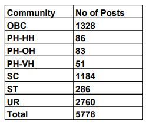

WB Post Office Recruitment 2019: Indian Post-West Bengal Postal Circle has Reopen recruitment of the Post of Gramin Dak Sevak. As Per West Bengal Postal Circle Recruitment Notification 2019 A total of 5778 Vacancies are there. Good Chance for Those Candidates Who Searching Post office Jobs In West Bengal. Eligible Candidates can Apply Online For West Bengal Postal Circle Recruitment 2019 Before 14-12-2019.

## **West Bengal Postal Circle Recruitment 2019 For Gramin Dak Sevak Post**

<table style="border-collapse: collapse; width: 100%;"><tbody><tr><td style="width: 50%; background-color: #2a5a8e;" colspan="2"><h3 style="text-align: center;">West Bengal Postal Circle Recruitment 2019</h3></td></tr><tr><td style="width: 50%; text-align: center;">Job Recruitment Board</td><td style="width: 50%; text-align: center;">Indian Post Office</td></tr><tr><td style="width: 50%; text-align: center;">Advertisement No.</td><td style="width: 50%; text-align: center;">RECTT./R-100/ONLINE/GDS/VOL-VI DATED 05.04.2018</td></tr><tr><td style="width: 50%; text-align: center;">Post</td><td style="width: 50%; text-align: center;">Gramin Dak Sevaks</td></tr><tr><td style="width: 50%; text-align: center;">Vacancies</td><td style="width: 50%; text-align: center;">5778</td></tr><tr><td style="width: 50%; text-align: center;">Job Location</td><td style="width: 50%; text-align: center;">West Bengal Postal Circle</td></tr><tr><td style="width: 50%; text-align: center;">Job Type</td><td style="width: 50%; text-align: center;">Post Office Jobs</td></tr><tr><td style="width: 50%; text-align: center;">Application Mode</td><td style="width: 50%; text-align: center;">Online</td></tr></tbody></table>

West Bengal Post Office GDS Recruitment 2019 Notification has to Publish on His Official website. Applicants, you Can get All West Bengal Post Gramin Dak Sevak Notification Details From Here. Also, We Provide Direct Apply Online Link For Easy to apply for West Bengal Postal Circle Recruitment GDS Post. To know about West Bengal Post Office Vacancy Details Like Education Qualification, Age Limits, Salary, Application Fee, How to apply, etc. Given Below on this page.

<table style="border-collapse: collapse;"><tbody><tr><td style="width: 50%; background-color: #2a5a8e; text-align: center;" colspan="2"><h3>Important Dates</h3></td></tr><tr><td style="width: 50%; text-align: center;">Starting date for Online Registration</td><td style="width: 50%; text-align: center;">05-12-2019</td></tr><tr><td style="width: 50%; text-align: center;">Last date for Online Registration</td><td style="width: 50%; text-align: center;">14-12-2019</td></tr></tbody></table>

### **West Bengal Post GDS Vacancy Details**

- WB Gramin Dak Sevak Vacancy 2019: 5778 Posts

Category Wise West Bengal Post Office Vacancy Details

 

### **WB Post Office Recruitment 2019 Eligibility Criteria**

Education Qualification:

- Secondary School Examination pass certificate of 10th standard with passing marks in Mathematics and English.
- Compulsory knowledge of Local Language.
- The candidate should have computer knowledge and will be required to furnish the basic computer training certificates for at least 60 days from a recognized Computer Training Institute.

Age Limits:

- Minimum: 18 Years
- Maximum:
    - General Candidates: 40 Years
    - SC/ST Candidates: 45 Years
    - OBC Candaeits: 43 Years
    - Persons with Disabilities (PwD): 50 Years
    - Persons with Disabilities (PwD) + OBC: 53 Years
    - Persons with Disabilities (PwD) + SC/ST: 55 Years

### **West Bengal Post Office Exam Selection Process**

- Selection will be made as per the automatically generated merit list as per the rules based on the candidate's online submitted applications.
- No weight will be given for higher educational qualifications. Only marks obtained in 10th standard of approved Boards aggregated to percentage to the accuracy of 4 decimals will be the criteria for finalizing the selection.

### **How to Apply For West Bengal Postal Circle GDS recruitment 2019**

The only online application will be accepted by the candidate. A candidate who desires to apply online will have to register himself/herself in the portal through https://indiapost.gov.in or http://appost.in/gdsonline

1. Go to Indian Post Office Official Website: http://www.appost.in/
2. First Registration on India Post Office Site
3. Pay Application Fee(Online/Offline)
4. Click on Apply Online
5. Fill Indian Post Office Application Form
6. Upload Documents
7. Submit Application
8. Download & Save For Future Use.
9. Done

Candidates can Visit www.appost.In For West Bengal postal upcoming notification 2019, latest postal jobs in West Bengal 2019, Merit list, WB Postal Result, WB Post Recruitment Updates. Keep Visit Ragulaly our website or allow notification for all Lastest Jobs Updates.

### **West Bengal Post Office Recruitment Important Links**

- Direct Apply Online For WB Post Office Recruitment 2019: [Registration](https://indiapostgdsonline.in/phase4/fee.aspx) | [Apply Online](http://indiapostgdsonline.in/phase4/reference.aspx)
- Re-open WB Post Office Recruitment Notification 2019 PDF: [Click Here](http://appost.in/gdsonline/Notifications/WB-23_Cycle-I.pdf)
- West Bengal Post Office Official Website: [Click Here](http://www.westbengalpost.gov.in/)

Indian Post Office Jobs:

- [Telangana Postal Circle Recruitment 2019 | 970 TS Postal GDS Notification](https://freegovtjobalert.in/telangana-postal-circle-recruitment-gds/)
- [Chhattisgarh Postal Circle Recruitment 2019 | 1799 CG GDS Vacancy](https://freegovtjobalert.in/chhattisgarh-postal-circle-recruitment-gds/)
- [AP Postal Circle Recruitment 2019 | 2707 Gramin Dak Sevak Vacancies](https://freegovtjobalert.in/ap-postal-circle-recruitment-gds-gramin-dak-sevak/)
