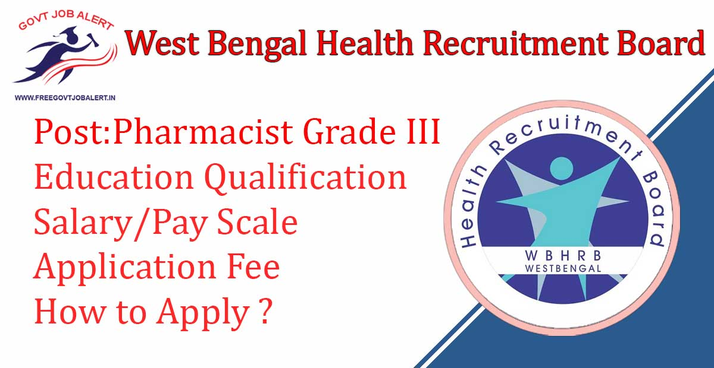
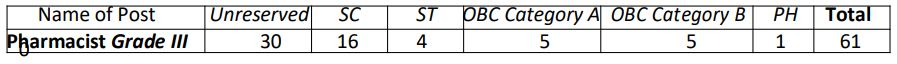

WBHRB Recruitment 2019: West Bengal Health Recruitment Board Has Released Notification For the recruitment of the post of Pharmacist Grade III. WB Health Recruitment Board has Online Applications are invited from Indian Citizens and such other nationals as declared eligible by the Government of India for recruitment to the Post of Pharmacist Grade III under Health & Family Welfare Department, Government of West Bengal. As Per west Bengal health recruitment board advertisement A Total of 61 Vacancies Are There. WBHRB Pharmacist Grade III Online Form 2019 has Start on 17-10-2019 to 24-10-2019.

## WBHRB Recruitment 2019 For Pharmacist Grade III Post Details

<table style="border-collapse: collapse; width: 100%;"><tbody><tr><td style="width: 50%; background-color: #2a5a8e;" colspan="2"><h3 style="text-align: center;">WBHRB Recruitment 2019</h3></td></tr><tr><td style="width: 50%; text-align: center;">Job Recruitment Board</td><td style="width: 50%; text-align: center;">West Bengal Health Recruitment Board</td></tr><tr><td style="width: 50%; text-align: center;">Advertisement No.</td><td style="width: 50%; text-align: center;">R/Phar./74(1)/1/2019</td></tr><tr><td style="width: 50%; text-align: center;">Post</td><td style="width: 50%; text-align: center;">Pharmacist Grade III</td></tr><tr><td style="width: 50%; text-align: center;">Vacancies</td><td style="width: 50%; text-align: center;">61 Post</td></tr><tr><td style="width: 50%; text-align: center;">Job Location</td><td style="width: 50%; text-align: center;">West Bengal</td></tr><tr><td style="width: 50%; text-align: center;">Job Type</td><td style="width: 50%; text-align: center;">State Govt Job</td></tr><tr><td style="width: 50%; text-align: center;">Application Mode</td><td style="width: 50%; text-align: center;">Online</td></tr></tbody></table>

WBHRB Pharmacist Grade III Recruitment Notification 2019 has published on his official website. Candidates Should Have Minimum 12th Pass/ Diploma/ Graduate. Applicants Age Should not More than 39 years. Good Opportunity For those candidates Who Finding Govt Job In West Bengal, can apply online WBHRB Recruitment 2019. Selected Candidates Will be Posted in West Bengal. to Know About WBHRB Vacancy Details Like Education Qualification, Salary/Pay Scale, Age limits, Selection Process, How to Apply, etc Given Below on this page.

<table style="border-collapse: collapse;"><tbody><tr><td style="width: 50%; background-color: #2a5a8e;" colspan="2"><h3 style="text-align: center;">WBHRB Exam Important Dates</h3></td></tr><tr><td style="width: 50%; text-align: center;">Starting Date of Online Registration</td><td style="width: 50%; text-align: center;">17-10-2019</td></tr><tr><td style="width: 50%; text-align: center;">Last Date Of Online Registration</td><td style="width: 50%; text-align: center;">24-10-2019</td></tr></tbody></table>

### WBHRB Vacancy 2019 Details

- Pharmacist Grade III: 61 Posts

Category Wise WBHRB Pharmacist Grade III Vacancy Details

###  WBHRB Pharmacist Grade III Education Qualification

- Passed Higher Secondary Examination (10+2) from West Bengal Council of Higher Secondary Examination, or it's equivalent with Physics, Chemistry, Mathematics/ Biology; and
- Two Years Diploma Course in Pharmacy recognized by the Government of West Bengal, or Bachelor Degree in Pharmacy recognized by the Government of West Bengal; and
- Registered as ‘A’ category Pharmacist under the West Bengal Pharmacy Council.

Age Limits:

- Candidates Not More than 39 Years.

### WBHRB Job Salary/Pay Scale

- Rs.7100/- - Rs.37600/-, \[Entry Pay Rs. 7,440/-\] with Grade Pay – Rs. 3600/-\]. (Pay Band 3 of ROPA 09 Rules)

### Application Fee

- General/OBC Candidates: Rs. 160/-
- SC/ST Candidates: Nil
- Payment Mode: Pay only through GRPS ( Govt. Receipt Portal System ), Govt. of West Bengal 

### Distribution Pattern of Marks for the Pharmacist, Grade III

<table style="border-collapse: collapse; width: 100%; height: 209px;"><tbody><tr style="height: 20px;"><td style="width: 77.9736%; text-align: center; height: 20px; background-color: #2a5a8e;"><strong>Subject</strong></td><td style="width: 22.0264%; text-align: center; height: 20px; background-color: #2a5a8e;"><strong>Marks</strong></td></tr><tr style="height: 42px;"><td style="width: 77.9736%; text-align: center; height: 42px;">Marks obtained in Higher Secondary (10+2) or its equivalent examinations in Science subjects [ Physics, Chemistry and Mathematics/Biology]</td><td style="width: 22.0264%; text-align: center; height: 42px;">60(Max.)</td></tr><tr style="height: 20px;"><td style="width: 77.9736%; text-align: center; height: 20px;">Two years Diploma Course in Pharmacy</td><td style="width: 22.0264%; text-align: center; height: 20px;">12</td></tr><tr style="height: 10px;"><td style="width: 77.9736%; text-align: center; height: 10px;">Bachelor Degree in Pharmacy</td><td style="width: 22.0264%; text-align: center; height: 10px;">13</td></tr><tr style="height: 20px;"><td style="width: 77.9736%; text-align: center; height: 20px;">Master Degree in Pharmacy</td><td style="width: 22.0264%; text-align: center; height: 20px;">15</td></tr><tr style="height: 87px;"><td style="width: 77.9736%; text-align: center; height: 87px;">Experience:

(For State Govt. service(Permanent/ Contractual- 2 marks/year For Private Institution - 1 mark/year) [Maximum last 5 years’ tenure of experience will be taken into account]</td><td style="width: 22.0264%; text-align: center; height: 87px;">10(Max.)</td></tr><tr style="height: 10px;"><td style="width: 77.9736%; text-align: center; height: 10px;">Interview</td><td style="width: 22.0264%; text-align: center; height: 10px;">15(Max)</td></tr></tbody></table>

### How to apply for WBHRB Recruitment Pharmacist Grade III Post

1. Candidates Go to WBHRB Official website: https://wbhrb.net.in
2. Select desired post from online application section and click on Apply Now button
3. Fill registration along with some basic information like Name, Date of Birth, Caste, etc. with registered mobile number and email.
4. After successful registration, the applicant should get a notification of registration no. and password through SMS
5. Applicant can get into the applicant’s dashboard using valid Registration ID and password through the Applicant Login button.
6. Click on the “Make Payment” (if applicable) link for payment of fees through GRIPS portal and take a print out of GRIPS challan
7. Click ‘Payment Verification’ Button after 30 minutes of successful payment (if required) Please do not pay again.
8. After successful payment, the final Application Form will be opened in the applicant’s dashboard. If not, then lodge a complaint through WBHRB “Complain Box for Online Application” Complain Box for Online Application” link. (Complaint through other media should not entertain related to online application like phone, email).
9. Then click on the “Fill Application Form” to fill up the details in the application form with requisite information along with Personal information, Qualification & Experience details.
10. In the next step, the applicant is required to upload a scanned recent passport size color photograph and Signature one by one.
11. Once all the details are filled in, the candidate is required to Review the details entered and Confirm. No edit will be allowed once the application is confirmed.
12. After successful submission of application form, a completed application form will display on the screen. Take two copies printout of Application form for document verification (it will not available in future).

### WBHRB Recruitment 2019 Important Links

- Direct Apply Online WBHRB Recruitment Pharmacist Grade III Post: [Click Here](https://wbhrb.net.in/reg-form/T0RBME1nPT0=)
- WBHRB Recruitment Pharmacist Grade III Post Notification 2019 PDF: [Click Here](https://freegovtjobalert.in/wp-content/uploads/2019/10/WBHRB-Recruitment-Pharmacist-Grade-III-Post-Notification-2019.pdf)
- WBHRB Official website: [Click Here](https://wbhrb.net.in)
