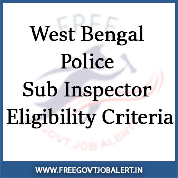

West Bengal Police Recruitment 2019: West Bengal Police Sub Inspector Eligibility Criteria (WB SI Eligibility Criteria) Mentioned in West Bengal Police Recruitment Board Notification and Also Candidates Can Get to Know All Eligibility Criteria Details. Candidates Must Be a Citizen of India and Permanently Stay in India. Applicable Candidates Should Be Competent in Minimum Physical Standard, Physical Efficiency, Qualification, Age Limit. West Bengal Police SI (WB SI) Eligibility Criteria are given in this page below...

## West Bengal Police Sub Inspector Eligibility Criteria (WB SI)Details

**Nationality:**

- Candidates must be a citizen of India.

**Education Qualification:**

- The Candidates must have a bachelor’s degree in any discipline from a recognized university or its equivalent.

**Language:**

- The applicant must be able to speak, read and write the Bengali Language. However, this provision will not be applicable to the persons who are permanent residents of hill sub-divisions of Darjeeling and Kalimpong Districts.
- For the applicant of hill sub-divisions of Darjeeling and Kalimpong District, the provisions laid down in the West Bengal Official Language Act, 1961 will be applicable.

**Age Limits:**

- The applicant must not be below 20 years and not more than 27 years as on 01.01.2019.

**Age Limits relaxation:**

- Upper age limit is relaxable by 5 years for SC and ST and by 3 years for OBC candidates of West Bengal only.
- Upper age limit is also relaxable up to 35 years for departmental candidates of West Bengal Police only having the requisite qualification.

**Minimum Physical Standard:**

- Candidates must have a minimum physical measurement as mentioned below : -

<table style="height: 343px; width: 81.4529%; border-collapse: collapse; border-style: double;"><tbody><tr style="height: 22px;"><td style="width: 27.1096%; height: 22px; text-align: center; background-color: #2a5a8e;"><strong>Post Name</strong></td><td style="width: 32.3544%; height: 22px; text-align: center; background-color: #2a5a8e;"><strong>Category</strong></td><td style="width: 8.22835%; height: 22px; text-align: center; background-color: #2a5a8e;"><strong>Height</strong></td><td style="width: 8.22845%; height: 22px; text-align: center; background-color: #2a5a8e;"><strong>Weight</strong></td><td style="width: 18.1352%; height: 22px; text-align: center; background-color: #2a5a8e;"><strong>Chest</strong></td></tr><tr style="height: 22px;"><td style="width: 27.1096%; height: 44px; text-align: center;" rowspan="2">Sub-Inspector of Police [Unarmed Branch (UB) in West Bengal Police]</td><td style="width: 32.3544%; height: 22px; text-align: center;">Candidates of all categories (except Gorkhas, Rajbanshis, Garwalis, and Scheduled Tribes)</td><td style="width: 8.22835%; height: 22px; text-align: center;">167 cm</td><td style="width: 8.22845%; height: 22px; text-align: center;">56 kg</td><td style="width: 18.1352%; height: 22px; text-align: center;">79 cm. with a minimum expansion of 5 cm</td></tr><tr style="height: 22px;"><td style="width: 32.3544%; height: 22px; text-align: center;">Gorkhas, Rajbanshis, Garwalis and Scheduled Tribes</td><td style="width: 8.22835%; height: 22px; text-align: center;">160 cm</td><td style="width: 8.22845%; height: 22px; text-align: center;">52 kg</td><td style="width: 18.1352%; height: 22px; text-align: center;">76 cm. with a minimum expansion of 5 cm</td></tr><tr style="height: 22px;"><td style="width: 27.1096%; height: 44px; text-align: center;" rowspan="2">Sub-Inspector of Police [Armed Branch (AB) in West Bengal Police]</td><td style="width: 32.3544%; height: 22px; text-align: center;">Candidates of all categories (except Gorkhas, Rajbanshis, Garwalis, and Scheduled Tribes)</td><td style="width: 8.22835%; height: 22px; text-align: center;">173 cm</td><td style="width: 8.22845%; height: 22px; text-align: center;">60 kg.</td><td style="width: 18.1352%; height: 22px; text-align: center;">86 cm. with a minimum expansion of 5 cm</td></tr><tr style="height: 22px;"><td style="width: 32.3544%; height: 22px; text-align: center;">Gorkhas, Rajbanshis, Garwalis and Scheduled Tribes</td><td style="width: 8.22835%; height: 22px; text-align: center;">163 cm</td><td style="width: 8.22845%; height: 22px; text-align: center;">54 kg.</td><td style="width: 18.1352%; height: 22px; text-align: center;">81 cm. with a minimum expansion of 5 cm</td></tr></tbody></table>

**Physical Efficiency:** 

- Must qualify the following Physical Efficiency Tests : -

<table style="height: 119px; width: 82.1454%; border-collapse: collapse; border-style: double;"><tbody><tr><td style="width: 50%; text-align: center; background-color: #2a5a8e;"><strong>Post Name</strong></td><td style="width: 50%; text-align: center; background-color: #2a5a8e;"><strong>Test</strong></td></tr><tr><td style="width: 50%; text-align: center;">Male candidates for the post of Sub-Inspector of Police (UB) and Sub-Inspector of Police (AB) in West Bengal Police</td><td style="width: 50%; text-align: center;">800 meters run within 03 (three) minutes</td></tr></tbody></table>

> Physically Handicapped candidates shall not be eligible to apply

<table style="height: 148px; width: 84.9475%; border-collapse: collapse; border-style: double;"><tbody><tr style="height: 30px;"><td style="width: 100%; height: 30px; background-color: #2a5a8e; text-align: center;" colspan="2"><strong>West Bengal Police Recruitment 2019 Important Link</strong></td></tr><tr style="height: 10px;"><td style="width: 50%; text-align: center; height: 10px;"><strong>Apply Online&nbsp;</strong></td><td style="width: 50%; text-align: center; height: 10px;"><strong><a style="color: #ff0000;" title="WB Police" href="https://wbprb.applythrunet.co.in/Signup.aspx?L=A" target="_blank" rel="noopener noreferrer">Register</a>&nbsp;|&nbsp;<a style="color: #ff0000;" title="WB Police" href="https://wbprb.applythrunet.co.in/Login.aspx?L=A" target="_blank" rel="noopener noreferrer">Login</a></strong></td></tr><tr style="height: 25px;"><td style="width: 50%; text-align: center; height: 25px;"><strong>Download Offline Form</strong></td><td style="width: 50%; text-align: center; height: 25px;"><a style="color: #ff0000;" href="http://offlinewbprb.applythrunet.co.in/ApplicationFormSIOff.aspx" target="_blank" rel="noopener noreferrer"><strong>Click Here</strong></a></td></tr><tr style="height: 25px;"><td style="width: 50%; text-align: center; height: 25px;"><strong>SI Application Details</strong></td><td style="width: 50%; text-align: center; height: 25px;"><a style="color: #ff0000;" href="http://wbpolice.gov.in/WBP/Common/WBP_Recruitment_Notice.aspx?Id=2019/0017" target="_blank" rel="noopener noreferrer"><strong>Click Here</strong></a></td></tr><tr style="height: 36px;"><td style="width: 50%; text-align: center; height: 23px;"><strong>Notification</strong></td><td style="width: 50%; text-align: center; height: 23px;"><strong><a style="color: #ff0000;" href="https://freegovtjobalert.in/wp-content/uploads/2019/08/Notification-WB-Police-Sub-Inspector-Online-Posts.pdf" target="_blank" rel="noopener noreferrer">Online Mode</a> | <a style="color: #ff0000;" href="https://freegovtjobalert.in/wp-content/uploads/2019/08/Notification-WB-Police-Sub-Inspector-Offline-Posts.pdf" target="_blank" rel="noopener noreferrer">Offline Mode</a></strong></td></tr><tr style="height: 25px;"><td style="width: 50%; text-align: center; height: 25px;"><strong>Short Notification</strong></td><td style="width: 50%; text-align: center; height: 25px;"><a style="color: #ff0000;" href="https://freegovtjobalert.in/wp-content/uploads/2019/08/Short-Notice-WB-Police-Sub-Inspector-Posts.pdf" target="_blank" rel="noopener noreferrer"><strong>Click Here</strong></a></td></tr><tr style="height: 10px;"><td style="width: 50%; text-align: center; height: 10px;"><strong>&nbsp;Official Website</strong></td><td style="width: 50%; text-align: center; height: 10px;"><a style="color: #ff0000;" href="http://wbpolice.gov.in/" target="_blank" rel="noopener noreferrer"><strong>Click Here</strong></a></td></tr></tbody></table>

> More Govt Jobs: [www.freegovtjobalert.in](https://freegovtjobalert.in)
