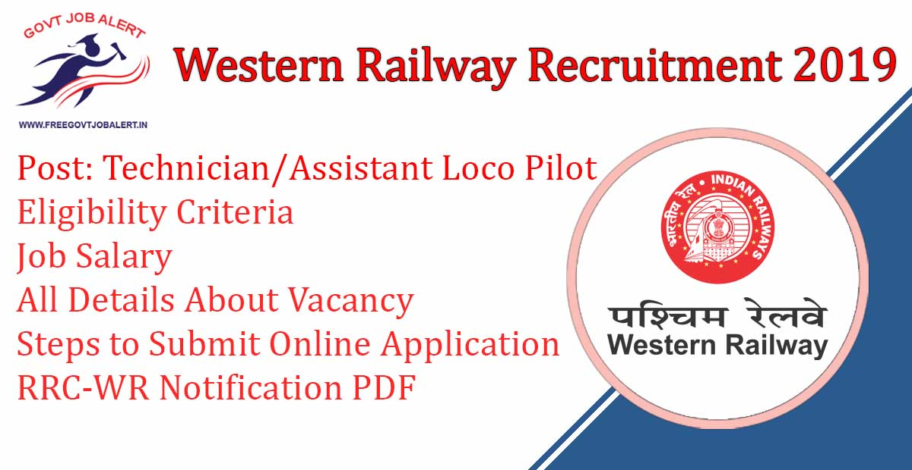
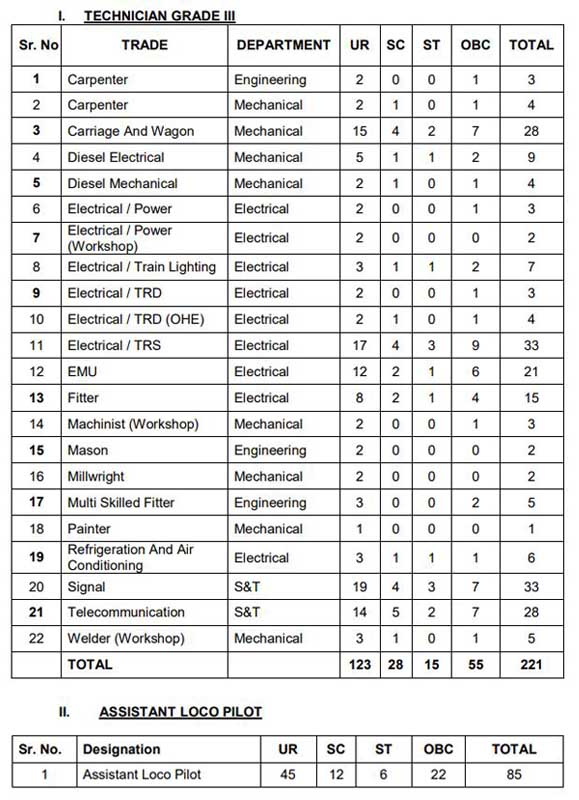

Western Railway Recruitment 2019: Railway Recruitment Cell has Released Notification For The Recruitment of the post of Technician & Assistant Loco Pilot at western railway. Railway Recruitment Cell-Western Railway Invites Online Application Form Eligible Candidates for Filling up the post of Technician & ALP. As Per western railway recruitment 2019 notification A Total 306 Vacancies Are There. Good Chance For Those Candidates Who are Finding Railway Jobs in Mumbai. www.rrc-wr.com online registration has started on 12-10-2019.

## Western Railway Recruitment 2019 For Technician & Assistant Loco Pilot Post

<table style="border-collapse: collapse; width: 100%;"><tbody><tr><td style="width: 50%; background-color: #2a5a8e; text-align: center;" colspan="2"><h3>Railway Recruitment Cell-Western Railway Recruitment 2019</h3></td></tr><tr><td style="width: 50%; text-align: center;">Job Recruitment Board</td><td style="width: 50%; text-align: center;">Railway Recruitment Cell-Western Railway</td></tr><tr><td style="width: 50%; text-align: center;">Notification No.</td><td style="width: 50%; text-align: center;">07/2019 GDCE</td></tr><tr><td style="width: 50%; text-align: center;">Post</td><td style="width: 50%; text-align: center;">Technician &amp; Assistant Loco Pilot</td></tr><tr><td style="width: 50%; text-align: center;">Vacancies</td><td style="width: 50%; text-align: center;">306 Posts</td></tr><tr><td style="width: 50%; text-align: center;">Job Location</td><td style="width: 50%; text-align: center;">anywhere on Western Railway</td></tr><tr><td style="width: 50%; text-align: center;">Job Type</td><td style="width: 50%; text-align: center;">Railway Jobs</td></tr><tr><td style="width: 50%; text-align: center;">Application Mode</td><td style="width: 50%; text-align: center;">Online</td></tr></tbody></table>

Railway Recruitment Cell Western Railway Recruitment Notification 2019 is Published on his Official website. In WR Recruitment Notification 2019 Mentioned Details of 221 Technician Grade-III & 85 Assistant Loco Pilot (ALP) Vacancies. western railway recruitment 2019 online application form has Available 12-10-2019 to 11-11-2019. to know About WR Railway Jobs Details Like Education Qualification, Age Limit, Salary/Pay Scale, Selection Process, Steps to submit WR Recruitment Online Application, Etc Given Below In this page.

<table style="border-collapse: collapse; width: 100%;"><tbody><tr><td style="width: 50%; background-color: #2a5a8e; text-align: center;" colspan="2"><h3>Important Dates</h3></td></tr><tr><td style="width: 50%; text-align: center;">Opening Date &amp; Time</td><td style="width: 50%; text-align: center;">12-10-2019</td></tr><tr><td style="width: 50%; text-align: center;">Closing Date &amp; Time</td><td style="width: 50%; text-align: center;">11-11-2019</td></tr></tbody></table>

### **RRC Western Railway 2019 Vacancy Details**

- Technician Grade-III: 221 Posts
- Assistant Loco Pilot (ALP): 85 Posts

RRC Western Railway 2019 Category Wise Vacancy Details

### **RRC-WR Vacancy Technician & Assistant Loco Pilot Eligibility Criteria**

<table style="border-collapse: collapse; width: 100%; height: 604px;"><tbody><tr style="height: 24px;"><td style="width: 100%; height: 24px; background-color: #2a5a8e; text-align: center;" colspan="2"><strong>Education Qualification</strong></td></tr><tr style="height: 24px;"><td style="width: 31.0572%; text-align: center; height: 24px;"><strong>Post Name</strong></td><td style="width: 68.9428%; text-align: center; height: 24px;"><strong>Education Qualification</strong></td></tr><tr style="height: 42px;"><td style="width: 31.0572%; height: 42px;">Carpenter(Engineering &amp; Mechanical)</td><td style="width: 68.9428%; height: 42px;">Matriculation / SSLC plus ITI from recognized institutions of NCVT/SCVT in the trades of Carpenter / Furniture and Cabinet Maker.</td></tr><tr style="height: 42px;"><td style="width: 31.0572%; height: 42px;">Carriage And Wagon (Mechanical)</td><td style="width: 68.9428%; height: 42px;">Matriculation / SSLC plus ITI from recognized institutions of NCVT/SCVT in the trades of Fitter / Carpenter / Welder / Plumber / Pipe Fitter.</td></tr><tr style="height: 64px;"><td style="width: 31.0572%; height: 64px;">Diesel Electrical (Mechanical )</td><td style="width: 68.9428%; height: 64px;">Matriculation / SSLC plus ITI from recognized institutions of NCVT/SCVT in the trades of Electrician / Mechanic Auto electrical and Electronics / Wireman / Electronics Mechanic / Mechanic Power Electronics.</td></tr><tr style="height: 64px;"><td style="width: 31.0572%; height: 64px;">Diesel Mechanical (Mechanica)</td><td style="width: 68.9428%; height: 64px;">Matriculation / SSLC plus ITI from recognized institutions of NCVT/SCVT in the trades of Fitter / Mechanic Diesel / Mechanic (Repair and Maintenance of Heavy Vehicles) /Mechanic Automobile (Advanced Diesel Engine) / Mechanic Motor Vehicle / Tractor Mechanic / Welder / Painter.</td></tr><tr style="height: 42px;"><td style="width: 31.0572%; height: 42px;">Electrical / Power (Electrica)</td><td style="width: 68.9428%; height: 42px;">Matriculation / SSLC plus ITI from recognized institutions of NCVT/SCVT in the trades of Electrician / Wireman / Mechanic HT, LT Equipments and Cable Jointing / Electronics Mechanic</td></tr><tr style="height: 20px;"><td style="width: 31.0572%; height: 20px;">Electrical / Power (Workshop) (Electrical)</td><td style="width: 68.9428%; height: 50px;" rowspan="3">Matriculation / SSLC plus ITI from recognized institutions of NCVT/SCVT in the trades of Electrician / Wireman / Mechanic HT, LT Equipments and Cable Jointing / Electronics Mechanic</td></tr><tr style="height: 20px;"><td style="width: 31.0572%; height: 20px;">Electrical / Train Lighting (Electrical )</td></tr><tr style="height: 20px;"><td style="width: 31.0572%; height: 10px;">Electrical / TRD (Electrica)</td></tr><tr style="height: 42px;"><td style="width: 31.0572%; height: 10px;">Electrical / TRD (OHE) (Electrical )</td><td style="width: 68.9428%; height: 10px;">Matriculation / SSLC plus ITI from recognized institutions of NCVT/SCVT in the trades of Electrician / Wireman / Mechanic HT, LT Equipments and Cable Jointing / Electronics Mechanic</td></tr><tr style="height: 44px;"><td style="width: 31.0572%; height: 44px;">Electrical / TRS</td><td style="width: 68.9428%; height: 65px;" rowspan="2">Matriculation / SSLC plus ITI from recognized institutions of NCVT/SCVT in the trades of Electrician / Wireman / Electronics Mechanic / Mechanic Power Electronics / Mechanic HT, LT Equipments and Cable Jointing / Fitter / Welder / Painter General / Machinist / Carpenter</td></tr><tr style="height: 45px;"><td style="width: 31.0572%; height: 21px;">EMU (Electrical )</td></tr><tr style="height: 64px;"><td style="width: 31.0572%; height: 10px;">Fitter (Electrical)</td><td style="width: 68.9428%; height: 10px;">Matriculation / SSLC plus ITI from recognized institutions of NCVT/SCVT in the trade of Fitter</td></tr><tr style="height: 85px;"><td style="width: 31.0572%; height: 24px;">Machinist(WORKSHOP) (Electrical)</td><td style="width: 68.9428%; height: 24px;">Matriculation / SSLC plus ITI from recognized institutions of NCVT/SCVT in the trades of Machinist / Turner / Machinist (Grinder)</td></tr><tr style="height: 64px;"><td style="width: 31.0572%; height: 11px;">Mason (Engineering )</td><td style="width: 68.9428%; height: 11px;">Matriculation / SSLC plus ITI from recognized institutions of NCVT/SCVT in the trades of Mason (Building Constructor)</td></tr><tr style="height: 42px;"><td style="width: 31.0572%; height: 47px;">Millwright (Mechanical )</td><td style="width: 68.9428%; height: 47px;">Matriculation / SSLC plus ITI from recognized institutions of NCVT/SCVT in the trades of Millwright Maintenance Mechanic / Mechanic Machine Tool Maintenance / Mechanic Advanced Machine Tool Maintenance</td></tr><tr style="height: 42px;"><td style="width: 31.0572%; height: 10px;">Multi-Skilled Fitter (Engineering)</td><td style="width: 68.9428%; height: 10px;">Matriculation / SSLC plus ITI from recognized institutions of NCVT/SCVT in the trades of Fitter / Welder / Machinist

OR

Matriculation / SSLC plus Course Completed Act Apprenticeship in the trades mentioned above.</td></tr><tr style="height: 99px;"><td style="width: 31.0572%; height: 25px;">Painter (Mechanical )</td><td style="width: 68.9428%; height: 25px;">Matriculation / SSLC plus ITI from recognized institutions of NCVT/SCVT in the trades of Painter General /Domestic Painter/ Industrial Painter</td></tr><tr style="height: 42px;"><td style="width: 31.0572%; height: 10px;">Refrigeration And Air Conditioning (Electrica)</td><td style="width: 68.9428%; height: 20px;" rowspan="2">Matriculation / SSLC plus ITI from recognized institutions of NCVT/SCVT in the trades of Refrigeration and Air Conditioning Mechanic / Electrician / Wireman / Electronics Mechanic (OR) Matriculation / SSLC plus Course Completed Act Apprenticeship in the trades mentioned above.

A) Matriculation / SSLC plus ITI from recognized institutions of NCVT/SCVT in the trades of Electrician / Electronics Mechanic / Wireman

B ) 10th + 2 with Physics &amp; Maths</td></tr><tr style="height: 56px;"><td style="width: 31.0572%; height: 10px;">Signal (S and T)</td></tr><tr style="height: 42px;"><td style="width: 31.0572%; height: 10px;">Telecommunication (S and T)</td><td style="width: 68.9428%; height: 10px;">A) Matriculation / SSLC plus ITI from recognized institutions of NCVT/SCVT in the trades of Electrician / Electronics Mechanic / Wireman

B ) 10th + 2 with Physics &amp; Maths</td></tr><tr style="height: 42px;"><td style="width: 31.0572%; height: 10px;">Welder (Workshop) (Mechanical)</td><td style="width: 68.9428%; height: 10px;">Matriculation / SSLC plus ITI from recognized institutions of NCVT/SCVT in the trades of Welder / Welder (Gas and Electric) / Gas Cutter / Structural Welder / Welder (Pipe) / Welder (TIG/MIG)</td></tr><tr style="height: 42px;"><td style="width: 31.0572%; height: 10px;">Assistant Loco Pilot (Electrical)</td><td style="width: 68.9428%; height: 10px;">A) Matriculation / SSLC plus ITI from recognized institutions of NCVT/SCVT in the trades of Armature and Coil Winder / Electrician / Electronics Mechanic / Fitter / Heat Engine / Instrument Mechanic / Machinist / Mechanic Diesel / Mechanic Motor Vehicle / Millwright Maintenance Mechanic / Mechanic Radio &amp; TV / Refrigeration and Air-conditioning Mechanic / Tractor Mechanic / Turner / Wireman

B) 3 years Diploma in Mechanical / Electrical / Electronics / Automobile Engineering (OR) Combination of various streams of these Engineering disciplines from a recognized Institution in lieu of ITI.</td></tr></tbody></table>

### **RRC-WR Age Limits**

- Minimum: 18 Years
- Maximum:
    - General Candidates: 42 Years
    - OBC Candaiets: 45 Years
    - SC/ST Candaietas: 47 Years

### **WR Railway Jobs Salary/Pay Scale**

- Level-02 of 7th CPC Pay Matrix with initial pay of Rs.19900/- plus other allowances as admissible

### **RRC-Western Railway Selection Process**

1. Written Test/CBT
2. Document Verification

### **WR Exam Syllabus For Written Test/CBT**

- The syllabus and standard of the examination shall be of the level of RRB examination of Notified posts. The Question paper shall be of Objective Multiple Choice Type. The question paper will be in English/Hindi/Marathi/Gujarati.
- There shall be negative marking in the examination and 1/3 of the allotted marks for each question shall be deducted for every wrong answer.

### **How to Apply For RRC- WR Recruitment Posts?**

1. Candidates Go to RRC-WR Official website: https://www.rrc-wr.com/
2. Click on the “ONLINE/E-APPLICATION” link
3. Click on the “New Registration” link
4. Fill in the basic details
5. On submission of required details an e-mail will be received in the registered e-mail ID. Open inbox of your registered e-mail and click on the link received to proceed further.
6. Login using the Registration number & password sent in the e-mail
7. Follow the instructions and complete the registration process step-by-step.
8. Upload your scanned recent color photograph/Signature.
9. Final Submit Application Form.
10. Download & Save Application PDF For Future Use.
11. Done

### **RRC Western Railway Recruitment 2019 Important Links**

- Direct Apply Online the posts of Assistant Loco Pilot (ALP) & Technician Grade-III: [Registration](http://rrc_w_alpt.cbtexam.in/Candidate/EntryForm.aspx) | [Login](http://rrc_w_alpt.cbtexam.in/Candidate/LoginPage.aspx)
- RRC- Western Railway Assistant Loco Pilot (ALP) & Technician Grade-III Recruitment 2019 Notification PDF: [Click Here](https://freegovtjobalert.in/wp-content/uploads/2019/10/RRC-Western-Railway-Assistant-Loco-Pilot-ALP-Technician-Grade-III-Recruitment-2019-Notification-PDF.pdf)
- RRC-WR Official website: [Click Here](https://www.rrc-wr.com)
